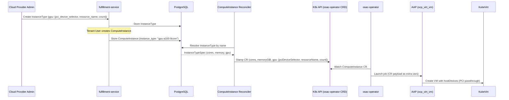

# GPU-Enabled InstanceTypes for ComputeInstances

## Summary

This design extends the InstanceType resource with a structured `GpuSpec` sub-message
containing PCI device selector, resource name, and count, and wires that data through the
existing InstanceType-to-ComputeInstance reconciliation pipeline so that tenant VMs are
provisioned with GPU hardware attached via KubeVirt host device passthrough. See
[PRD](prd.md) for detailed requirements.

## Motivation

OSAC provisions compute instances by resolving an InstanceType reference into concrete
hardware parameters (cores, memory) that flow from the fulfillment API through the
reconciler, operator, and AAP provisioning stack. The Ansible `ocp_virt_vm` role already
supports GPU passthrough via a `gpu_devices` parameter that configures KubeVirt
`hostDevices` entries, but this capability is only accessible through direct AAP template
configuration. There is no path from the tenant-facing API to the provisioning layer for
GPU hardware.

This means tenants cannot self-service GPU-equipped VMs. Cloud Provider Admins must
manually configure AAP templates per GPU configuration, bypassing OSAC's InstanceType
catalog, tenant isolation metadata, and resource lifecycle management. As sovereign AI
cloud deployments grow, this gap blocks the primary use case: tenants running AI/ML
workloads on GPU-accelerated virtual machines.

The proposed design adds GPU fields to InstanceType and extends the existing data flow
(InstanceType -> ComputeInstance CR -> AAP extra vars -> `ocp_virt_vm` role) to carry GPU
information end-to-end. No new resources, services, or reconciliation patterns are
introduced.

### Goals

- Reuse the existing InstanceType-to-ComputeInstance reconciliation pattern for GPU fields,
  with no new controllers or reconciliation loops.
- Use a structured sub-message for GPU data to allow future extension (MIG, vGPU,
  framebuffer memory) without breaking the API shape.
- Enforce the same immutability contract on GPU fields as on `cores` and `memory_gib`.
- Use `pci_device_selector` and `resource_name` as the GPU fields in the API, matching
  what the AAP `ocp_virt_vm` role already consumes. No template-level mapping layer.
- Require no database schema migrations -- GPU data is stored in the existing JSON `data`
  column.
- Extend the existing [InstanceType developer guide](https://github.com/osac-project/docs/blob/main/guides/developer/instancetype-guide.md)
  with GPU-specific sections.

### Non-Goals

- GPU discovery API for programmatic detection of available hardware on cluster nodes.
  [Locked: D5]
- Per-tenant GPU quotas (deferred until the general quota system is built).
- MIG partitioning, vGPU, or GPU cluster (InfiniBand) support. [Locked: D7]
- Multi-cluster GPU placement decisions. [Locked: D6]
- UI changes -- API and CLI only for this milestone.

## Proposal

This feature makes changes across three repositories:

1. **fulfillment-service**: Add a `GpuSpec` sub-message to `InstanceTypeSpec` in both
   public and private protos. Extend the ComputeInstance reconciler's `addExplicitFields`
   method to resolve GPU fields from the referenced InstanceType and stamp them onto the
   K8s ComputeInstance CR. Add GPU columns to the InstanceType CLI table rendering.

2. **osac-operator**: Add a `GpuSpec` struct with `PciDeviceSelector`, `ResourceName`,
   and `Count` fields to the ComputeInstance CRD spec, mirroring the proto `GpuSpec`
   shape. These fields are populated by the fulfillment reconciler and serialized as
   part of the CR payload sent to AAP. No controller logic changes are needed -- the
   existing `extractExtraVars` method serializes the entire CR spec, so new fields are
   automatically included.

3. **osac-aap**: Update the `ocp_virt_vm` role to read GPU fields from
   `compute_instance.spec.gpu` (`pciDeviceSelector`, `resourceName`, `count`)
   instead of the separate `gpu_devices` role parameter, which is removed. The role
   loops over `count` to create repeated `hostDevices` entries. The playbook already
   passes the full CR payload as `compute_instance`, so no playbook changes are needed.

No new gRPC services, database migrations, or CRDs are introduced.

### Workflow Description

#### Creating a GPU-Enabled InstanceType

**Actor:** Cloud Provider Admin
**Starting state:** OSAC is deployed with GPU-equipped worker nodes.

1. Cloud Provider Admin calls `InstanceTypes/Create` with GPU fields:
   ```
   POST /api/fulfillment/v1/instance_types
   {
     "object": {
       "metadata": { "name": "gpu-a100-8core" },
       "spec": {
         "cores": 8,
         "memory_gib": 64,
         "description": "8 vCPU, 64 GiB, 1x A100 GPU",
         "gpu": {
           "pci_device_selector": "10DE:20B0",
           "resource_name": "nvidia.com/A100",
           "count": 1
         }
       }
     }
   }
   ```
2. The server validates `cores > 0`, `memory_gib > 0`, and when `gpu` is present:
   `pci_device_selector` and `resource_name` are non-empty, `count` is between 1 and 16.
3. The InstanceType is persisted with state `ACTIVE`.

#### Provisioning a GPU ComputeInstance

**Actor:** Tenant User
**Starting state:** A GPU-enabled InstanceType exists and is `ACTIVE`.

The following diagram shows the data flow from InstanceType creation through VM
provisioning:



This diagram shows the end-to-end data flow. The key addition is the GPU fields flowing
from the InstanceType through the reconciler to the CR as a nested `gpu` struct (same
shape as the proto). The CR payload is serialized to AAP, where the `ocp_virt_vm` role
reads `gpu.count` to create the `hostDevices` entries.

Steps:

1. Tenant User calls `ComputeInstances/Create` referencing the GPU-enabled InstanceType:
   ```
   POST /api/fulfillment/v1/compute_instances
   {
     "object": {
       "spec": {
         "instance_type": "gpu-a100-8core",
         ...
       }
     }
   }
   ```
2. The ComputeInstance is created with no GPU fields on its own proto -- GPU flows through
   the InstanceType reference.
3. The fulfillment reconciler's `addExplicitFields` resolves the InstanceType, reads
   `spec.gpu`, and stamps the `gpu` struct (`pciDeviceSelector`, `resourceName`,
   `count`) onto the K8s ComputeInstance CR.
4. The osac-operator watches the CR. The `extractExtraVars` method serializes the full CR
   spec (including the `gpu` struct) into `ansible_eda.event.payload`.
5. The AAP `ocp_virt_vm` role reads `compute_instance.spec.gpu` from the payload and
   loops over `count` to create KubeVirt `hostDevices` entries in the VM domain spec.
6. KubeVirt schedules the VM on a node with the matching GPU hardware.

#### Listing InstanceTypes with GPU Information

**Actor:** Tenant User

1. Tenant User calls `InstanceTypes/List`.
2. Response includes GPU fields on each InstanceType. GPU-enabled types show
   `gpu.pci_device_selector`, `gpu.resource_name`, and `gpu.count`; non-GPU types omit
   the `gpu` field (proto `optional`).
3. CLI table rendering shows GPU DEVICE, GPU RESOURCE, and GPU COUNT columns (blank for
   non-GPU types).
4. Filtering by GPU fields is supported via CEL: `has(this.spec.gpu)` or
   `this.spec.gpu.resource_name == "nvidia.com/A100"`.

#### Error Handling: GPU Hardware Unavailable

When a tenant creates a ComputeInstance referencing a GPU-enabled InstanceType but no
nodes have matching GPU hardware, the behavior follows standard Kubernetes eventual
consistency. [Locked: D4] The VM pod remains in `Pending` state. The ComputeInstance
status reflects the underlying provisioning state through existing condition reporting.
No GPU-specific error handling is introduced.

### API Extensions

This feature modifies existing API resources and CRDs. No new services, webhooks,
finalizers, or aggregated API servers are introduced.

**Modified resources:**

| Resource | Component | Change |
|----------|-----------|--------|
| `InstanceType` proto (public + private) | fulfillment-service | Add `GpuSpec` sub-message to `InstanceTypeSpec` |
| `ComputeInstance` CRD | osac-operator | Add `GpuSpec` struct (`gpu` field) to `ComputeInstanceSpec` |

The InstanceType service methods (`Create`, `List`, `Get`, `Update`, `Delete`) remain
unchanged in signature. GPU data flows through the existing `object` field in request and
response messages.

If the fulfillment reconciler is down, ComputeInstance CRs are not updated with GPU
fields (or any other InstanceType-resolved fields). This is existing behavior -- the
reconciler is already required for cores and memory resolution.

## UX Alignment

The `@temp-api` file at `osac-ux/libs/ui-components/src/api/v1/instance-types.ts`
currently has no GPU fields. UI work is deferred to a follow-up milestone.

When the proto changes in this design land and `pnpm gen-types` is run in osac-ux:
- The generated TypeScript types will include the `gpu` field on `InstanceTypeSpec`
  with `pciDeviceSelector`, `resourceName`, and `count`.
- The `formatInstanceTypeSizing` helper (which currently returns strings like
  "4 vCPU, 8 GiB") will need updating to append GPU information.
- InstanceType list and detail views will need GPU columns or display fields.

No `@temp-api` deviations or anti-patterns apply -- the proto design uses a structured
sub-message that maps cleanly to TypeScript.

### Implementation Details/Notes/Constraints

#### Proto Changes (fulfillment-service)

Add the following to both `proto/public/osac/public/v1/instance_type_type.proto` and
`proto/private/osac/private/v1/instance_type_type.proto`:

```protobuf
// Hardware specification for GPU devices attached to compute instances
// provisioned with this instance type.
message GpuSpec {
  // PCI device selector identifying the GPU hardware (e.g., "10DE:20B0").
  // Must match the device selector configured on the cluster's GPU nodes.
  string pci_device_selector = 1 [(buf.validate.field).string.min_len = 1];

  // Kubernetes device plugin resource name (e.g., "nvidia.com/A100").
  // Used by KubeVirt to request GPU resources from the node.
  string resource_name = 2 [(buf.validate.field).string.min_len = 1];

  // Number of GPU devices of this type.
  int32 count = 3 [(buf.validate.field).int32 = {gte: 1, lte: 16}];
}
```

Extend `InstanceTypeSpec` (field 6, after `deprecation = 5`):

```protobuf
message InstanceTypeSpec {
  // Number of virtual CPU cores.
  int32 cores = 1 [(buf.validate.field).int32.gte = 1];

  // Memory in gibibytes.
  int32 memory_gib = 2 [(buf.validate.field).int32.gte = 1];

  // Human-readable description of the instance type.
  string description = 3;

  // Lifecycle state of the instance type.
  InstanceTypeState state = 4;

  // Deprecation details. Set when state is DEPRECATED or OBSOLETE.
  InstanceTypeDeprecation deprecation = 5;

  // GPU configuration. Omit for non-GPU instance types.
  optional GpuSpec gpu = 6;
}
```

The `optional` keyword ensures that non-GPU instance types serialize without a `gpu`
field, and `has(this.spec.gpu)` works in CEL filter expressions.

Validation constraints on `GpuSpec` fields (`min_len = 1` on `pci_device_selector` and
`resource_name`, `gte = 1, lte = 16` on `count`) are enforced by protovalidate only when
the `gpu` field is present. When `gpu` is omitted, the constraints are not evaluated.
[Codebase: fulfillment-service/docs/API.md]

#### Server Changes (fulfillment-service)

**Immutability enforcement** in
`internal/servers/private_instance_types_server.go` `Update` method:

The private server's `Update` method enforces immutability of `cores` and `memory_gib` by
comparing the incoming spec against the stored object and rejecting changes to those
fields. The `gpu` field must follow the same pattern:

```go
// In the Update method, after existing immutability checks:
if !proto.Equal(incoming.GetSpec().GetGpu(), stored.GetSpec().GetGpu()) {
    return nil, status.Errorf(codes.InvalidArgument,
        "gpu is immutable after creation")
}
```

The public server (`instance_types_server.go`) delegates to the private server via the
generic mapper pattern and requires no GPU-specific changes.
[Codebase: fulfillment-service/internal/servers/instance_types_server.go]

**No Create method changes** are needed beyond protovalidate. The existing Create flow
persists the full `InstanceTypeSpec` (including the new `gpu` field) via the generic DAO's
JSON serialization. No explicit field handling is required.

#### Reconciler Changes (fulfillment-service)

In `internal/controllers/computeinstance/computeinstance_reconciler_function.go`, the
`addExplicitFields` method resolves InstanceType fields and stamps them onto the K8s
ComputeInstance CR. After the existing `spec.Cores` and `spec.MemoryGiB` assignments
(line ~665):

```go
// Stamp GPU fields from InstanceType
if gpu := itSpec.GetGpu(); gpu != nil {
    spec.Gpu = &v1alpha1.GpuSpec{
        PciDeviceSelector: gpu.GetPciDeviceSelector(),
        ResourceName:      gpu.GetResourceName(),
        Count:             gpu.GetCount(),
    }
}
```

When the InstanceType has no GPU (`gpu` is nil), the CR's `gpu` field remains nil, which
the operator and AAP treat as "no GPU." This follows the same pattern as other optional
structs on `ComputeInstanceSpec` (e.g., `UserDataSecretRef`).

#### Table Rendering (fulfillment-service)

Update `internal/rendering/tables/osac.public.v1.InstanceType.yaml` to add GPU columns
between MEMORY and STATE:

```yaml
columns:
  - header: NAME
    value: this.id
  - header: CORES
    value: this.spec.cores
  - header: MEMORY
    value: this.spec.memory_gib
  - header: GPU DEVICE
    value: this.spec.gpu.pci_device_selector
  - header: GPU RESOURCE
    value: this.spec.gpu.resource_name
  - header: GPU COUNT
    value: this.spec.gpu.count
  - header: STATE
    value: this.spec.state
    type: osac.public.v1.InstanceTypeState
  - header: DESCRIPTION
    value: this.spec.description
```

For non-GPU instance types, GPU columns evaluate to empty/zero and render as blank cells.

#### CRD Changes (osac-operator)

Add a `GpuSpec` struct and `Gpu` field to `ComputeInstanceSpec` in
`api/v1alpha1/computeinstance_types.go`, following the existing pattern for nested structs
like `ImageSpec` and `DiskSpec`:

```go
// GpuSpec defines GPU passthrough configuration resolved from the InstanceType.
type GpuSpec struct {
    // PciDeviceSelector is the PCI vendor:device ID (e.g., "10DE:20B0").
    // +kubebuilder:validation:Required
    // +kubebuilder:validation:MinLength=1
    PciDeviceSelector string `json:"pciDeviceSelector"`

    // ResourceName is the Kubernetes device plugin resource (e.g., "nvidia.com/A100").
    // +kubebuilder:validation:Required
    // +kubebuilder:validation:MinLength=1
    ResourceName string `json:"resourceName"`

    // Count is the number of GPU devices of this type.
    // +kubebuilder:validation:Required
    // +kubebuilder:validation:Minimum=1
    // +kubebuilder:validation:Maximum=16
    Count int32 `json:"count"`
}

// In ComputeInstanceSpec:

// Gpu defines GPU passthrough configuration resolved from the InstanceType.
// Nil for non-GPU instances.
// +optional
Gpu *GpuSpec `json:"gpu,omitempty"`
```

The `Gpu` field is populated by the fulfillment reconciler (not set by users directly),
following the nested struct pattern used by `ImageSpec` and `DiskSpec`. The struct mirrors the proto
`GpuSpec` shape. No CRD-level immutability rules are needed — the reconciler always
stamps the same values because GPU fields on the source InstanceType are immutable
(enforced at the API server level).

**No controller changes required.** The existing `extractExtraVars` method in
`pkg/provisioning/aap_provider.go` serializes the entire ComputeInstance CR into the AAP
payload. The `gpu` struct is automatically included in
`ansible_eda.event.payload.spec`.
[Codebase: osac-operator/pkg/provisioning/aap_provider.go]

#### AAP Integration (osac-aap)

The `ocp_virt_vm` role already supports GPU passthrough via the `gpu_devices` role
parameter, which accepts a list of `{pci_device_selector, resource_name}` objects and
creates KubeVirt `hostDevices` entries.
[Codebase: osac-aap/collections/ansible_collections/osac/templates/roles/ocp_virt_vm/]

The role is updated to read GPU fields from `compute_instance.spec.gpu`
(`pciDeviceSelector`, `resourceName`, `count`) instead of the separate `gpu_devices`
role parameter, which is removed from the role's argument spec and task references.
The role loops over `count` to create repeated `hostDevices` entries, each using the
same `pciDeviceSelector` and `resourceName`. The playbook already passes the full CR
payload as `compute_instance` (`ansible_eda.event.payload`), so no playbook changes
are needed.

The Cloud Provider Admin is responsible for entering the correct PCI device selector and
resource name when creating InstanceTypes — these values must match the GPU hardware and
device plugins configured on the cluster nodes.

#### Database

No schema migration is required. InstanceType data is stored as JSON-serialized protobuf
in the generic DAO's `data` column. The new `gpu` field is automatically included in the
JSON representation.
[Codebase: fulfillment-service/internal/database/migrations/51_create_instance_types_tables.up.sql]

CEL-based filtering on GPU fields (`has(this.spec.gpu)`,
`this.spec.gpu.resource_name == "nvidia.com/A100"`) works through the existing
`FilterTranslator`, which translates CEL expressions into SQL JSON path queries against
the `data` column.

### Security Considerations

This feature inherits the existing security model without changes. InstanceTypes are
managed by Cloud Provider Admins through the same authentication (JWT) and authorization
(OPA) mechanisms used for all fulfillment API resources. Tenant Users have read-only
access to InstanceTypes (List, Get) and cannot create, update, or delete them.

ComputeInstances created with GPU-enabled InstanceTypes carry the standard tenant
isolation metadata (`osac.openshift.io/tenant` annotation) and are subject to the same
OPA policy enforcement as non-GPU instances.

The GPU fields (`pci_device_selector` and `resource_name`) are validated for non-empty
strings but not checked against the cluster's actual hardware inventory. The Cloud
Provider Admin is trusted to enter correct values. Incorrect PCI device selectors or
resource names result in AAP provisioning failures or KubeVirt scheduling failures, not
security issues.

### Failure Handling and Recovery

**InstanceType with invalid GPU device identifiers:** The Cloud Provider Admin creates an
InstanceType with a `pci_device_selector` or `resource_name` that does not match the
cluster's GPU hardware. ComputeInstances referencing this InstanceType proceed through
reconciliation normally. The AAP job succeeds but KubeVirt cannot schedule the VM due to
unsatisfied device resource requests. The ComputeInstance status reflects the failure
through existing condition reporting. Recovery: Cloud Provider Admin marks the InstanceType
as `DEPRECATED` or `OBSOLETE` and creates a corrected one.

**GPU hardware unavailable on cluster:** A tenant creates a ComputeInstance referencing a
GPU-enabled InstanceType, but no nodes have the requested GPU. KubeVirt creates the VM
definition, but the pod remains `Pending` due to unsatisfied resource requests. The
ComputeInstance status reflects the scheduling failure through existing condition
reporting. This matches the behavior for CPU/memory resource shortages. [Locked: D4]

**Reconciler restart mid-reconciliation:** If the fulfillment reconciler restarts while
stamping GPU fields onto a CR, the reconciler re-resolves the InstanceType on the next
reconciliation loop and stamps the fields again. The operation is idempotent -- stamping
the same GPU values onto the CR produces no change.

**InstanceType deleted while ComputeInstance exists:** The existing referential integrity
trigger (migration 56) prevents deleting an InstanceType while active ComputeInstances
reference it. This applies equally to GPU-enabled InstanceTypes. No additional protection
is needed.

### RBAC / Tenancy

No RBAC or tenancy changes are required. InstanceTypes are platform-scoped resources
(no tenant ownership) managed by Cloud Provider Admins. Tenant Users have read-only access
via the public API. ComputeInstances carry tenant isolation metadata regardless of whether
they reference GPU-enabled InstanceTypes. The existing OPA policies enforce tenant
isolation at the ComputeInstance level, and GPU fields do not affect policy evaluation.

### Observability and Monitoring

No new observability changes. Existing monitoring mechanisms apply.

The ComputeInstance reconciler's existing metrics (reconciliation duration, error counts)
cover GPU-enabled reconciliations without modification. AAP job success/failure metrics
already capture GPU provisioning outcomes. GPU-specific metrics (utilization, temperature)
are the responsibility of the node-level monitoring stack, not OSAC.

### Risks and Mitigations

**Risk: GPU device identifier drift.** Cloud Provider Admin creates InstanceTypes with
PCI device selectors that become stale when cluster GPU hardware changes. Tenants
reference stale InstanceTypes and get provisioning failures.
**Mitigation:** Cloud Provider Admin deprecates stale InstanceTypes using the existing
`DEPRECATED` -> `OBSOLETE` lifecycle. The PRD notes that a GPU discovery API (future
feature) would further mitigate this. [Locked: D5]

**Risk: Version skew during rollout.** The fulfillment-service is updated before the
osac-operator. The reconciler stamps GPU fields onto CRs, but the CRD does not yet have
GPU fields, causing the CR update to fail (unknown fields are rejected by default in
Kubernetes).
**Mitigation:** Deploy the osac-operator CRD update before the fulfillment-service
reconciler so the K8s API accepts the new fields. PRs merge in proto-dependency order
(fulfillment-service -> osac-operator -> osac-aap), but deployment applies the CRD first.
If the reconciler is deployed first, it retries until the CRD is updated (see Version
Skew Strategy).

### Drawbacks

Adding GPU fields to InstanceType couples GPU configuration to the InstanceType
abstraction. If future requirements call for GPU configurations that vary independently
of CPU/memory (e.g., attaching GPUs to an existing non-GPU instance type), this coupling
becomes a constraint. However, the team explicitly rejected a separate GPU resource
because it would not be reused outside InstanceType and adds lifecycle complexity.

Storing PCI device selectors directly in the API exposes hardware-level details to the
Cloud Provider Admin. A typo in the PCI device selector or resource name passes API
validation (non-empty string) but causes provisioning failures at the KubeVirt scheduling
layer. This is acceptable because the Cloud Provider Admin is the persona responsible for
hardware configuration, and a future GPU discovery API [Locked: D5] could provide
validated device lists.

## Alternatives (Not Implemented)

### Flat fields on InstanceTypeSpec

Add `gpu_pci_device_selector` (string), `gpu_resource_name` (string), and `gpu_count`
(int32) as top-level fields on `InstanceTypeSpec` instead of a structured `GpuSpec`
sub-message.

**Pros:** Simpler proto definition. No nested message.
**Cons:** Cannot be extended without adding more top-level fields. Future GPU attributes
(MIG profile, vGPU type, framebuffer memory) would require additional `gpu_*` fields,
polluting the InstanceTypeSpec namespace. The `optional` keyword on individual fields does
not cleanly express "this is a GPU-enabled instance type."
**Rejection reason:** Team consensus favored the sub-message for extensibility and
semantic grouping.

### Separate GpuProfile resource

Create a new `GpuProfile` resource with its own CRUD service. InstanceType references a
GpuProfile by name.

**Pros:** Decouples GPU configuration from InstanceType. Allows reuse across multiple
InstanceTypes.
**Cons:** Adds a new resource with its own lifecycle, service, table rendering, and CLI
commands. GpuProfile would only be referenced from InstanceType, making reuse theoretical.
Increases API surface area and implementation cost disproportionately for the MVP scope.
**Rejection reason:** The team agreed that GPU configuration is an attribute of an
InstanceType, not an independent resource. A separate resource adds complexity without
demonstrated reuse.

### Do nothing

Continue using AAP template-level GPU overrides. Cloud Provider Admins configure GPU
passthrough directly in AAP templates without OSAC API involvement.

**Pros:** Zero implementation cost. Already works for single-tenant or admin-managed
deployments.
**Cons:** No self-service for tenants. No tenant isolation metadata on GPU configurations.
No visibility into GPU capabilities through the InstanceType catalog. Tenants cannot
distinguish GPU-enabled from non-GPU InstanceTypes via the API or CLI.
**Rejection reason:** Fails to meet the core requirement of tenant self-service GPU
provisioning.

## Test Plan

### Unit Tests

**fulfillment-service (Ginkgo):**

- `GpuSpec` validation: Create rejects `gpu.count = 0`, `gpu.count = -1`,
  `gpu.pci_device_selector = ""`, and `gpu.resource_name = ""` when `gpu` is present.
- Create accepts InstanceType with `gpu` omitted (non-GPU instance type).
- Create accepts InstanceType with valid `gpu` (pci_device_selector = "10DE:20B0",
  resource_name = "nvidia.com/A100", count = 1).
- Update rejects changes to `gpu` field (immutability).
- Update allows changes to `description` and `state` on a GPU-enabled InstanceType
  without modifying `gpu`.
- List returns GPU fields in response objects.
- List with CEL filter `has(this.spec.gpu)` returns only GPU-enabled InstanceTypes.
- List with CEL filter `this.spec.gpu.resource_name == "nvidia.com/A100"` returns
  matching InstanceTypes.
- Table rendering includes GPU DEVICE, GPU RESOURCE, and GPU COUNT columns.
- `addExplicitFields` stamps `gpu` struct on CR when InstanceType has GPU.
- `addExplicitFields` leaves `gpu` nil when InstanceType has no GPU.

**osac-operator (Ginkgo + envtest):**

- ComputeInstance CR with `gpu` struct (`pciDeviceSelector`, `resourceName`,
  `count`) passes CRD validation.
- ComputeInstance CR without GPU fields passes CRD validation.

### Integration Tests

**fulfillment-service (kind cluster):**

- Create a GPU-enabled InstanceType (count=2), create a ComputeInstance referencing it,
  verify the reconciler stamps the `gpu` struct with `count=2` on the K8s
  ComputeInstance CR.
- Create a non-GPU InstanceType, create a ComputeInstance, verify CR has no GPU fields.
- Verify referential integrity: cannot delete a GPU-enabled InstanceType while active
  ComputeInstances reference it.

### E2E Tests

E2E tests require a cluster with GPU hardware and are expected to be manual for the MVP.
Automated E2E coverage via osac-test-infra will be added when a GPU-equipped test
environment is available.

Scenarios for manual validation:
- Cloud Provider Admin creates a GPU-enabled InstanceType. Tenant User creates a
  ComputeInstance referencing it. Verify the resulting VM has GPU hardware attached
  (check KubeVirt VM spec for `hostDevices` entries).
- Tenant User lists InstanceTypes and can distinguish GPU-enabled types via CLI output.

## Graduation Criteria

Graduation criteria will be defined when targeting a release. Expected stages:
Dev Preview -> Tech Preview -> GA based on production deployment feedback.

For Dev Preview exit:
- All unit and integration tests passing.
- Manual E2E validation on a GPU-equipped cluster.
- CLI displays GPU information in InstanceType listings.

## Version Skew Strategy

The fulfillment-service and osac-operator must be upgraded in order:

1. **osac-operator CRD first**: Apply the updated CRD with the `gpu` struct so the K8s
   API accepts CRs with `gpu.pciDeviceSelector`, `gpu.resourceName`, and `gpu.count`.
2. **fulfillment-service second**: Deploy the updated reconciler that stamps GPU fields
   onto CRs.

If the fulfillment-service is upgraded first, the reconciler attempts to set the `gpu`
struct on CRs using a CRD that does not yet have that field. Kubernetes rejects the
update with a validation error. The reconciler retries on the next loop. Once the CRD is
updated, reconciliation succeeds.

If the osac-operator is upgraded first, the CRD accepts the `gpu` field but no reconciler
populates it. The field remains nil. This is safe -- the operator and AAP treat a missing
`gpu` field as "no GPU."

## Support Procedures

**Symptom: ComputeInstance stuck in Provisioning state for a GPU-enabled InstanceType.**

1. Check ComputeInstance conditions via the fulfillment API or `osac` CLI for AAP job
   failure reasons.
2. Verify the InstanceType's `pci_device_selector` and `resource_name` match the cluster's
   GPU hardware (`kubectl get nodes -o json | jq '.items[].status.allocatable'`).
3. Check the KubeVirt VM pod events for GPU scheduling failures
   (`kubectl describe pod <vm-pod>`).

**Symptom: GPU columns blank in CLI output for a known GPU-enabled InstanceType.**

1. Verify the InstanceType was created with the `gpu` field
   (`osac get instance_type <name> -o json | jq '.spec.gpu'`).
2. If `gpu` is null, the InstanceType was created before the GPU feature was deployed
   or was created without GPU fields. GPU fields are immutable -- create a new
   InstanceType with GPU fields.

**Disabling:** GPU functionality cannot be disabled independently. To prevent GPU
provisioning, deprecate all GPU-enabled InstanceTypes (set state to `OBSOLETE`). Existing
GPU-equipped ComputeInstances continue to run unaffected.

## Infrastructure Needed

- A cluster with at least one GPU node for E2E testing. Unit and integration tests
  run on existing kind clusters without GPU hardware.
