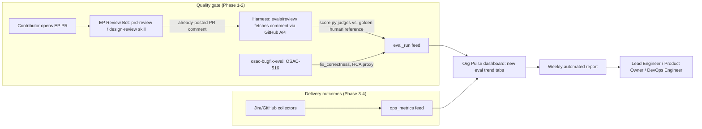

# Agentic SDLC Measurement

## Summary

Build a phased measurement framework that scores the quality of AI-agent-driven planning and bug-fix work against human-validated reference cases, then surfaces operational trends (MTTR, velocity) through the team's existing Org Pulse dashboard rather than a new one. This gives engineering leadership a trustworthy, independently-calibrated signal for whether the agentic SDLC transition is actually working, instead of an unvalidated LLM-as-judge score taken at face value. See [PRD](prd.md) for detailed requirements.

## Terminology

- **Golden case / golden dataset:** a curated set of real, already-merged `enhancement-proposals` PRs (`evals/review/cases/`) with a human-authored `reference-review.md` and `annotations.yaml` — the fixed reference this design's judges score against.
- **Judges:** the three scoring checks this design runs — `rubric_scoring` (deterministic, regex-parses the skill's own rubric table), `critical_findings_recall` (deterministic, fuzzy-matches annotated critical findings), and `qualitative_finding_quality` (LLM-as-judge, the only one affected by model choice).
- **Calibration:** the process of checking that a judge's verdict agrees with a human reviewer's verdict on golden cases — the trust mechanism this design relies on instead of (or ahead of) model-family separation.
- **`eval_run` / `ops_metrics`:** the two feed types in `evals/lib/*.schema.yaml` that everything downstream (Org Pulse, the weekly report) reads from — `eval_run` for judge/skill scoring results, `ops_metrics` for Jira/GitHub-sourced MTTR/velocity data.

## Motivation

The team has no dedicated way to tell whether AI-agent-driven bug-fix and feature-development work is actually working. The only existing signal — the FTPR (first-time-pass-rate) dashboard in UOI (Konflux DevLake) — predates the agentic effort and measures CI pass rate on first commit across all merged PRs; it does not isolate agent-driven work, and it says nothing about whether an agent's *reasoning* (a PRD, a design, a root-cause diagnosis) was sound before code was ever written.

Industry treats this as two distinct measurement layers: **quality gates** (does agent/skill output pass a rubric before merge — a regression suite against a golden dataset) and **delivery outcomes** (lead time, MTTR, velocity — DORA-style telemetry, optionally segmented by AI vs. human authorship). This design addresses the quality-gate layer first, then extends into delivery outcomes once the gate is proven — the same sequencing DORA's 2025–2026 generative-AI research recommends (baseline before claiming ROI) and the same order Eran Cohen specified for this Feature.

A production consumer of this same quality-gate layer already exists: the EP Review Bot ([OSAC-1773](https://redhat.atlassian.net/browse/OSAC-1773)) runs on every `enhancement-proposals` pull request and posts `prd-review`/`design-review` scores live. As of `enhancement-proposals` commit `c6df563` (OSAC-2815, merged 2026-07-16), the bot clones this workspace and runs the *same* `skills/prd-review/SKILL.md` / `skills/design-review/SKILL.md` files this harness grades — they are not independently-maintained prompts. That convergence changes what this design needs to justify: the harness is not a second implementation of the bot's logic, it is the accuracy backstop the bot itself lacks. The bot only performs inference — it runs the skill and posts whatever it outputs, with no check against a human-validated baseline. Nothing about the bot's own pipeline calibrates its verdicts against what a human reviewer would have said; that calibration is this harness's entire purpose.

Four industry-standard components make up a production LLM/agent eval harness: a golden dataset, multi-layer scorers (deterministic + LLM-as-judge), a runner, and a required CI gate. This design delivers a variant of the first two directly, and deliberately does not build the third or fourth as originally conceived. Scoring the EP Review Bot's already-posted PR comment — rather than locally re-executing the skill — means there is no separate "runner" component to build: the harness's own scoring engine (`score.py`) is reused as a dependency, but nothing under this design's control ever invokes the skill under test. That, in turn, makes a blocking pre-merge CI gate structurally inapplicable, not just deferred: there is no local re-execution step to gate a not-yet-merged skill/rubric change against — the earliest this design can score a change is after it ships and the bot reviews the next real PR. [OSAC-3010](https://redhat.atlassian.net/browse/OSAC-3010)'s local-vs-remote (Harbor/EvalHub) execution-mode question, which previously motivated deferring the gate, is therefore moot for this design: there is no execution mode to choose between, local or remote, because there is no execution. Pre-merge regression testing for skill authors is a real, legitimate capability this design does not deliver — see Non-Goals and Alternatives for why, and where that capability could live instead ([OSAC-2019](https://redhat.atlassian.net/browse/OSAC-2019)) if ever requested.

### Goals

- **The bot's already-posted review score is independently checked against human judgment, not trusted at face value.** The harness's own judges (`rubric_scoring`, `critical_findings_recall`, `qualitative_finding_quality`) score the EP Review Bot's real PR comment on curated golden-case PRs against a human-validated reference — not a locally re-executed copy of the skill. (See Alternatives for why a custom scorer, and why local re-execution, were both rejected.)
- **Engineers can trust that a reported score reflects human judgment, not just model self-consistency.** LLM-as-judge scoring is validated against human-authored reference cases (quantified via Cohen's κ) before being treated as reliable — the mechanism that establishes trust, not the choice of judge model. [PRD: In Scope — judge-model policy] [Locked: D7]
- **Lead Engineer, Product Owner, and DevOps Engineer personas see agent performance trends in the same Org Pulse dashboard they already use daily** — no new tool to learn or check. [PRD: Dependencies — Org Pulse] [Locked: D4] (See Alternatives for why a standalone dashboard was rejected.)
- **RCA-accuracy and bug-fix-outcome trends are visible without this workspace re-implementing bug-fix evaluation** — the external `osac-bugfix-eval` (OSAC-516) harness's output is ingested, not duplicated. [PRD: Dependencies — bugfix harness]
- **A recurring calibration signal shows whether the bot's self-reported scores can be trusted, without a second execution pipeline to produce it.** This runs periodically against a sample of real, already-reviewed PRs — not as a merge gate, since there is no pre-merge artifact to gate against under this architecture (see Motivation, Non-Goals).

### Non-Goals

- **Pre-merge regression testing for a not-yet-merged skill/rubric change.** This design deliberately does not re-execute `prd-review`/`design-review` locally; it only scores the bot's already-posted, real PR output. A skill author wanting to test a draft change before opening a PR has no automated check from this design — see Alternatives. This capability, if ever prioritized, belongs under [OSAC-2019](https://redhat.atlassian.net/browse/OSAC-2019) (Agentic SDLC Quality), which already runs an equivalent pre-merge loop for the bugfix skill (OSAC-516); it is not built here because it serves the harness-maintainer/skill-author persona explicitly excluded from this PRD. [Locked: D2]
- Replacing the existing FTPR/UOI dashboard — this framework extends visibility into agent-specific quality signals; FTPR remains the CI-pass-rate baseline it already is. [PRD: Assumptions]
- Building a standalone bug-fix evaluation harness — OSAC-516/`osac-bugfix-eval` already does this; this design only ingests its output. [Codebase: `AUDIT.md` §2]
- Custom fine-tuning of the skill or judge LLMs.
- Code quality metrics (test coverage, cyclomatic complexity), OSAC Tenant User productivity tracking, and tenant/production AI-usage cost analysis — all explicitly out of scope per the PRD. [PRD: Out of Scope]

## Proposal

The framework has four workspace-native pieces: (1) `evals/review/` — harness judges (`score.py`, reused from `agent-eval-harness` as a dependency) scoring the EP Review Bot's real, already-posted PR comments against a human-curated golden dataset, not a locally re-executed copy of the skill; (2) an ingestion adapter that folds OSAC-516's bug-fix eval output into a common report schema; (3) a Jira/GitHub data-collection layer producing operational metrics (MTTR, velocity) into that same schema; (4) an extension to the existing Org Pulse dashboard and a new weekly reporting pipeline that reads from both schemas. Phasing detail is in Implementation Details/Notes/Constraints.



The diagram separates the two measurement layers from Motivation and shows where they merge: the harness and the external bugfix-eval both write into a single `eval_run`-shaped feed; Jira/GitHub collection writes into a separate `ops_metrics`-shaped feed; Org Pulse and the weekly report are the only consumers of either feed, so no new dashboard surface is created. Unlike an earlier iteration of this design, the harness does not run an independent execution stack alongside the bot — it consumes the bot's own already-posted output directly, so there is no separate "runner" relationship to reconcile via a future CI gate; the harness and the bot are two stages of one pipeline, not two parallel ones.

### Workflow Description

Actors: **Contributor** (opens a PRD/EP pull request), **EP Review Bot** (automated, runs in `enhancement-proposals` CI), **Harness** (automated, runs locally or in CI on `osac-workspace`), **Lead Engineer / Product Owner / DevOps Engineer** (consume aggregated trend output — the PRD's personas). [PRD: User Stories]

1. A contributor opens a pull request against `enhancement-proposals` containing `prd.md` and/or `design.md`.
2. The EP Review Bot clones `osac-workspace`, runs `skills/prd-review` and/or `skills/design-review` against the changed file(s), and posts a scored comment on the PR. This happens today, independent of this design.
3. For curated golden-case PRs (`evals/review/cases/`), the harness fetches the bot's already-posted comment via the GitHub API and writes it to the path `score.py` expects (`{run_dir}/{case_id}/artifacts/review-output.md`) — no local skill invocation occurs.
4. The harness's judges (`rubric_scoring`, `critical_findings_recall`, `qualitative_finding_quality`) score that fetched comment against the case's `reference-review.md` + `annotations.yaml`, and write a report. `rubric_scoring` is skipped for bot-sourced `prd-review` cases until [OSAC-3123](https://redhat.atlassian.net/browse/OSAC-3123) (the bot's PRD score table doesn't match the skill's own rubric) is resolved; it already works for `design-review` cases.
5. If a judge fails, the engineer inspects `evals/review/results/` to determine whether the bot's real output has actually regressed, or whether the case/rubric needs updating.
6. This is a periodic, human-triggered (or lightly-scheduled) calibration check, not a pre-merge gate — there is no pre-merge artifact to gate under this architecture. A not-yet-merged skill/rubric change can only be observed once it ships and the bot reviews the next real PR (see Motivation, Non-Goals).
7. In parallel, Jira/GitHub collectors (Phase 3) populate `ops_metrics`; the bugfix-eval adapter (Phase 2) populates `eval_run` from OSAC-516's output.
8. Org Pulse ingests both feeds and renders new trend tabs; the weekly reporting pipeline (Phase 4) reads the same feeds and produces the automated report the PRD's DevOps Engineer and Lead Engineer personas consume.

**Error handling variant — a judge call fails mid-run (e.g., LLM API timeout):** the run exits non-zero for that case, no report is written, and the previous baseline in `evals/review/results/baseline/` remains the last-known-good comparison point; nothing overwrites it. See Failure Handling and Recovery.

**Error handling variant — a golden-case PR has no bot comment yet (outage, rate limit, or the PR predates the bot going live):** that case can't be scored this run. Trigger the bot manually via the `/review-ep` slash command `ep-review.yml` already supports, then re-run. See Failure Handling and Recovery.

### API Extensions

None. This design adds no CRDs, gRPC services, REST endpoints, webhooks, or finalizers to `fulfillment-service` or `osac-operator`. All new surfaces are workspace-native files (YAML eval configs, shell scripts, schema definitions in `evals/lib/`) and additive fields in the existing `org-pulse-data` pipeline. There is no OSAC public/private API surface to extend.

### Implementation Details/Notes/Constraints

**Architecture.** Planning-phase evals live in `evals/review/` inside `osac-workspace` — workspace-native, not a bootstrapped component repo. They run from the workspace root and consume skills and `.design/context/` already present here, plus `enhancement-proposals/` via `./bootstrap.sh`.

```text
osac-workspace/
  evals/
    README.md                 # prerequisites, how to run all eval types
    review/                    # Phase 1 - planning-phase review evals
      eval-prd-review.yaml
      eval-design-review.yaml
      run-eval.sh
      harness.lock              # pins agent-eval-harness v1.22.0 — score.py dependency only, no local execution
      cases/
        prd/*/
        design/*/
      docs/                     # measurement-taxonomy.md, case-schema.md
      lib/                      # case validation, report aggregation (thin, not a scoring engine)
      results/                  # run output; baseline/ committed, others gitignored
    run-all.sh                  # Phase 2 - orchestrates review + external bugfix eval
  .claude/skills/prd-review/    # invoked by the EP Review Bot's own pipeline, not by this harness
  .claude/skills/design-review/
  enhancement-proposals/        # bootstrapped; source of reference case documents and golden-case PRs
```

Case/judge patterns are adopted from `agent-eval-harness` (https://github.com/opendatahub-io/agent-eval-harness) and from the sibling `osac-bugfix-eval` harness, without mirroring bugfix's `deps/`, `workspace-template/`, or per-case repo SHA pinning — review evals score already-posted PR comments with no external repo state to pin. `preflight.py`/`workspace.py`/`execute.py`/`collect.py` (the harness's execution-layer scripts) are not used; only `score.py judges` is invoked, against artifacts this design's own fetch step writes directly.

**Scoring model.** `prd-review`: 0–2 per dimension, `/10` total, PASS ≥7 with no zero on any dimension. `design-review`: 0–2 per dimension, `/8` total, PASS ≥5 with no zero on any dimension. Primary scoring is harness-native judges declared in `eval-prd-review.yaml`/`eval-design-review.yaml`:

```yaml
judges:
  - name: rubric_scoring          # deterministic check judge; regex-parses the skill's own rubric table
  - name: critical_findings_recall # deterministic check judge; fuzzy-matches annotated critical findings
  - name: qualitative_finding_quality # LLM prompt judge; only judge affected by model-family choice
thresholds:
  rubric_scoring: { min_pass_rate: 1.0 }
  critical_findings_recall: { min_pass_rate: 1.0 }
  qualitative_finding_quality: { min_mean: 3.5 }
```

Pass criteria include the skill's own zero-dimension auto-fail rule, not a looser tolerance — an eval that is more forgiving than the production skill would validate the wrong thing. Optional thin Python in `evals/review/lib/` exists for case validation and report merging only, never as a second scoring path.

`eval-prd-review.yaml`/`eval-design-review.yaml` carry only `dataset:`, `outputs:`, `models.judge`, `judges:`, and `thresholds:` — there is no `execution:`, `runner:`, `models.skill`, `permissions:`, or `hooks:` block, since nothing under this design executes the skill under test.

**Output capture.** Under this design, `artifacts/review-output.md` is populated by fetching the EP Review Bot's already-posted PR comment via the GitHub API and writing its body directly to that path — not by locally executing the skill. Harness `outputs.path` must still target the containing directory (`artifacts`), not the file itself — pointing `outputs.path` at a file silently prevented judges from reading the collected content (a bug in the pinned harness v1.22.0, fixed during OSAC-2264's implementation). Judges score the collected `review-output.md` directly, without parsing chat stdout — this holds regardless of whether that file's content came from a live execution or, as here, a fetched bot comment; `score.py`'s `load_case_record()` only requires that the file exists at the expected path.

**Judge-model policy (detail, decided 2026-07-23).** `eval-prd-review.yaml` and `eval-design-review.yaml` pin a single `models.judge: claude-sonnet-4-6` for both the team-default fallback and the one LLM judge (`qualitative_finding_quality`) — no per-judge override. An earlier iteration of this decision split the two (`models.judge: claude-opus-4-6` default, with a per-judge override restoring just `qualitative_finding_quality` to `claude-sonnet-4-6`), reasoned about below; it was superseded by this single-model policy for config clarity, since the split bought only a partial mitigation (see next paragraph) at the cost of an extra moving part to maintain. `rubric_scoring` and `critical_findings_recall` are deterministic regex judges unaffected by model choice either way. There is no `models.skill` to pin under this design — the text being judged is the EP Review Bot's own already-posted comment, produced by whatever model its production pipeline (`agentic_ci`/Vertex AI, OSAC-1773's own configuration) used on that run, which this design does not control, pin, or necessarily know precisely for any given case.

Splitting the judge model from the team default would not have been a complete fix in any case, and is documented here as context for why it was tried and dropped rather than kept as a permanent hedge: industry research on LLM-as-judge bias (2026) distinguishes *self-preference bias* (the exact same model grading its own output) from a separate, also-documented *family bias* (same provider/training lineage, different model favored regardless). The published evidence for self-preference bias (Zheng et al.; Panickssery et al.) is strongest for *pairwise* comparison judging; this judge instead scores a single output against a fixed human reference on an absolute scale, where the more plausible transfer risk is *style-familiarity*/family bias — rewarding AI-typical structure over the human reference's style, which could skew a score in either direction, not just inflate it. An Opus/Sonnet split would have crossed the self-preference line (different model) but not the family-bias line (both Anthropic) — a genuinely bias-resistant judge would need a different **provider** (e.g. GPT, Gemini). That option was evaluated and rejected: the pinned harness's `score.py` hardcodes an Anthropic-only LLM client (`_get_anthropic_client()` → `anthropic.Anthropic`/`AnthropicVertex`, no LiteLLM/OpenAI routing), so cross-provider judging would mean patching that pinned upstream dependency or building a second non-harness judge-calling path — both conflict with this design's core principle of consuming `score.py`'s judge orchestration as-is (OSAC-2264 AC-6: no standalone scorer.py duplicating harness judge logic). Since a same-provider model split doesn't reach genuine family-bias separation anyway, it was dropped in favor of one model and one clear config.

The primary trust mechanism therefore is **calibration against the human-authored cases OSAC-2265/OSAC-2267 curate**, with an explicit, quantified bar instead of a qualitative "tracks human judgment" check: **Cohen's κ between judge scores and human annotations on the golden set — κ ≥ 0.6 is acceptable, κ ≥ 0.8 is strong; κ < 0.5 means the rubric/prompt needs rework, not the model** (industry-standard thresholds; computed and reported in OSAC-2267's baseline). This calibration step, not the choice of judge model, is what establishes trust in the score.

**Phasing.**

| Phase | Deliverable | Location |
|---|---|---|
| 1 | PRD + design review eval harness, baseline report | `evals/review/` |
| 2 | Unified reporting with `osac-bugfix-eval` | `evals/run-all.sh` + adapter, `evals/lib/unified-report.schema.yaml` (`feed_type: eval_run`) |
| 3 | Jira + GitHub operational metrics | Extend `org-pulse-data` pipelines; `evals/lib/ops-metrics-feed.schema.yaml` (`feed_type: ops_metrics`) |
| 4 | Org Pulse trends + weekly reports | Coordinate with OSAC-2004 via OSAC-2518 |

The Phase 4 weekly report is a purpose-built pipeline reading the `eval_run`/`ops_metrics` feeds above — distinct from the workspace's unrelated `generate-status-report` skill, which produces a personal 1:1 activity digest from an individual's own PRs/Jira, not agent-performance-trend reporting. [Clarify: R1.Q5] [Locked: D5]

**Schema shape.** `evals/lib/unified-report.schema.yaml` (`feed_type: eval_run`, already implemented) is a top-level report keyed by `run_id` and `timestamp`, containing a `workflows` array — one entry per `prd-review`/`design-review`/`bugfix` workflow, each with a `gate` name, a `pass`/`fail`/`partial`/`skipped` `result`, and a `cases` array of per-case `case_id`/`passed`/`verdict`/`scores` — plus an `aggregate` object with `overall_pass_rate`. Per-case cost/duration tracking already exists in this schema for the bugfix workflow (`run_result.cost_usd`, `num_turns`, `duration_s`) but is not yet populated for `prd-review`/`design-review` cases — Story 4.03 (per-run cost telemetry) extends this same `run_result` shape to the review workflows rather than adding a new field, keeping the schema addition additive as the PRD's cost-telemetry scope note requires. `evals/lib/ops-metrics-feed.schema.yaml` (`feed_type: ops_metrics`, Phase 3, not yet implemented) is expected to follow the same discriminator pattern with MTTR/velocity fields in place of `workflows`/`cases`; its exact shape is deferred to Epic 3 implementation, not fixed here.

**Dependency detail beyond what's in the PRD:** OSAC-2007 (EP Review Data Pipeline) already dashboards the EP Review Bot's scores in Org Pulse today — Phase 4 must define the *delta* against that existing pipeline, not duplicate it. `osac-bugfix-eval` lives on a personal fork (`eranco74`) with no organizational backup and no commits since 2026-06-03; Epic 2's adapter work should include a liveness check before hard-wiring to it.

### Security Considerations

The harness's LLM judge (`qualitative_finding_quality`) sends the EP Review Bot's already-posted PR comment plus the case's human-authored reference review to an external LLM API (`claude-sonnet-4-6` via the configured provider) for scoring. This is a strictly smaller data-exposure footprint than an earlier iteration of this design: there is no second skill-under-test execution sending full PRD/design document content to a second LLM call — only the bot's own already-public PR comment and the golden reference review are sent. This is the same data-exposure profile the EP Review Bot already has in production today for its half of the exchange — no new exposure is introduced. No credentials, secrets, or tenant data pass through this path.

**Credential provisioning.** Harness runs (`evals/review/run-eval.sh`) need two credentials: (1) a GitHub token to fetch the bot's already-posted PR comment (read-only; the engineer's own `gh` auth locally, or `GITHUB_TOKEN` in CI) — no write access needed, since this design never posts anywhere; (2) the engineer's own already-configured Claude Code credentials for the `qualitative_finding_quality` judge call — the same mechanism as any other Claude Code skill invocation in this workspace. This design provisions no new secret for either. The CI smoke check (`evals-review-smoke.yml`) stubs both and skips the judge call entirely, so no CI-scoped LLM credential exists yet. Provisioning one for a periodic scheduled run, if pursued, is a small follow-on decision — no longer entangled with OSAC-3010, which does not govern this design's (nonexistent) execution mode. See Open Question #2, Infrastructure Needed.

There is no `permissions.deny` block under this design — that mechanism existed to sandbox a locally-executed skill from mutating live Jira/GitHub state during an eval run, and there is no local skill execution left to sandbox. The harness's only external interaction is a read-only GitHub API fetch of an already-posted comment (`gh api .../issues/{pr}/comments`, GET only); it never writes to a PR, issue, or Jira ticket.

No new authentication or authorization model is introduced. This framework does not touch OSAC's tenant-isolation model (`osac.openshift.io/tenant`, `osac.openshift.io/owner-reference`) because it produces no tenant-facing resources — see RBAC / Tenancy below.

### Failure Handling and Recovery

| Failure mode | What happens | Recovery | User-visible effect |
|---|---|---|---|
| LLM API call fails/times out (judge call) | Harness run exits non-zero for that case | Re-run the case; no partial report is written | Engineer sees a failed run, not a silently-wrong score |
| Harness process crashes mid-suite | No results file for the interrupted run | Previous `results/baseline/` remains the comparison point; re-run from scratch (runs are not resumable mid-suite) | Baseline is never overwritten by a partial run |
| A judge's deterministic `check` throws (e.g., malformed rubric table in the bot's posted comment) | That case fails `rubric_scoring` | Treated as a genuine regression in the bot's output format, not the harness | Engineer investigates the skill/bot, not the harness |
| A golden-case PR's bot comment doesn't exist yet, or was deleted | That case can't be scored this run | Trigger the bot manually via the `/review-ep` slash command (`ep-review.yml` supports this), then re-run | Case is skipped with a clear reason, not silently scored against stale/missing data |
| `rubric_scoring` runs against a bot-sourced `prd-review` case before [OSAC-3123](https://redhat.atlassian.net/browse/OSAC-3123) lands | Judge would mismatch on every case (schema mismatch, not a quality signal) | Judge is skipped for `prd-review` cases via the `annotations.yaml` opt-out until OSAC-3123 resolves; `design-review` is unaffected | Baseline report notes `prd-review` coverage is partial (2 of 3 judges) until the fix lands |
| `osac-bugfix-eval` fork becomes unreachable (Phase 2) | Adapter ingestion fails at fetch time | Falls back to the last successfully ingested `summary.yaml`; does not block Phase 1 harness runs, which are independent | Bug-fix trend data goes stale until the fork is reachable again or migrated |
| Org Pulse ingestion pipeline fails (Phase 3–4) | New eval/ops trend tabs show stale data | Existing Org Pulse alerting/on-call for pipeline failures applies unchanged — this design adds no new pipeline infrastructure, only new fields into the existing one | Dashboard viewers see a stale-data indicator already produced by Org Pulse's existing mechanism |

There is no idempotency concern for read-only review evals — re-running the same case against the same skill/model version produces an independent, non-mutating scoring attempt each time; there is no shared mutable state to corrupt on retry.

### RBAC / Tenancy

No RBAC or tenancy changes. This feature produces no new OSAC resources (CRDs, gRPC-managed objects) and has no tenant-observable behavior — confirmed during PRD clarification: its consumers are internal engineering roles (Lead Engineer, Product Owner, DevOps Engineer), not OSAC's tenant-facing personas. [Locked: D1] No `osac.openshift.io/tenant` or `osac.openshift.io/owner-reference` annotations apply because there is no tenant-scoped resource to annotate.

The same no-tenant-surface reasoning means the Documentation, UI, and E2E Testing dimensions in `.design/context/osac-dimensions.md` don't apply either: there is no `osac-ui` console surface (Org Pulse is a separate internal tool, not `osac-ui`), no tenant-facing documentation need, and no `osac-test-infra` pytest coverage requirement — this design's own Test Plan is the equivalent verification layer for its actual (non-tenant) surface.

### Observability and Monitoring

New signals, all delivered via the `eval_run`/`ops_metrics` feeds into Org Pulse rather than a new metrics backend:

- **Eval pass rate** (per skill, per case, trended over time) — a sustained drop below the harness's per-judge thresholds (`rubric_scoring`/`critical_findings_recall` at `min_pass_rate: 1.0`, `qualitative_finding_quality` at `min_mean: 3.5`) indicates a skill or rubric regression.
- **Per-run judge-call cost telemetry** (what scoring a batch of golden cases costs in judge LLM calls) — a distinct observability signal from AI-usage billing, added per PRD clarification. [PRD: In Scope] [Locked: D3] There is no skill-execution cost to track under this design; the EP Review Bot's own production invocation cost is OSAC-1773's scope, not duplicated here (see Story 4.03). A sustained per-run cost increase with no corresponding scope change indicates a judge prompt/model regression worth investigating.
- **MTTR trend** (Phase 3) — agent MTTR defined as time from a bug's "New" state to its first autofix PR; a flattening or worsening trend after an agent-workflow change indicates the change didn't help.
- **Velocity trend** (Phase 3) — feature development throughput with agent assistance; a large unexplained swing in either direction warrants investigation before being reported to leadership.

If no new observability changes were needed, this section would state that plainly — that is not the case here; these are genuinely new signals layered onto existing pipelines.

### Risks and Mitigations

| Risk | Severity | Mitigation |
|---|---|---|
| No pre-merge blocking gate exists, and none is architecturally possible under this design | Low (reframed from a pending decision to a deliberate scope choice) | This is Non-Goals, not a gap: this design only scores already-posted bot output, so there is no pre-merge artifact to gate. OSAC-3010's local-vs-remote execution question is moot for this design specifically (no execution exists to place locally or remotely). Pre-merge regression testing, if ever wanted, is a smaller follow-on scoped to OSAC-2019, not blocked on any infrastructure decision here. |
| Style-familiarity / family bias in the one LLM `prompt` judge (`qualitative_finding_quality`) — same-provider (Anthropic) grading, since `models.judge: claude-sonnet-4-6` is used for the default and this judge alike | Medium | Quantified human-case calibration (Cohen's κ ≥ 0.6, OSAC-2265/OSAC-2267) is the primary and only mitigation — a same-provider per-judge model split was considered and dropped (see Alternatives) because it doesn't reach genuine cross-provider separation anyway; the pinned harness's `score.py` only supports Anthropic models. Only this one judge is affected — the two deterministic `check` judges are immune by construction. |
| EP Review Bot's PRD score table uses different criteria than `prd-review`'s own rubric ([OSAC-3123](https://redhat.atlassian.net/browse/OSAC-3123), cross-repo) | Medium | `rubric_scoring` skipped for bot-sourced `prd-review` cases until fixed; `critical_findings_recall` and `qualitative_finding_quality` unaffected; `design-review` has no equivalent bug. |
| `osac-bugfix-eval` (Phase 2 dependency) lives on a personal fork with no organizational backup and no commits since 2026-06-03 | Medium | Liveness/portability check before Epic 2's adapter hard-wires to it; consider migrating under the `osac-project` org before Phase 2 implementation. |
| Org Pulse / `org-pulse-data` (Phase 3–4) and OSAC-2007 (EP Review Data Pipeline) already own adjacent surface area | Medium | OSAC-2518 coordination task runs a gap review before Epic 3–4 implementation coding, so new work is additive (new fields/tabs), not duplicate fetchers or a parallel dashboard. |
| Program-level alignment (phased E2E, indirect RCA accuracy, Epic 3–4 prioritization) was communicated but not yet confirmed by the feature's original requester | Low (process, not technical) | Tracked as a PRD Dependency, not silently assumed; work on Epic 1–2 is not blocked on it per Eran Cohen's own "not blocking" framing, but Epic 3–4 investment should pause for a reply if one hasn't arrived by then. |

### Drawbacks

An earlier iteration of this design ran the skill a second time locally, through a second execution stack (`agent-eval-harness`/Claude Code) alongside the bot's own production stack (`agentic_ci`/GCP Vertex AI) — a real, since-rejected drawback (see Alternatives, and `.artifacts/design/OSAC-959/EPIC1-SCOPE-AUDIT.md` for the full scope-audit analysis). This design instead scores the bot's real output directly, which removes that drawback but introduces different ones:

- **No pre-merge signal.** A skill/rubric regression is only visible after it ships and the bot reviews the next real PR — there is no local check a skill author can run against a draft change first. Accepted because this capability serves a persona (harness maintainer/skill author) explicitly excluded from this PRD [Locked: D2]; it can be re-homed under OSAC-2019 later if the team decides it's worth building for that persona.
- **Coupling to bot availability and format.** If the bot fails to post a comment on a golden-case PR (rate limit, outage, workflow bug), that case can't be scored until the bot successfully reviews it — there's no local fallback execution path. Mitigated by the `/review-ep` slash-command retrigger `ep-review.yml` already supports.
- **PRD rubric-schema mismatch ([OSAC-3123](https://redhat.atlassian.net/browse/OSAC-3123)).** The bot's PRD score table uses different criteria names than `prd-review`'s own rubric, so `rubric_scoring` can't run against bot-sourced PRD cases until that cross-repo bug is fixed. `design-review` is unaffected; the other two judges are unaffected either way.

The ongoing cost that remains: a golden dataset that needs curation and occasional refresh, and LLM API cost for the judge calls (`qualitative_finding_quality`) on every scoring run — smaller than an earlier iteration's cost, since there is no second skill-execution LLM call to pay for.

## Alternatives (Not Implemented)

**Custom `scorer.py` instead of harness-native judges.** An earlier iteration of this plan proposed a bespoke Python scorer with ±1 tolerance on the total rubric score. Rejected: `agent-eval-harness` already provides `check` and LLM `prompt` judges with per-judge thresholds, and a custom scorer would duplicate that logic while also being looser than the skill's own zero-dimension auto-fail rule — validating a different, weaker contract than the one actually shipping to production. [Codebase: `AUDIT.md` §1, Risk R4]

**Locally re-executing the skill against golden cases (this design's original Phase 1 plan).** Would give a pre-merge regression-testing capability the current design doesn't have. Rejected after a scope audit (`.artifacts/design/OSAC-959/EPIC1-SCOPE-AUDIT.md`): that capability serves only the harness-maintainer/skill-author persona, explicitly excluded from this PRD [Locked: D2]; the local execution stack (isolated workspaces, MCP sandboxing, a second LLM call re-running the skill) is real, ongoing cost and maintenance for a capability nobody asked for in the Feature's DoD. It also measures a proxy (a separately-executed copy of the skill) rather than the DevOps Engineer story's literal ask — "agent success rates" — which this design's chosen approach measures directly, by scoring the bot's real production output. Re-executing locally remains available as a smaller, on-demand follow-on under OSAC-2019 if skill authors request it.

**A new standalone dashboard instead of extending Org Pulse.** Rejected: Org Pulse (OSAC-2004) and OSAC-2007 already dashboard adjacent data (EP Review Bot scores, GitLab-sourced `org-pulse-data`); a new dashboard would duplicate infrastructure and fragment where engineers look for agent-SDLC health. [PRD: Dependencies — Org Pulse] [Locked: D4]

**Remote Harbor/EvalHub execution.** Both runners are mature upstream (verified directly against the pinned checkout, not assumed from documentation) — but this design has no execution step at all to place locally or remotely, so the choice between them is moot here, not merely deferred. OSAC-3010's decision may still matter for other harnesses in this workspace (e.g. `osac-bugfix-eval`'s own execution mode), just not for this design's review-eval harness.

**Switching the judge model instead of calibrating.** Changing `models.judge` to a different family instead of calibrating would remove the same-*model* concern but not establish trust. Rejected as a *substitute* for calibration: a judge's trustworthiness comes from tracking human verdicts on calibration cases (now with an explicit Cohen's κ bar — see OSAC-2267), not from which model it is. Quantified calibration is the mechanism that actually establishes trust; the model choice itself is a separate, secondary decision (see next entry).

**A per-judge model override, split from the `models.judge` default (tried, then dropped).** Briefly restored `qualitative_finding_quality` to `claude-sonnet-4-6` while leaving `models.judge` at `claude-opus-4-6`, on the theory that a different model than the team default is a cheap supplementary hedge against same-model grading. Dropped in favor of one model for both: the split only crosses the *self-preference* line (different model), not the *family-bias* line (both still Anthropic) that 2026 LLM-as-judge bias research treats as a distinct, also-documented risk — so it bought a partial mitigation at the cost of an extra config knob to maintain, with calibration doing the actual trust-establishing work regardless. Unifying to `claude-sonnet-4-6` everywhere removes that knob without giving up anything the split was actually providing.

**A cross-provider (non-Anthropic) judge model.** Considered as the only way to achieve genuine family-bias separation — any same-provider choice (Opus, Sonnet, or a mix) doesn't fully address the documented family-bias risk (distinct from self-preference bias). Rejected: the pinned harness's `score.py` hardcodes an Anthropic-only LLM client (`_get_anthropic_client()`) with no multi-provider routing (no LiteLLM/OpenAI path); adding one would mean patching the pinned upstream dependency or building a second non-harness judge-calling path, both of which conflict with this design's core principle of consuming the harness's judge orchestration as-is rather than duplicating or forking it. Left undone; would need to be revisited as a deliberate harness-patching investment, not a config change, if ever pursued.

## Open Questions

### 1. What cadence and execution environment should the periodic judge-scoring run use?

Since this design has no pre-merge gate to trigger on, the harness's judge-scoring run against golden-case PRs needs its own cadence — human-triggered on demand (today's only mode), a lightweight scheduled GitHub Action (needs a CI-scoped LLM credential this design doesn't yet provision — see Security Considerations), or triggered opportunistically whenever a golden-case PR's bot comment changes. This determines how fresh the Org Pulse trend data in Phase 4 can be.

- **Owner:** Whoever owns Phase 4 (Org Pulse trends) scheduling
- **Impact:** Determines whether Phase 4's trend tab reflects a snapshot from the last manual run or a continuously-refreshed signal.

### 2. Should judge-scoring extend beyond the curated golden set to a rolling sample of all real bot comments?

The golden set (OSAC-2265's curated cases) gives an accuracy/calibration signal against known human verdicts. A separate, larger rolling sample of all real EP PRs (not just golden ones) — scored only by `qualitative_finding_quality` (no human reference needed for a bare quality read) — could give an early-warning trend signal between golden-set refreshes, at additional judge-call cost.

- **Owner:** To be determined — likely whoever owns Phase 4 planning
- **Impact:** If built, adds recurring judge-call cost proportional to real PR volume; if not, only the fixed golden-case set is monitored, and drift on categories of PRs the golden set doesn't cover goes undetected between dataset refreshes.

## Test Plan

### Unit Tests

- Case validation in `evals/review/lib/` rejects a case missing `reference-review.md` or `annotations.yaml`.
- `unified-report.schema.yaml` and `ops-metrics-feed.schema.yaml` validation rejects a feed record missing a required `feed_type` value.

### Integration Tests

- `evals/review/run-eval.sh` in smoke mode (the current CI smoke check, `evals-review-smoke.yml`) exercises harness setup and case discovery without incurring LLM or GitHub API cost — validates the plumbing without validating scoring accuracy.
- A full run against the golden dataset in `evals/review/cases/` — fetching each case's real EP Review Bot comment via the GitHub API and scoring it — validates that every applicable judge (`rubric_scoring` for `design-review` cases; `critical_findings_recall` and `qualitative_finding_quality` for both) produces a score, and that thresholds are evaluated correctly against known-good and known-bad fixture cases.
- Phase 2: the bugfix-eval adapter correctly maps a sample `osac-bugfix-eval` `summary.yaml` into the `eval_run` schema, including a case where the external fork is unreachable (falls back to last-ingested data, per Failure Handling).

### E2E Tests

- Full baseline run: harness scores all curated PRD and design golden cases and produces a report matching expected pass/fail verdicts for each case, including at least one deliberately-failing case per skill to prove the zero-dimension auto-fail rule is enforced, not just the total-score threshold.
- Phase 3–4: a synthetic Jira/GitHub dataset flows through the operational-metrics collector into `ops_metrics`, and the resulting Org Pulse trend tab renders the expected MTTR/velocity values — proving the full pipeline, not just the collector in isolation.

CI scope for all of the above remains unit tests plus the wiring-only smoke check (`evals-review-smoke.yml`) until a CI-scoped LLM credential is provisioned for a periodic scheduled run (Open Question #2); full judge-scoring runs stay human-triggered until then. This is independent of OSAC-3010, which no longer governs this design's execution mode (see Motivation).

## Graduation Criteria

This is workspace-internal tooling, not a component targeting an OpenShift release train, so `alpha`/`beta`/`GA` maturity levels don't apply. The four delivery phases already defined (Phase 1: eval harness; Phase 2: unified bugfix-eval reporting; Phase 3: operational metrics; Phase 4: Org Pulse trends + weekly reports) are the graduation stages. A phase is complete when its Definition-of-Done items (tracked per-Epic in Jira under OSAC-959) are met and, for Phase 1–2, the eval harness golden dataset and baseline report exist and are reproducible.

## Upgrade / Downgrade Strategy

Not applicable. There is no running service, CRD, or persistent cluster state introduced by this design — `evals/review/` is a set of files invoked on demand, and the Org Pulse extension adds fields to an existing pipeline rather than introducing a new one. "Downgrading" is deleting the added files and feed fields; nothing depends on them existing for correctness of any other OSAC component.

## Version Skew Strategy

Largely not applicable — there is no multi-component cluster rollout to skew. The one real version-coupling concern is between the pinned harness version (`evals/review/harness.lock` → `v1.22.0`, used for `score.py` only), the skill files the EP Review Bot invokes and whose output this harness scores (`skills/prd-review`, `skills/design-review`), and the golden dataset's `rubric_version` annotation: if the skill's rubric changes without a corresponding case/annotation update, the harness will score against a stale expectation. This is mitigated by versioning the rubric alongside the dataset (`rubric_version` in case annotations) rather than by any runtime skew-handling logic.

## Support Procedures

**Detecting failure:** a failed harness run exits non-zero and leaves no new report in `evals/review/results/`; the previous baseline remains visible for comparison. There is no PR-blocking check to fail under this design — see Non-Goals.

**Disabling:** the harness is not, and cannot become, a blocking gate under this design (`evals-review-smoke.yml` is `workflow_dispatch`-only and skips the judge call entirely), so there is nothing to disable in an emergency — the review pipeline (bot on PRs) is unaffected either way, and there is no local skill execution to disable since none exists.

**Recovery:** re-enabling the gate (or fixing a broken harness run) requires no data migration or consistency repair — evals are stateless, read-only document exercises with no mutable external state to reconcile.

## Infrastructure Needed

**None.** This design reuses `osac-workspace`'s existing repo, existing GitHub Actions CI (`evals-review-smoke.yml`, `workflow_dispatch`-only), the existing GitHub API (a read-only fetch of already-posted bot comments), and the existing Org Pulse / `org-pulse-data` pipeline. No new subproject, repository, cluster namespace, or testing infrastructure is requested for any phase.

Unlike an earlier iteration of this design, this holds regardless of OSAC-3010's outcome: that decision governs local-vs-remote *execution* infrastructure (Harbor's cluster namespace/RBAC/container image, or EvalHub's operator deployment/provider registration — both real, mature upstream per the harness's deploy docs), and this design has no execution step to place anywhere, locally or remotely (see Motivation, Non-Goals, Alternatives). OSAC-3010 may still matter for other harnesses in this workspace — `osac-bugfix-eval`'s own execution mode, for instance — just not for this review-eval harness.

The only infrastructure question this design does leave open is a small one: whether a CI-scoped credential gets provisioned for a scheduled (non-blocking) periodic run, versus staying human-triggered indefinitely — see Open Question #2 and Security Considerations (credential provisioning).

---

## Provenance

Authored: revise @ design 0.4.0 - 7b6dfe0, workspace OSAC-2264-review-harness-judges @ 6f530dcb
Phases: revise, revise, draft, revise

<!-- ai-workflow-provenance:{"schema_version":1,"provenance_kind":"session","workflow":"design","workflow_version":"0.4.0","ai_workflows":"7b6dfe0","source_repo":"6f530dcb","source_repo_branch":"OSAC-2264-review-harness-judges","commits_behind_main":0,"commits_ahead_main":6,"main_ref":"main","phases":["revise","revise","draft","revise"],"authoring_modes":["skill"],"context_changed":false} -->
