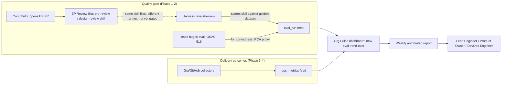

# Agentic SDLC Measurement

## Summary

Build a phased measurement framework that scores the quality of AI-agent-driven planning and bug-fix work using a human-calibrated eval harness, then surfaces operational trends (MTTR, velocity) through the team's existing dashboard rather than a new one. See [PRD](prd.md) for detailed requirements.

## Motivation

The team has no dedicated way to tell whether AI-agent-driven bug-fix and feature-development work is actually working. The only existing signal — the FTPR (first-time-pass-rate) dashboard in UOI (Konflux DevLake) — predates the agentic effort and measures CI pass rate on first commit across all merged PRs; it does not isolate agent-driven work, and it says nothing about whether an agent's *reasoning* (a PRD, a design, a root-cause diagnosis) was sound before code was ever written.

Industry treats this as two distinct measurement layers: **quality gates** (does agent/skill output pass a rubric before merge — a regression suite against a golden dataset) and **delivery outcomes** (lead time, MTTR, velocity — DORA-style telemetry, optionally segmented by AI vs. human authorship). This design addresses the quality-gate layer first, then extends into delivery outcomes once the gate is proven — the same sequencing DORA's 2025–2026 generative-AI research recommends (baseline before claiming ROI) and the same order Eran Cohen specified for this Feature.

A production consumer of this same quality-gate layer already exists: the EP Review Bot ([OSAC-1773](https://redhat.atlassian.net/browse/OSAC-1773)) runs on every `enhancement-proposals` pull request and posts `prd-review`/`design-review` scores live. As of `enhancement-proposals` commit `c6df563` (OSAC-2815, merged 2026-07-16), the bot clones this workspace and runs the *same* `skills/prd-review/SKILL.md` / `skills/design-review/SKILL.md` files this harness grades — they are not independently-maintained prompts. That convergence changes what this design needs to justify: the harness is not a second implementation of the bot's logic, it is the accuracy backstop the bot itself lacks. The bot only performs inference — it runs the skill and posts whatever it outputs, with no check against a human-validated baseline. Nothing about the bot's own pipeline calibrates its verdicts against what a human reviewer would have said; that calibration is this harness's entire purpose.

Four industry-standard components make up a production LLM/agent eval harness: a golden dataset, multi-layer scorers (deterministic + LLM-as-judge), a runner, and a required CI gate. This design delivers the first three now; the fourth — a blocking CI gate — is explicitly deferred pending [OSAC-3010](https://redhat.atlassian.net/browse/OSAC-3010)'s decision on local vs. remote (Harbor/EvalHub) execution, since gating a merge on a check that has no secrets-management or cost story yet would be premature.

### Goals

- Adopt `agent-eval-harness`'s native case/judge patterns (`check` and LLM `prompt` judges, `thresholds`) for planning-phase review evals instead of building a parallel custom scoring engine. [Codebase: `AUDIT.md` §1, §"Recommended Plan Revisions"]
- Establish a judge-model policy for LLM-as-judge scoring that is validated against human-authored reference cases, with model-family separation as a low-cost supplementary hedge. [PRD: In Scope — judge-model policy] [Locked: D7]
- Extend the existing Org Pulse dashboard and `org-pulse-data` pipelines with new eval/ops trend data rather than building a parallel dashboard or a duplicate Jira/GitHub fetcher. [PRD: Dependencies — Org Pulse] [Locked: D4]
- Ingest the external bugfix-evaluation harness's (OSAC-516) output for RCA-accuracy and bug-fix-outcome data rather than reimplementing bug-fix evaluation inside this workspace. [PRD: Dependencies — bugfix harness]
- Land the required, blocking CI gate as the harness's fourth standard component once OSAC-3010 resolves the execution-mode question — not as an indefinitely-deferred nice-to-have.

### Non-Goals

- Replacing the existing FTPR/UOI dashboard — this framework extends visibility into agent-specific quality signals; FTPR remains the CI-pass-rate baseline it already is. [PRD: Assumptions]
- Building a standalone bug-fix evaluation harness — OSAC-516/`osac-bugfix-eval` already does this; this design only ingests its output. [Codebase: `AUDIT.md` §2]
- Custom fine-tuning of the skill or judge LLMs.
- Code quality metrics (test coverage, cyclomatic complexity), OSAC Tenant User productivity tracking, and tenant/production AI-usage cost analysis — all explicitly out of scope per the PRD. [PRD: Out of Scope]

## Proposal

The framework has four workspace-native pieces: (1) `evals/review/` — harness-driven regression evals for the `prd-review`/`design-review` skills against a human-curated golden dataset; (2) an ingestion adapter that folds OSAC-516's bug-fix eval output into a common report schema; (3) a Jira/GitHub data-collection layer producing operational metrics (MTTR, velocity) into that same schema; (4) an extension to the existing Org Pulse dashboard and a new weekly reporting pipeline that reads from both schemas. Phasing detail is in Implementation Details/Notes/Constraints.



The diagram separates the two measurement layers from Motivation and shows where they merge: the harness and the external bugfix-eval both write into a single `eval_run`-shaped feed; Jira/GitHub collection writes into a separate `ops_metrics`-shaped feed; Org Pulse and the weekly report are the only consumers of either feed, so no new dashboard surface is created. The dotted line from the EP Review Bot to the harness marks the relationship established in Motivation — same skill source, independent execution, not yet reconciled by a CI gate.

### Workflow Description

Actors: **Contributor** (opens a PRD/EP pull request), **EP Review Bot** (automated, runs in `enhancement-proposals` CI), **Harness** (automated, runs locally or in CI on `osac-workspace`), **Lead Engineer / Product Owner / DevOps Engineer** (consume aggregated trend output — the PRD's personas). [PRD: User Stories]

1. A contributor opens a pull request against `enhancement-proposals` containing `prd.md` and/or `design.md`.
2. The EP Review Bot clones `osac-workspace`, runs `skills/prd-review` and/or `skills/design-review` against the changed file(s), and posts a scored comment on the PR. This happens today, independent of this design.
3. Separately, an engineer runs the harness (`evals/review/run-eval.sh`, or the future `evals/run-all.sh`) against the golden dataset in `evals/review/cases/`. The harness executes the same skill files, scores output against `reference-review.md` + `annotations.yaml` per case via `check` and LLM `prompt` judges, and writes a report.
4. If a judge or case fails, the engineer inspects `evals/review/results/` and either fixes a regression in the skill or updates the case/rubric if the skill's new behavior is correct.
5. Once OSAC-3010 resolves the execution-mode question, step 3 becomes a required CI check: a PR that touches `skills/prd-review`, `skills/design-review`, `evals/review/`, or `.design/context/` must pass the harness before merge.
6. In parallel, Jira/GitHub collectors (Phase 3) populate `ops_metrics`; the bugfix-eval adapter (Phase 2) populates `eval_run` from OSAC-516's output.
7. Org Pulse ingests both feeds and renders new trend tabs; the weekly reporting pipeline (Phase 4) reads the same feeds and produces the automated report the PRD's DevOps Engineer and Lead Engineer personas consume.

**Error handling variant — harness run fails mid-execution (e.g., LLM API timeout):** the run exits non-zero, no report is written, and the previous baseline in `evals/review/results/baseline/` remains the last-known-good comparison point; nothing overwrites it. See Failure Handling and Recovery.

**Error handling variant — EP Review Bot and harness disagree on the same PR:** both are visible independently (bot comment on the PR; harness result in `evals/review/results/`); this design does not auto-reconcile them. A periodic comparison check is proposed as an Open Question below, not built in Phase 1.

### API Extensions

None. This design adds no CRDs, gRPC services, REST endpoints, webhooks, or finalizers to `fulfillment-service` or `osac-operator`. All new surfaces are workspace-native files (YAML eval configs, shell scripts, schema definitions in `evals/lib/`) and additive fields in the existing `org-pulse-data` pipeline. There is no OSAC public/private API surface to extend.

### Implementation Details/Notes/Constraints

**Architecture.** Planning-phase evals live in `evals/review/` inside `osac-workspace` — workspace-native, not a bootstrapped component repo. They run from the workspace root and consume skills and `.design/context/` already present here, plus `enhancement-proposals/` via `./bootstrap.sh`.

```text
osac-workspace/
  evals/
    README.md                 # prerequisites, how to run all eval types
    review/                    # Phase 1 - planning-phase review evals
      eval-prd-review.yaml
      eval-design-review.yaml
      run-eval.sh
      harness.lock              # pins agent-eval-harness v1.22.0
      cases/
        prd/*/
        design/*/
      docs/                     # measurement-taxonomy.md, case-schema.md
      lib/                      # case validation, report aggregation (thin, not a scoring engine)
      results/                  # run output; baseline/ committed, others gitignored
    run-all.sh                  # Phase 2 - orchestrates review + external bugfix eval
  .claude/skills/prd-review/    # harness invokes these directly (already in workspace)
  .claude/skills/design-review/
  enhancement-proposals/        # bootstrapped; source of reference case documents
```

Case/judge patterns are adopted from `agent-eval-harness` (https://github.com/opendatahub-io/agent-eval-harness) and from the sibling `osac-bugfix-eval` harness, without mirroring bugfix's `deps/`, `workspace-template/`, or per-case repo SHA pinning — review evals are read-only document exercises with no external repo state to pin.

**Scoring model.** `prd-review`: 0–2 per dimension, `/10` total, PASS ≥7 with no zero on any dimension. `design-review`: 0–2 per dimension, `/8` total, PASS ≥5 with no zero on any dimension. Primary scoring is harness-native judges declared in `eval-prd-review.yaml`/`eval-design-review.yaml`:

```yaml
judges:
  - name: rubric_scoring          # deterministic check judge; regex-parses the skill's own rubric table
  - name: critical_findings_recall # deterministic check judge; fuzzy-matches annotated critical findings
  - name: qualitative_finding_quality # LLM prompt judge; only judge affected by model-family choice
thresholds:
  rubric_scoring: { min_pass_rate: 1.0 }
  critical_findings_recall: { min_pass_rate: 1.0 }
  qualitative_finding_quality: { min_mean: 3.5 }
```

Pass criteria include the skill's own zero-dimension auto-fail rule, not a looser tolerance — an eval that is more forgiving than the production skill would validate the wrong thing. Optional thin Python in `evals/review/lib/` exists for case validation and report merging only, never as a second scoring path.

**Output capture.** Review skills emit structured markdown to `artifacts/review-output.md` via skill execution arguments. Harness `outputs.path` must target the containing directory (`artifacts`), not the file itself — pointing `outputs.path` at a file silently prevented judges from reading the skill's own output (a bug in the pinned harness v1.22.0, fixed during OSAC-2264's implementation). Judges score the collected `review-output.md` directly, without parsing chat stdout.

**Judge-model policy (detail).** `eval-prd-review.yaml` and `eval-design-review.yaml` currently pin `models.skill: opus-4.6` and `models.judge: opus-4.6` — the same model family grades its own output for `qualitative_finding_quality` only; `rubric_scoring` and `critical_findings_recall` are deterministic regex judges unaffected by model choice either way. The published evidence for self-preference bias (Zheng et al.; Panickssery et al.) is strongest for *pairwise* comparison judging; this judge instead scores a single output against a fixed human reference on an absolute scale, where the more plausible transfer risk is *style-familiarity* bias — rewarding AI-typical structure over the human reference's style, which could skew a score in either direction, not just inflate it. This is treated as a real but likely smaller-magnitude risk than the classic pairwise-study findings, and — per the PRD's trust requirement — is addressed two ways: (1) calibration against the human-authored cases OSAC-2265/OSAC-2267 curate, which validates any judge model by checking agreement with human verdicts directly; (2) restoring a per-judge model override so `qualitative_finding_quality` uses a different model family (e.g., `claude-sonnet-4-6`) than the skill under test — a mechanism (`_resolve_judge_model()`'s per-judge override precedence) already implemented in the harness and previously exercised in this file's history before being lost in a rebase onto a "team default" model pin. Restoring it is a one-line config change, not new engineering; see Open Questions for sequencing.

**Phasing.**

| Phase | Deliverable | Location |
|---|---|---|
| 1 | PRD + design review eval harness, baseline report | `evals/review/` |
| 2 | Unified reporting with `osac-bugfix-eval` | `evals/run-all.sh` + adapter, `evals/lib/unified-report.schema.yaml` (`feed_type: eval_run`) |
| 3 | Jira + GitHub operational metrics | Extend `org-pulse-data` pipelines; `evals/lib/ops-metrics-feed.schema.yaml` (`feed_type: ops_metrics`) |
| 4 | Org Pulse trends + weekly reports | Coordinate with OSAC-2004 via OSAC-2518 |

The Phase 4 weekly report is a purpose-built pipeline reading the `eval_run`/`ops_metrics` feeds above — distinct from the workspace's unrelated `generate-status-report` skill, which produces a personal 1:1 activity digest from an individual's own PRs/Jira, not agent-performance-trend reporting. [Clarify: R1.Q5] [Locked: D5]

**Dependency detail beyond what's in the PRD:** OSAC-2007 (EP Review Data Pipeline) already dashboards the EP Review Bot's scores in Org Pulse today — Phase 4 must define the *delta* against that existing pipeline, not duplicate it. `osac-bugfix-eval` lives on a personal fork (`eranco74`) with no organizational backup and no commits since 2026-06-03; Epic 2's adapter work should include a liveness check before hard-wiring to it.

### Security Considerations

The harness sends EP document content (PRD/design markdown, which may reference internal architecture and Jira ticket details) to an external LLM API (`opus-4.6`/`claude-sonnet-4-6` via the configured provider) as part of both the skill-under-test execution and the LLM `prompt` judge. This is the same data-exposure profile the EP Review Bot already has in production today — no new exposure is introduced, but it is worth stating explicitly since a naive reading of "internal tooling" might assume no external data leaves the workspace. No credentials, secrets, or tenant data pass through this path; the documents under review are the same PRDs/EPs already merged or under PR review in a repo the LLM provider's contract already covers for the bot.

`permissions.deny` in `eval-prd-review.yaml`/`eval-design-review.yaml` blocks the skill under test from making live calls to Jira or GitHub MCP tools during an eval run — the skill only ever sees the case's local input files, preventing an eval run from accidentally mutating a real Jira ticket or GitHub PR, or having its score depend on live external state that could change between runs.

No new authentication or authorization model is introduced. This framework does not touch OSAC's tenant-isolation model (`osac.openshift.io/tenant`, `osac.openshift.io/owner-reference`) because it produces no tenant-facing resources — see RBAC / Tenancy below.

### Failure Handling and Recovery

| Failure mode | What happens | Recovery | User-visible effect |
|---|---|---|---|
| LLM API call fails/times out (skill execution or judge) | Harness run exits non-zero for that case | Re-run the case; no partial report is written | Engineer sees a failed run, not a silently-wrong score |
| Harness process crashes mid-suite | No results file for the interrupted run | Previous `results/baseline/` remains the comparison point; re-run from scratch (runs are not resumable mid-suite) | Baseline is never overwritten by a partial run |
| A judge's deterministic `check` throws (e.g., malformed rubric table in skill output) | That case fails `rubric_scoring` | Treated as a genuine regression — the skill's own output format broke, not the harness | Engineer investigates the skill, not the harness |
| `osac-bugfix-eval` fork becomes unreachable (Phase 2) | Adapter ingestion fails at fetch time | Falls back to the last successfully ingested `summary.yaml`; does not block Phase 1 harness runs, which are independent | Bug-fix trend data goes stale until the fork is reachable again or migrated |
| Org Pulse ingestion pipeline fails (Phase 3–4) | New eval/ops trend tabs show stale data | Existing Org Pulse alerting/on-call for pipeline failures applies unchanged — this design adds no new pipeline infrastructure, only new fields into the existing one | Dashboard viewers see a stale-data indicator already produced by Org Pulse's existing mechanism |
| CI gate (once built per OSAC-3010) fails on a legitimate skill improvement that the golden dataset hasn't caught up to | PR is blocked | Reviewer override with justification, then a follow-up case/rubric update — matches the "override requires reviewer approval" pattern used by production regression-suite CI gates elsewhere | Contributor sees a blocked PR with a specific failing case, not a silent merge |

There is no idempotency concern for read-only review evals — re-running the same case against the same skill/model version produces an independent, non-mutating scoring attempt each time; there is no shared mutable state to corrupt on retry.

### RBAC / Tenancy

No RBAC or tenancy changes. This feature produces no new OSAC resources (CRDs, gRPC-managed objects) and has no tenant-observable behavior — confirmed during PRD clarification: its consumers are internal engineering roles (Lead Engineer, Product Owner, DevOps Engineer), not OSAC's tenant-facing personas. [Locked: D1] No `osac.openshift.io/tenant` or `osac.openshift.io/owner-reference` annotations apply because there is no tenant-scoped resource to annotate.

### Observability and Monitoring

New signals, all delivered via the `eval_run`/`ops_metrics` feeds into Org Pulse rather than a new metrics backend:

- **Eval pass rate** (per skill, per case, trended over time) — a sustained drop below the harness's per-judge thresholds (`rubric_scoring`/`critical_findings_recall` at `min_pass_rate: 1.0`, `qualitative_finding_quality` at `min_mean: 3.5`) indicates a skill or rubric regression.
- **Per-run cost telemetry** for eval/CI-review invocations (what a harness run or EP Review Bot invocation costs) — a distinct observability signal from AI-usage billing, added per PRD clarification. [PRD: In Scope] [Locked: D3] A sustained per-run cost increase with no corresponding scope change indicates a prompt/model regression worth investigating.
- **MTTR trend** (Phase 3) — agent MTTR defined as time from a bug's "New" state to its first autofix PR; a flattening or worsening trend after an agent-workflow change indicates the change didn't help.
- **Velocity trend** (Phase 3) — feature development throughput with agent assistance; a large unexplained swing in either direction warrants investigation before being reported to leadership.

If no new observability changes were needed, this section would state that plainly — that is not the case here; these are genuinely new signals layered onto existing pipelines.

### Risks and Mitigations

| Risk | Severity | Mitigation |
|---|---|---|
| No CI gate exists yet — the fourth standard eval-harness component (golden dataset, scorers, and runner are built; the blocking gate is not) | High | Tracked explicitly on OSAC-3010; not silently deferred. The gap is about OSAC's own secrets/cost/ownership policy, not tool readiness — Harbor and EvalHub runners are both fully shipped upstream (`agent_eval/harbor/`, `agent_eval/evalhub/adapter.py`, per-step MLflow tracing since v1.18.0) as of the pinned v1.22.0 checkout. |
| Style-familiarity bias in the one LLM `prompt` judge (`qualitative_finding_quality`) from same-model-family grading | Medium | Human-case calibration (OSAC-2265/OSAC-2267) validates the judge regardless of model; per-judge model-override restoration is a cheap supplementary hedge already mechanically available. Only this one judge is affected — the two deterministic `check` judges are immune by construction. |
| `osac-bugfix-eval` (Phase 2 dependency) lives on a personal fork with no organizational backup and no commits since 2026-06-03 | Medium | Liveness/portability check before Epic 2's adapter hard-wires to it; consider migrating under the `osac-project` org before Phase 2 implementation. |
| Org Pulse / `org-pulse-data` (Phase 3–4) and OSAC-2007 (EP Review Data Pipeline) already own adjacent surface area | Medium | OSAC-2518 coordination task runs a gap review before Epic 3–4 implementation coding, so new work is additive (new fields/tabs), not duplicate fetchers or a parallel dashboard. |
| Program-level alignment (phased E2E, indirect RCA accuracy, Epic 3–4 prioritization) was communicated but not yet confirmed by the feature's original requester | Low (process, not technical) | Tracked as a PRD Dependency, not silently assumed; work on Epic 1–2 is not blocked on it per Eran Cohen's own "not blocking" framing, but Epic 3–4 investment should pause for a reply if one hasn't arrived by then. |

### Drawbacks

This adds a second automated review pipeline (the harness) alongside one that already exists in production (the EP Review Bot), running the same skill files through two different execution stacks (`agent-eval-harness`/Claude Code locally vs. `agentic_ci`/GCP Vertex AI in the bot). A reasonable objection is: if the bot already scores every PR, why maintain a second harness at all?

The answer is that the bot and the harness answer different questions. The bot answers "what does the skill say about this specific PR, right now" — useful for the contributor, but it has no way to know if that score is *correct*. The harness answers "does the skill's scoring behavior match a human reviewer's judgment on cases we know the right answer to" — the only one of the two that can catch a skill regression before it ships to production and starts scoring real PRs incorrectly. Removing the harness would mean shipping skill/rubric changes with no regression signal at all until a human notices the bot behaving oddly on a real PR.

The ongoing cost is real: two YAML configs to keep in sync with the skill's rubric, a golden dataset that needs curation and occasional refresh, and LLM API cost for every harness run in addition to every bot run. This is accepted as proportionate to the risk of an unnoticed scoring regression reaching every future EP review.

## Alternatives (Not Implemented)

**Custom `scorer.py` instead of harness-native judges.** An earlier iteration of this plan proposed a bespoke Python scorer with ±1 tolerance on the total rubric score. Rejected: `agent-eval-harness` already provides `check` and LLM `prompt` judges with per-judge thresholds, and a custom scorer would duplicate that logic while also being looser than the skill's own zero-dimension auto-fail rule — validating a different, weaker contract than the one actually shipping to production. [Codebase: `AUDIT.md` §1, Risk R4]

**Measuring the EP Review Bot's live output directly instead of a local skill harness.** Would eliminate the "two pipelines" drawback above. Rejected for Phase 1: the bot has no human-validated baseline to compare against — it would let a regression in the bot's rubric interpretation go undetected indefinitely, since there'd be nothing accurate to detect it against. A periodic comparison between bot output and harness verdicts on the same PR (now that same-skill-source is confirmed) is a cheaper follow-on, not a Phase 1 substitute — see Open Questions.

**A new standalone dashboard instead of extending Org Pulse.** Rejected: Org Pulse (OSAC-2004) and OSAC-2007 already dashboard adjacent data (EP Review Bot scores, GitLab-sourced `org-pulse-data`); a new dashboard would duplicate infrastructure and fragment where engineers look for agent-SDLC health. [PRD: Dependencies — Org Pulse] [Locked: D4]

**Remote Harbor/EvalHub execution now, instead of deferring to OSAC-3010.** Both runners are mature upstream — this was verified directly against the pinned checkout, not assumed from documentation. Rejected for this design regardless: the open question isn't whether the tooling works, it's whether OSAC wants to manage the secrets, cost, and ownership model remote execution implies. That is a decision for OSAC-3010 to make deliberately, not a default this design should preempt.

**Switching the judge model now instead of calibration-first.** Immediately changing `models.judge` to a different family would remove the same-model-family concern outright. Rejected as the *first* move: a judge's trustworthiness comes from tracking human verdicts on calibration cases, not from which model it is — switching models without that calibration step would trade a known, bounded risk (style-familiarity bias on one judge) for an unknown one (an uncalibrated different-model judge). The model-override restoration is sequenced as a supplementary hedge after calibration exists, not a replacement for it.

## Open Questions

### 1. Restore per-judge model override before or after the Phase 1 baseline run?

The mechanism to run `qualitative_finding_quality` on a different model family than the skill under test (e.g., `claude-sonnet-4-6` judging `opus-4.6`) already exists and was previously in use before an incidental rebase onto a team-default model pin removed it. Should this be restored before OSAC-2265/OSAC-2267's human-case calibration baseline runs (so the baseline reflects the intended final config), or is restoring it a follow-up once calibration itself is proven, since calibration — not model separation — is the primary trust mechanism?

- **Owner:** AI SDLC engineering (harness maintainers)
- **Impact:** Determines whether the Phase 1 baseline report needs to be re-run after this change, or whether it can be applied without invalidating the baseline.

### 2. What CI trigger scope enforces the blocking gate once OSAC-3010 resolves execution mode?

Once local vs. Harbor/EvalHub is decided, the required check still needs a defined trigger scope — e.g., any PR touching `skills/prd-review/`, `skills/design-review/`, `evals/review/`, or `.design/context/` — and a defined override path for a reviewer to bypass a known-stale golden case.

- **Owner:** Owner of the OSAC-3010 decision
- **Impact:** Determines whether this design's CI-gate goal can close immediately after OSAC-3010 resolves, or needs its own follow-up story.

### 3. Should a periodic EP-Review-Bot-vs-harness comparison be built, and if so, in which phase?

Now that the bot and harness are confirmed to share skill source, a low-cost check that the bot's live-posted verdicts agree with the harness's golden-case verdicts on the same document would catch execution-stack drift (`agentic_ci`/Vertex AI vs. `agent-eval-harness`/Claude Code) that same-skill-source alone doesn't rule out. This was explicitly out of scope for Phase 1 in Motivation, but Phase 2's unified reporting work is a natural place to reconsider it.

- **Owner:** To be determined — likely whoever owns Phase 2 planning
- **Impact:** If built, adds a small recurring comparison job; if not, execution-stack drift between bot and harness remains undetected until a human notices a discrepancy.

## Test Plan

### Unit Tests

- Case validation in `evals/review/lib/` rejects a case missing `reference-review.md` or `annotations.yaml`.
- `unified-report.schema.yaml` and `ops-metrics-feed.schema.yaml` validation rejects a feed record missing a required `feed_type` value.

### Integration Tests

- `evals/review/run-eval.sh --skip-execute --skip-score` (the current CI smoke check) exercises harness setup and case discovery without incurring LLM cost — validates the plumbing without validating scoring accuracy.
- A full local run against the golden dataset in `evals/review/cases/` validates that every judge (`rubric_scoring`, `critical_findings_recall`, `qualitative_finding_quality`) produces a score and that thresholds are evaluated correctly against known-good and known-bad fixture cases.
- Phase 2: the bugfix-eval adapter correctly maps a sample `osac-bugfix-eval` `summary.yaml` into the `eval_run` schema, including a case where the external fork is unreachable (falls back to last-ingested data, per Failure Handling).

### E2E Tests

- Full baseline run: harness scores all curated PRD and design golden cases and produces a report matching expected pass/fail verdicts for each case, including at least one deliberately-failing case per skill to prove the zero-dimension auto-fail rule is enforced, not just the total-score threshold.
- Phase 3–4: a synthetic Jira/GitHub dataset flows through the operational-metrics collector into `ops_metrics`, and the resulting Org Pulse trend tab renders the expected MTTR/velocity values — proving the full pipeline, not just the collector in isolation.

CI scope for all of the above remains unit tests only until OSAC-3010 resolves; full LLM eval runs stay local/manual until a CI gate exists.

## Graduation Criteria

This is workspace-internal tooling, not a component targeting an OpenShift release train, so `alpha`/`beta`/`GA` maturity levels don't apply. The four delivery phases already defined (Phase 1: eval harness; Phase 2: unified bugfix-eval reporting; Phase 3: operational metrics; Phase 4: Org Pulse trends + weekly reports) are the graduation stages. A phase is complete when its Definition-of-Done items (tracked per-Epic in Jira under OSAC-959) are met and, for Phase 1–2, the eval harness golden dataset and baseline report exist and are reproducible.

## Upgrade / Downgrade Strategy

Not applicable. There is no running service, CRD, or persistent cluster state introduced by this design — `evals/review/` is a set of files invoked on demand, and the Org Pulse extension adds fields to an existing pipeline rather than introducing a new one. "Downgrading" is deleting the added files and feed fields; nothing depends on them existing for correctness of any other OSAC component.

## Version Skew Strategy

Largely not applicable — there is no multi-component cluster rollout to skew. The one real version-coupling concern is between the pinned harness version (`evals/review/harness.lock` → `v1.22.0`), the skill files it invokes (`skills/prd-review`, `skills/design-review`), and the golden dataset's `rubric_version` annotation: if the skill's rubric changes without a corresponding case/annotation update, the harness will score against a stale expectation. This is mitigated by versioning the rubric alongside the dataset (`rubric_version` in case annotations) rather than by any runtime skew-handling logic.

## Support Procedures

**Detecting failure:** a failed harness run exits non-zero and leaves no new report in `evals/review/results/`; the previous baseline remains visible for comparison. Once a CI gate exists (post-OSAC-3010), a failing PR check with the specific failing case name is the detection signal.

**Disabling:** today, the harness is not a blocking gate (`evals-review-smoke.yml` is `workflow_dispatch`-only and skips execution via `--skip-execute --skip-score`), so there is nothing to disable in an emergency — the review pipeline (bot on PRs) is unaffected either way. Once a CI gate exists, disabling means removing the required-check designation on the relevant branch protection rule; this has no consequence on cluster health or any running workload, since nothing in production depends on the gate's presence — only on merges being blocked or not.

**Recovery:** re-enabling the gate (or fixing a broken harness run) requires no data migration or consistency repair — evals are stateless, read-only document exercises with no mutable external state to reconcile.

## Infrastructure Needed

None. This design reuses `osac-workspace`'s existing repo, existing GitHub Actions CI, and the existing Org Pulse / `org-pulse-data` pipeline. No new subproject, repository, or testing infrastructure is requested.

---

## Provenance

Authored: draft @ design 0.4.0 - 7b6dfe0, workspace OSAC-2264-review-harness-judges @ 6f530dcb
Phases: revise, revise, draft

<!-- ai-workflow-provenance:{"schema_version":1,"provenance_kind":"session","workflow":"design","workflow_version":"0.4.0","ai_workflows":"7b6dfe0","source_repo":"6f530dcb","source_repo_branch":"OSAC-2264-review-harness-judges","commits_behind_main":0,"commits_ahead_main":6,"main_ref":"main","phases":["revise","revise","draft"],"authoring_modes":["skill"],"context_changed":false} -->
