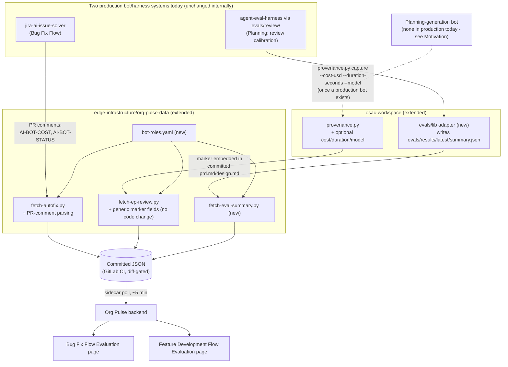
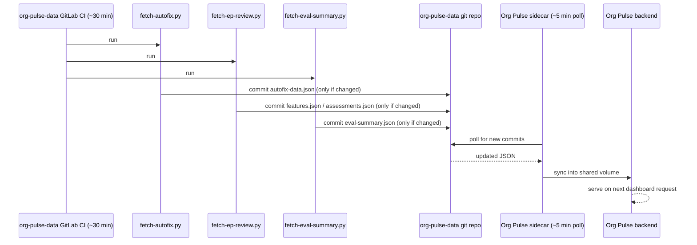
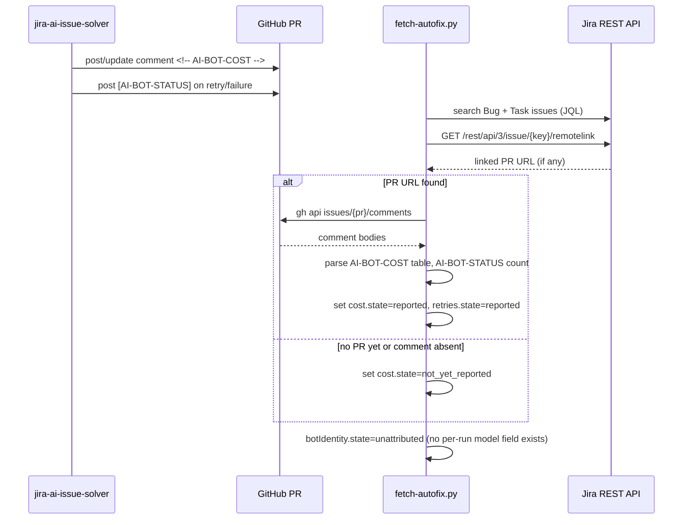
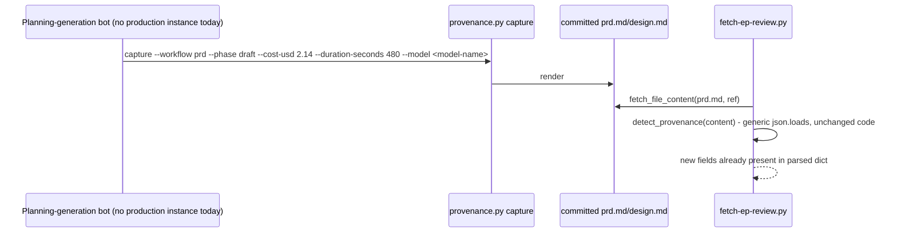
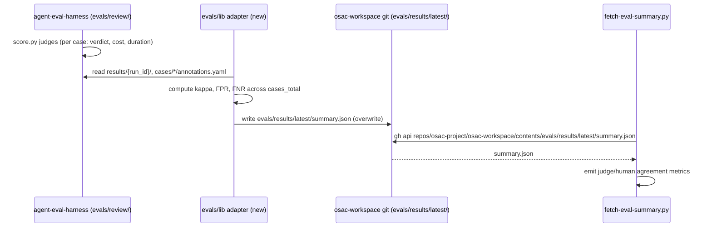

# Agentic SDLC Evaluation Framework

## Summary

This design extends OSAC's existing Org Pulse data pipeline (`edge-infrastructure/org-pulse-data`) and its two production fetchers, plus the workspace's shared provenance-marker library and the `evals/` eval-harness scaffolding, so that four bot roles — Bug Fix Flow, Planning-generation, Planning-review, and Implementation — each emit cost, identity, reliability, and (for the review role) judge-agreement data through mechanisms those systems already use today. A new declarative role-scope config and two Org Pulse dashboard pages consume that data. No new service, database, or push endpoint is introduced. See [PRD](prd.md) for detailed requirements.

## Motivation

OSAC runs two production bot/harness systems relevant to this Feature: `jira-ai-issue-solver` (a Go binary running in Kubernetes Jobs, state held in Jira/GitHub, no database) for Bug Fix Flow, and `agent-eval-harness` (a Python scoring harness invoked via a script chain) for Planning-review calibration. Each already externalizes some of what this Feature needs — `jira-ai-issue-solver` posts structured `<!-- AI-BOT-COST -->` and `[AI-BOT-STATUS]` PR comments today; `evals/lib/unified-report.schema.yaml` already reserves a `feed_type: eval_run` discriminator explicitly for Org Pulse ingestion. Neither emits everything this Feature needs, and no existing system aggregates them into role-comparable metrics.

No production Planning-generation bot exists today. OSAC-3168 (`prd-creator`/`design-creator`) is a real, tracked Jira epic, but its current implementation, `eranco74/ai-skills`, is a personal proof-of-concept/research repo — not a deployed OSAC system. This design does not treat it as something to extend or as a dependency to sequence against. It is useful only as directional evidence that the shared `ai-workflows` `provenance.py` marker mechanism this design already extends for `[Locked: D1]` is a viable integration point for this role too, since the PoC already calls that same shared script for its own publish step. Whatever bot eventually becomes OSAC's production Planning-generation system is the one this design's plumbing is built ahead of, not `eranco74/ai-skills` specifically.

The implementation challenge is therefore not building new instrumentation infrastructure — `org-pulse-data`'s existing scheduled-fetch/sidecar-poll pipeline already does that job for two other OSAC dashboards — but bridging heterogeneous, already-live emission mechanisms into one comparable data model without introducing a new one, while also building ahead of need for the two roles that have no production bot at all. Direct inspection of the live pipeline during design research confirmed the per-role starting points are asymmetric: Bug Fix Flow already emits cost and retry data externally (only bot identity is missing); Planning-generation has no production bot to emit anything (see above); Planning-review's calibration mechanics (harness judges, golden-set cases) are themselves still unconfigured (`judges: TBD` in both eval YAMLs; `cases/{prd,design}/` are empty placeholders). This design treats that asymmetry explicitly rather than proposing one uniform "add a field" plan across roles that are, in reality, at very different starting points.

A live `jira` CLI query run during this design (2026-07-30) also found zero Jira Task-type issues carrying a bot-processing label or bot assignee — the PRD's fourth role group, Implementation-stage, has no confirmed bot in production today either. This design still builds that role group's plumbing (Non-Goals does not exclude it), so it is ready the moment a bot starts processing Tasks, but its dashboard section starts in the "building baseline" state with zero attributed bots, which is a correct outcome under `[Locked: D3]`, not a gap in this design. Planning-generation is in the same position for a different reason (see above) — two of this design's four role groups start with zero attributed production bots, which `[Locked: D3]`'s explicit-state design was built to handle from day one, not as an afterthought.

### Goals

1. Extend, never replace, `org-pulse-data`'s two production fetchers (`fetch-ep-review.py`, `fetch-autofix.py`) and the shared `ai-workflows` `provenance.py` marker schema — no new ingestion service, push endpoint, or database. `[Locked: D1]`
2. Reuse the GitHub PR-comment-scraping pattern already proven in `fetch-ep-review.py` (`fetch_remote_links` → `filter_ep_prs` → `gh api` comment fetch) for `fetch-autofix.py`, rather than inventing a second Jira-to-GitHub correlation mechanism. `[Codebase: edge-infrastructure/org-pulse-data/fetch-ep-review.py]`
3. Treat `evals/lib/unified-report.schema.yaml` — already tagged `feed_type: eval_run` for Org Pulse ingestion — as the canonical Planning-review data contract, extending it additively rather than inventing a parallel schema. `[Codebase: evals/lib/unified-report.schema.yaml]`
4. Represent every missing-data case as an explicit state value at the fetcher-output layer, not as null or zero, so the frontend renders `[Locked: D3]`/`[Locked: D8]` without per-page special-casing.
5. Make bot-role-scope membership (which bot feeds which of the four selector groups) data, not code, so adding a fifth bot to an existing role — or a bot that starts filling the empty Implementation-stage role — requires a config change, not a dashboard-page code change.

### Non-Goals

- Rebuilding, forking, or modifying the internal logic of `jira-ai-issue-solver` or `agent-eval-harness` — this design specifies what each must additionally emit and where `org-pulse-data` reads it, not how those systems otherwise work. (No production Planning-generation bot exists to make an equivalent commitment about — see Motivation.)
- Populating the golden-set eval cases (10 PRD / 6 design) or configuring harness judges/thresholds — that is scope for the harness-judges/case-schema-definition and baseline-eval-run work tracked separately from this design (not cited by Jira number here, since the existing OSAC-959 Jira tree is expected to be replaced once this design is decomposed — see Open Questions). This design specifies the data contract those efforts must emit into so Planning-review's Key Metrics have somewhere to land once they exist.
- Real-time or webhook-driven updates — inherits the existing ~30-minute fetch cadence and ~5-minute sidecar-poll cadence as-is. `[Locked: D5]`
- A new database or persistent store beyond `org-pulse-data`'s existing JSON-committed-to-git pattern.
- Inventory, Provisioning, Networking, and Storage backend changes — not applicable; this Feature has no infrastructure-provisioning surface. Tenant Onboarding is likewise not applicable (see RBAC / Tenancy).

## Terminology

- **Bot role** — one of the four groups this design tracks separately: `bug_fix_flow` (`jira-ai-issue-solver`), `planning_generation` (no production bot today — see Motivation), `planning_review` (EP Review Bot via `agent-eval-harness`), and `implementation` (code-stage bot; currently unattributed — see Motivation).
- **Bot Metric Record** — the canonical per-record shape every extended fetcher emits (see Implementation Details), grouping fields by concern: `botIdentity`, `cost`, `reliability`, `ci`, `judgeAgreement`, `continuousImprovement`.
- **`state`** — a per-field-group status flag that is never absent, always one of: `reported` (real data present), `not_yet_reported` (upstream hasn't started emitting this yet), `unattributed` (identity-specific — the record exists but which bot/model produced it is unknown), or `building_baseline` (data exists but sample size is below the minimum for a reliable trend).

## Proposal

This design adds three fetcher-side extensions, one new shared config file, and two dashboard pages, all inside systems OSAC already operates:

1. **Bug Fix Flow extension** — `fetch-autofix.py` gains PR-comment reading (a capability it does not have today) to parse the cost/status comments `jira-ai-issue-solver` already posts.
2. **Planning-generation extension** — the shared `provenance.py` marker schema gains optional cost/duration/model fields; `fetch-ep-review.py`'s existing generic JSON parse of that marker picks them up with zero fetcher-code changes once a production Planning-generation bot starts emitting them. No such bot exists today (see Motivation) — this extension is plumbing built ahead of need, the same posture as the Implementation-stage role.
3. **Planning-review extension** — a new adapter script fills the currently-empty gap between `evals/review/`'s harness output and `evals/lib/unified-report.schema.yaml`'s already-reserved Org Pulse feed, computing judge/human agreement (Cohen's κ), false-pass/false-fail rate, and surfacing human-override rate (derivable today with zero new upstream emission).
4. **`bot-roles.yaml`** — a new declarative config in `org-pulse-data` mapping known bot identities to one of the four role-scope groups, read by all fetchers and re-exported as its own small JSON for the frontend selector.
5. **Two Org Pulse dashboard pages** — added as new tabs within the existing "AI Impact" module, not new platform modules, per `docs/MODULES.md`'s existing per-module data-route pattern.


```mermaid
flowchart TB
    subgraph Bots["Two production bot/harness systems today (unchanged internally)"]
        BF["jira-ai-issue-solver<br/>(Bug Fix Flow)"]
        RV["agent-eval-harness via evals/review/<br/>(Planning: review calibration)"]
    end

    PG["Planning-generation bot<br/>(none in production today - see Motivation)"]

    subgraph OPD["edge-infrastructure/org-pulse-data (extended)"]
        FA["fetch-autofix.py<br/>+ PR-comment parsing"]
        FE["fetch-ep-review.py<br/>+ generic marker fields (no code change)"]
        FS["fetch-eval-summary.py (new)"]
        BR["bot-roles.yaml (new)"]
    end

    subgraph WS["osac-workspace (extended)"]
        PV["provenance.py<br/>+ optional cost/duration/model"]
        AD["evals/lib adapter (new)<br/>writes evals/results/latest/summary.json"]
    end

    BF -->|"PR comments:<br/>AI-BOT-COST, AI-BOT-STATUS"| FA
    PG -.->|"provenance.py capture<br/>--cost-usd --duration-seconds --model<br/>(once a production bot exists)"| PV
    PV -->|"marker embedded in<br/>committed prd.md/design.md"| FE
    RV --> AD
    AD --> FS
    BR --> FA
    BR --> FE
    BR --> FS

    FA --> JSON[("Committed JSON<br/>(GitLab CI, diff-gated)")]
    FE --> JSON
    FS --> JSON

    JSON -->|"sidecar poll, ~5 min"| ORG["Org Pulse backend"]
    ORG --> P1["Bug Fix Flow Evaluation page"]
    ORG --> P2["Feature Development Flow Evaluation page"]
```

The diagram shows the full path from each bot/harness system to the two dashboard pages, including the Planning-generation path (dashed) this design builds ahead of there being a bot to use it. Nothing left of `org-pulse-data` changes its own architecture — `jira-ai-issue-solver` keeps posting the same comments, `agent-eval-harness` keeps running the same script chain, and whichever bot eventually fills the Planning-generation role only needs to start calling a shared script this workspace already owns. Everything this design adds sits in repos OSAC already owns and already schedules: `org-pulse-data`'s fetchers, this workspace's `provenance.py`/`evals/lib`, and Org Pulse's existing AI Impact module.

### Workflow Description

Actors: **Lead Engineer**, **Product Owner**, and **DevOps Engineer** (this Feature's personas per PRD Assumptions — none of OSAC's four tenant/provider personas apply, since nothing here is tenant-facing). The primary end-user workflow is viewing a dashboard; the more consequential workflows are the four scheduled data-ingestion paths that populate it.

#### Scheduled ingestion (unchanged cadence, extended content)


```mermaid
sequenceDiagram
    participant CI as org-pulse-data GitLab CI (~30 min)
    participant FA as fetch-autofix.py
    participant FE as fetch-ep-review.py
    participant FS as fetch-eval-summary.py
    participant GIT as org-pulse-data git repo
    participant SC as Org Pulse sidecar (~5 min poll)
    participant OP as Org Pulse backend

    CI->>FA: run
    CI->>FE: run
    CI->>FS: run
    FA->>GIT: commit autofix-data.json (only if changed)
    FE->>GIT: commit features.json / assessments.json (only if changed)
    FS->>GIT: commit eval-summary.json (only if changed)
    SC->>GIT: poll for new commits
    GIT-->>SC: updated JSON
    SC->>OP: sync into shared volume
    OP-->>OP: serve on next dashboard request
```

This is `org-pulse-data`'s existing scheduled-fetch + diff-gated-commit + sidecar-poll chain, unchanged in cadence or mechanism `[Locked: D5]`. `fetch-eval-summary.py` is the one net-new fetcher process; it runs alongside the two extended ones on the same schedule.

#### Bug Fix Flow: cost/retry/identity extraction


```mermaid
sequenceDiagram
    participant Bot as jira-ai-issue-solver
    participant PR as GitHub PR
    participant FA as fetch-autofix.py
    participant Jira as Jira REST API

    Bot->>PR: post/update comment <!-- AI-BOT-COST -->
    Bot->>PR: post [AI-BOT-STATUS] on retry/failure
    FA->>Jira: search Bug + Task issues (JQL)
    FA->>Jira: GET /rest/api/3/issue/{key}/remotelink
    Jira-->>FA: linked PR URL (if any)
    alt PR URL found
        FA->>PR: gh api issues/{pr}/comments
        PR-->>FA: comment bodies
        FA->>FA: parse AI-BOT-COST table, AI-BOT-STATUS count
        FA->>FA: set cost.state=reported, retries.state=reported
    else no PR yet or comment absent
        FA->>FA: set cost.state=not_yet_reported
    end
    FA->>FA: botIdentity.state=unattributed (no per-run model field exists)
```

`fetch-autofix.py` has no PR-awareness today — it only calls Jira's issue-search API. The extension adds the same `remotelink`-lookup pattern `fetch-ep-review.py` already uses (generalized to accept any repo, not just `enhancement-proposals`), then parses the same two comment markers `jira-ai-issue-solver` already posts. Bot identity stays `unattributed` until the upstream repo starts emitting it (see Implementation Details).

#### Planning-generation: provenance-marker extension


```mermaid
sequenceDiagram
    participant Skill as Planning-generation bot (no production instance today)
    participant PV as provenance.py capture
    participant Doc as committed prd.md/design.md
    participant FE as fetch-ep-review.py

    Skill->>PV: capture --workflow prd --phase draft --cost-usd 2.14 --duration-seconds 480 --model <model-name>
    PV->>Doc: render
    FE->>Doc: fetch_file_content(prd.md, ref)
    FE->>FE: detect_provenance(content) - generic json.loads, unchanged code
    FE-->>FE: new fields already present in parsed dict
```

`detect_provenance()` already does a generic `json.loads()` on the whole marker blob `[Codebase: fetch-ep-review.py:377-386]` — no fetcher code change is needed once the marker itself carries the new fields. The only real work is upstream: `provenance.py`'s `capture` subcommand gains three new optional flags, for whichever bot eventually becomes OSAC's production Planning-generation system to pass (see Motivation — none does today).

#### Planning-review: eval-summary extraction


```mermaid
sequenceDiagram
    participant Harness as agent-eval-harness (evals/review/)
    participant Adapter as evals/lib adapter (new)
    participant Repo as osac-workspace git (evals/results/latest/)
    participant FS as fetch-eval-summary.py

    Harness->>Harness: score.py judges (per case: verdict, cost, duration)
    Adapter->>Harness: read results/{run_id}/, cases/*/annotations.yaml
    Adapter->>Adapter: compute kappa, FPR, FNR across cases_total
    Adapter->>Repo: write evals/results/latest/summary.json (overwrite)
    FS->>Repo: gh api repos/osac-project/osac-workspace/contents/evals/results/latest/summary.json
    Repo-->>FS: summary.json
    FS->>FS: emit judge/human agreement metrics
```

This path has a real prerequisite gap: harness judges/thresholds (still `TBD` in both eval YAMLs) and populated golden cases (`cases/prd/`, `cases/design/` are currently empty placeholders) must land before κ/FPR/FNR have anything to compute from. This design defines the contract those efforts write into; it does not shortcut them (see Non-Goals).

#### DevOps Engineer viewing a dashboard

A DevOps Engineer opens the "Bug Fix Flow Evaluation" or "Feature Development Flow Evaluation" page in Org Pulse's AI Impact module, sees KPI tiles/trend/distribution for the role-scoped Bot/Model selector's current selection, and switches the dropdown to compare a different bot the same way they would change the time range — no new page or re-navigation, per the PRD's own framing. Missing-data states (`[Locked: D3]`) render distinctly per tile rather than as blank or zero, and bots without attributed identity appear under an explicit "unattributed" grouping (`[Locked: D8]`) rather than being hidden.

### API Extensions

This Feature introduces no gRPC service, no CRD, no webhook, and no finalizer — it touches no `fulfillment-service` or `osac-operator` surface. The only "API" affected is `org-pulse-core`'s pre-existing, incidental per-module `GET /api/modules/<slug>/data` route `[Locked: D2]`, which this design does not modify or depend on as a contract — it is a byproduct of adding data to a module that already exists on that platform. The actual extension surface is the **data contract** each of the three upstream systems must emit into, detailed in Implementation Details below.

## UX Alignment

No `osac-ux/libs/ui-components/src/api/v1/<resource>.ts` file exists for this Feature, and none is expected — this is an internal engineering dashboard consumed by OSAC's own team (Lead Engineer, Product Owner, DevOps Engineer), not a tenant-facing OSAC resource type with a corresponding proto/CRD. This section is not applicable.

## Implementation Details/Notes/Constraints

### Bot Metric Record (canonical shape)

Every extended fetcher emits records shaped around the same conceptual fields, so the frontend can render KPI tiles/trend/distribution identically across roles regardless of which fetcher produced the data. Each metric group carries its own `state` so partially-instrumented bots (the norm today, per Motivation) still render correctly:

| Field group | Fields | `state` values |
|---|---|---|
| `botIdentity` | `name`, `version`, `model` | `reported`, `unattributed` |
| `cost` | `totalUsd`, `modelSpendUsd`, `runtimeSpendUsd`, `retryReworkUsd`, `humanReviewMinutes` | `reported`, `not_yet_reported` |
| `reliability` | `attempts`, `successes`, `retryCount` | `reported`, `building_baseline` (below minimum sample size) |
| `ci` (Bug Fix Flow, Implementation only) | `firstTimePass`, `failureType` (`unit`\|`lint`\|`build`\|`integration`\|`none`) | `reported`, `not_yet_reported` |
| `judgeAgreement` (Planning-review only) | `kappa`, `falsePassRate`, `falseNegativeRate`, `nGoldenCases` | `reported`, `not_yet_reported` (harness/cases not yet configured) |
| `continuousImprovement` | `executionTraceCaptured` (bool), `humanOverrideCaptured` (bool) | `reported`, `not_yet_reported` |

`reliability.retryCount`'s meaning is role-specific: for Bug Fix Flow and Implementation it is retries within `jira-ai-issue-solver`'s feedback-round cost entries; for Planning-generation it is intended to be the count of REASSESS/FIXUP revision cycles before merge — a concept OSAC-3168's own pipeline design already names (`FETCH → GENERATE → ASSESS → REVIEW → REVISE → FIXUP → REASSESS → REPORT`) — directly answering the Product Owner's "does an autonomously generated PRD/design need fewer revision cycles" user story. `[Research: Domain 2]` found this cycle count already tracked internally in the current proof-of-concept's (`eranco74/ai-skills`) state machine but not yet externally exposed as a count; whichever bot becomes the production implementation of that pipeline should expose it the same way, via the same `provenance.py capture` flag extension (`--revision-count`) rather than a separate mechanism.

`continuousImprovement` answers the DevOps Engineer's user story on whether execution traces and human-override signals are being captured *completely* — it is a completeness indicator, not the traces themselves (raw traces are never displayed on the dashboard; Predictive/closed-loop use of them is explicitly out of the PRD's scope). `humanOverrideCaptured` is `true` today for Bug Fix Flow (the existing `jira-triage-human-assigned` label already signals a human took over `[Codebase: fetch-autofix.py:74-75]`) and for Planning-review (human-override-rate, described below). It is `not_yet_reported` for Planning-generation, both because no production bot exists yet and because it would additionally need a human-edit-before-merge signal (e.g., diffing the bot's initial commit against the merged PR) once one does. `executionTraceCaptured` is `reported` only for Planning-review today — `agent-eval-harness` already writes per-case traces (`traces: {stdout, stderr, metrics}` in both eval YAMLs `[Codebase: evals/review/eval-prd-review.yaml:53-56]`). Whether `jira-ai-issue-solver` retains any durable execution trace beyond its ephemeral run environment is **not confirmed** by this design's research — flagged as a Risk below rather than assumed either way. Planning-generation's `executionTraceCaptured` starts `not_yet_reported` by default, since no production bot exists to have a trace-retention policy at all.

`state` is never absent — a group with no data still appears with `state: not_yet_reported` (or the group-appropriate equivalent) and null values, satisfying `[Locked: D3]` at the schema level rather than leaving it to frontend inference. Example, a Bug Fix Flow record today, before bot-identity instrumentation lands:

```json
{
  "issueKey": "OSAC-3453",
  "prUrl": "https://github.com/osac-project/osac-operator/pull/512",
  "botRole": "bug_fix_flow",
  "botIdentity": { "state": "unattributed", "name": "jira-ai-issue-solver", "version": null, "model": null },
  "cost": { "state": "reported", "totalUsd": 4.82, "modelSpendUsd": 4.82, "runtimeSpendUsd": null, "retryReworkUsd": null, "humanReviewMinutes": null },
  "reliability": { "state": "reported", "attempts": 2, "successes": 1, "retryCount": 1 },
  "ci": { "state": "reported", "firstTimePass": false, "failureType": "unit" }
}
```

`runtimeSpendUsd`, `retryReworkUsd`, and `humanReviewMinutes` are null-with-`reported`-state here deliberately: `jira-ai-issue-solver`'s cost comment currently reports total model spend only, not a runtime/retry/human-review breakdown. `[Assumption]` Treat sub-fields not yet separable from a bot's current emission as null within an otherwise-`reported` group rather than blocking the whole group on `not_yet_reported` — the total is still real and usable, and it's the only place in the schema this ambiguity arises.

### `bot-roles.yaml` (new, `org-pulse-data`)

A single declarative file, read by all three fetchers and re-exported as its own `bot-roles.json` for the frontend selector, so role-scope membership (the PRD's four Bot/Model selector groups) is data:

```yaml
roles:
  bug_fix_flow:
    - id: jira-ai-issue-solver
      match: { source: fetch-autofix }
  planning_generation: []  # no production bot attributed yet - see Motivation
  planning_review:
    - id: ep-review-bot
      match: { source: fetch-eval-summary }
  implementation: []  # no bot attributed yet - see Motivation
```

Adding a bot to an existing role, or populating either currently-empty list (`planning_generation` once a production bot exists, `implementation` once a bot starts processing Task-type issues), is a one-line config change — no fetcher or frontend code changes. This directly satisfies Goal 5.

### Bug Fix Flow extension (`fetch-autofix.py`)

Three additive changes, in order of confidence:

1. **PR discovery (new capability).** `fetch-autofix.py` calls only Jira's issue-search API today — it has no PR awareness `[Codebase: fetch-autofix.py:17-52]`. Add a per-issue call to `GET /rest/api/3/issue/{key}/remotelink`, the same endpoint `fetch-ep-review.py`'s `fetch_remote_links()` already calls successfully `[Codebase: fetch-ep-review.py:315-320]`. Generalize `filter_ep_prs()`'s URL-substring filter (currently hardcoded to `"enhancement-proposals"`) into a parameter, so the same helper serves both fetchers against their respective target repos.
2. **Cost/retry parsing (port existing logic).** `jira-ai-issue-solver` already posts a machine-parseable `<!-- AI-BOT-COST -->` markdown table with a round-trip parser in its own codebase (`executor/costcomment.go`'s `parseCostComment()`) and a `[AI-BOT-STATUS]`-marked retry/failure comment (`executor/statuscomment.go`) `[Research: Domain 1]`. Port the same table-parsing logic into Python inside `fetch-autofix.py`; treat a parse failure (format drift, comment absent) as `cost.state = not_yet_reported`, never a fetcher crash.
3. **Bot identity (cross-repo dependency, not a fetcher change).** No per-run model/provider field exists anywhere in `jira-ai-issue-solver` today — `ai_provider`/`model` are static deployment config `[Research: Domain 1]`. This design records the field as `unattributed` until an upstream change lands. Two implementation options exist for that upstream change (see Alternatives): add a `Model` row to the existing cost-comment table, or a new sibling marker. This design recommends the former for parser-reuse consistency but leaves the final call to whoever owns that PR against `jira-ai-issue-solver`'s deployment (flagged in Open Questions).

`fetch-autofix.py`'s JQL also broadens from `issuetype = Bug` to `issuetype in (Bug, Task)` so Implementation-stage data has somewhere to land the moment a bot starts processing Tasks — today this simply returns zero additional rows, which is the correct "building baseline, zero attributed bots" state for that role group.

### Planning-generation extension (`provenance.py`)

`provenance.py`'s `capture` subcommand gains three new optional CLI flags — `--cost-usd`, `--duration-seconds`, `--model` — persisted as new optional keys on the existing event object in `provenance.json`'s `schema_version` (bumped to 2, additive: old logs without these keys remain valid) and carried through to the rendered `<!-- ai-workflow-provenance:{...} -->` footer. `fetch-ep-review.py`'s `detect_provenance()` already does a generic `json.loads()` of the whole marker (not a fixed-field parse) `[Codebase: fetch-ep-review.py:377-386]`, so this is the lowest-risk extension in the design regardless of which bot eventually populates it: one shared file changes once, and the fetcher needs zero changes to start surfacing the new fields once a production Planning-generation bot starts passing them. `eranco74/ai-skills` — a personal proof-of-concept for OSAC-3168's `prd-creator`/`design-creator`, not a deployed OSAC system — already calls this exact shared script for its own publish step `[Research: Domain 2]`, which is useful only as evidence the pattern is viable, not as a commitment this design is extending that specific repo.

This workspace's own manual `/prd:draft`/`/design:draft` skill invocations could optionally start passing the same flags (Claude Code CLI session cost is available to the calling skill) — this is a nice-to-have, not required by any locked decision. Whichever bot eventually becomes OSAC's production Planning-generation system is the one that must emit this data for that role's dashboard section to leave "building baseline."

### Planning-review extension (`evals/` adapter + `fetch-eval-summary.py`)

`evals/lib/unified-report.schema.yaml` already exists with a `feed_type: eval_run` field explicitly described as an "Org Pulse ingest discriminator" `[Codebase: evals/lib/unified-report.schema.yaml:24-27]`, but no adapter script produces it yet — `evals/lib/bugfix-ingest.md`'s own kickoff checklist still has "Implement adapter + unit test against fixture" unchecked, and the README defers this to "Phase 2." This design specifies the extension to that already-planned schema and builds the missing adapter, rather than treating either as a green field:

1. **Schema addition** to `workflow_aggregate` for `prd-review`/`design-review` workflows, mirroring the existing bugfix-only `fix_correctness_mean` pattern:

   ```yaml
   judge_human_kappa: { type: number, description: "Cohen's kappa, judge verdict vs. annotations.yaml expected_verdict" }
   false_pass_rate: { type: number }
   false_negative_rate: { type: number }
   n_golden_cases: { type: integer }
   ```

2. **New adapter script** (`evals/lib/generate-unified-report.py`) reads a completed harness run's per-case verdicts from `evals/review/results/{run_id}/` and each case's `annotations.yaml` `expected_verdict` (ground truth), computes κ/FPR/FNR across the run's cases, reads OSAC-516's `osac-bugfix-eval` `summary.yaml`/`run_result.json` per the contract `evals/lib/bugfix-ingest.md` already documents, and writes the combined report. A small, **not gitignored** rollup — `evals/results/latest/summary.json`, overwritten each run rather than the full per-run history under `evals/results/{run_id}/` — is committed to `osac-workspace` so `org-pulse-data` can read it.
3. **`fetch-eval-summary.py`** (new, sibling to the two existing fetchers rather than folded into `fetch-ep-review.py`, since it reads golden-set calibration output, not live PR reviews) fetches `evals/results/latest/summary.json` via `gh api repos/osac-project/osac-workspace/contents/evals/results/latest/summary.json` — the identical `gh api .../contents/...` pattern `fetch-ep-review.py`'s `fetch_file_content()` already uses, just against this workspace's repo instead of `enhancement-proposals`.
4. **Human-override rate — no new upstream emission needed.** `fetch-ep-review.py`'s existing output already carries `humanReviewStatus`, `recommendation`, and PR merge state `[Codebase: fetch-ep-review.py build_feature_entry/build_index_entry]`. Computing "how often did a human's outcome disagree with the bot's PASS/FAIL recommendation" is new aggregation logic inside the existing fetcher, not a new data source — this is the one Planning-review Key Metric available immediately, independent of the harness-judges/golden-case sequencing dependency above.
5. **Review-rationale trace completeness** is likewise computable today, directly from harness output structure: whether `artifacts/review-output.md` exists and is non-empty for a given case run — no new emission required.
6. **Cost per review** depends on whether `agent-eval-harness`'s already-configured `traces.metrics: true` (set in both `eval-prd-review.yaml` and `eval-design-review.yaml` today `[Codebase: evals/review/eval-prd-review.yaml:53-56]`) already captures per-case cost the way bugfix's `run_result.json` does. This design assumes it does and reads it accordingly; if it doesn't, that is a gap in `agent-eval-harness` itself, external to this design, tracked as Open Question 2.

### Dashboard pages

Both new pages are added as tabs within Org Pulse's **existing** "AI Impact" module (the same module Autofix and EP Review data already live in), not as new standalone `org-pulse-core` modules — see Alternatives for why. "Bug Fix Flow Evaluation" reuses the existing KPI-tile/trend/distribution template with one role-scoped Bot/Model selector. "Feature Development Flow Evaluation" stacks three independent sub-sections — Planning: generation, Planning: review, Implementation — each with its own selector, KPI tiles, trend, and distribution chart, matching the PRD's own three-selector diagram for that page. Exact tile layout, colors, and component-reuse-vs-extension decisions are explicitly out of the PRD's scope and are an implementation detail for whoever builds the frontend change — this design specifies the states and data shape that layout must render (the Bot Metric Record's `state` values above), not its visual form.

Each page includes a link out to the existing UOI (Konflux DevLake) view for MTTR and PR velocity — `[Locked: D6]` — rather than rendering those numbers on the new pages. This satisfies the Lead Engineer and Product Owner user stories referencing MTTR/velocity without duplicating a metric this Feature does not own.

The rolling 8-week trend chart on both pages is a client-side display window over the same unbounded, overwrite-pattern JSON history `org-pulse-data` already retains for its other trend charts (e.g., Autofix) — no new retention or purge infrastructure is introduced to support it. `[Locked: D7]`

### Dashboard User Documentation

The PRD identifies a documentation need it explicitly defers to this design to plan (though not fully deliver): a short guide explaining the five evaluation dimensions and the three missing-data states (`not_yet_reported`, `building_baseline`, `unattributed`) so a first-time dashboard viewer doesn't misread them as zero, broken, or a bot with no cost. This design specifies where that guide lives and who owns it:

- **Content owner:** whoever implements the two dashboard pages — the same owner Dashboard pages above already assigns exact tile layout and component decisions to. The guide is a short companion to that implementation, not a separate research effort.
- **Delivery point:** shipped alongside the Dev Preview graduation milestone (see Graduation Criteria), as an in-module reference (e.g., a linked page or tooltip) within Org Pulse's AI Impact space — consistent with the Org Pulse platform's own existing convention of documenting data shapes in-repo (e.g., `rhai-org-pulse`'s `docs/DATA-FORMATS.md`) rather than in a separate docs site.
- **Content scope:** the four bot roles and three `state` values defined in Terminology above, plus a one-line description of each of the five evaluation dimensions from the PRD — this design's own Terminology and Bot Metric Record sections are the source material, so no new content research is required to write it.

This introduces no new documentation infrastructure — it reuses the Org Pulse platform's existing in-repo documentation convention as the delivery mechanism.

## Security Considerations

No new authentication or authorization surface. The extended fetchers use the same Jira service-account credentials and the same GitHub API access (`gh` CLI, already authenticated in `org-pulse-data`'s CI) that `fetch-ep-review.py` already uses today — the only change is which repos/paths are read (`fetch-autofix.py` gains read-only PR-comment access to whatever repos `jira-ai-issue-solver` opens PRs against; `fetch-eval-summary.py` gains read-only contents access to `osac-project/osac-workspace`). No new write scope is introduced anywhere in this design — every fetcher remains read-only against Jira/GitHub, consistent with `org-pulse-data`'s existing model. Org Pulse's own platform-level authentication for the AI Impact space is unchanged; this Feature adds pages within that existing boundary.

## Failure Handling and Recovery

| Failure mode | Detection | Recovery | User-visible effect |
|---|---|---|---|
| PR-comment format drifts upstream (`jira-ai-issue-solver` changes its table format) | Parse function returns no match | Fetcher logs a warning (existing `print()`-based pattern) and sets `cost.state`/`reliability.state` to `not_yet_reported`; does not raise | Bug Fix Flow tile reverts to "not yet reported" rather than showing stale or wrong numbers |
| Provenance marker missing or malformed JSON | `detect_provenance()` already returns `None` safely today `[Codebase: fetch-ep-review.py:377-386]` | Unchanged existing behavior — record falls back to `unattributed`/`not_yet_reported` | No change from today's behavior for PRDs/designs without a marker |
| `evals/results/latest/summary.json` missing or stale (adapter hasn't run, or harness run failed) | `fetch-eval-summary.py`'s `gh api contents` call 404s, or `lastSyncedAt` inside the file is older than N fetch cycles | Fetcher treats missing file identically to "no data yet"; emits `judgeAgreement.state = not_yet_reported` | Planning-review section shows "building baseline" rather than stale numbers |
| GitLab CI job for a fetcher fails mid-run | CI job failure (existing GitLab CI failure signal) | Diff-gated commit means a failed run simply does not commit — last-known-good JSON stays live | No dashboard impact; data is one cycle stale until the next successful run |
| Sidecar poll fails or lags | Existing sidecar failure/lag behavior, unchanged by this design | Existing sidecar retry-on-next-poll behavior | Existing behavior, unchanged |

## RBAC / Tenancy

No RBAC or tenancy changes are required. This Feature has no tenant-facing surface — its only consumers are internal OSAC engineering roles (Lead Engineer, Product Owner, DevOps Engineer), confirmed as a PRD Assumption. `osac.openshift.io/tenant` and `osac.openshift.io/owner-reference` annotations do not apply because no new Kubernetes resource type is introduced. Dashboard access control is Org Pulse's existing platform-level authentication for its AI Impact space, which this Feature adds pages within rather than modifies. `[Locked: D4]`

## Observability and Monitoring

This design adds no long-running service and therefore no Prometheus metrics or Kubernetes events — every component is a scheduled batch script inside GitLab CI, the same operational shape `org-pulse-data`'s two existing fetchers already have. The relevant signal is GitLab CI job success/failure for the three fetchers, which already surfaces through whatever CI-failure notification mechanism `org-pulse-data`'s pipeline owners use today; this design does not introduce a new alerting channel. Each fetcher's existing `print()`-based stdout logging (the pattern already in `fetch-autofix.py`) is extended with a per-run count of records landing in each non-`reported` state per role, so pipeline owners can watch instrumentation-rollout progress across the four roles over time without a new dashboard for the dashboard.

## Risks and Mitigations

| Risk | Mitigation |
|---|---|
| PR-comment/markdown-table parsing is string-based, not schema-versioned — `jira-ai-issue-solver`'s own `parseCostComment()` round-trips by string parsing, not JSON `[Research: Integration Constraints]` | Defensive parsing returns `not_yet_reported` rather than crashing on drift (see Failure Handling); if drift becomes frequent, propose a JSON sibling marker to that repo as a follow-up, not a day-one requirement |
| Model/bot identity emission for Bug Fix Flow requires an upstream change to a repo this design does not own; Planning-generation has no production bot to make that ask of at all | `[Locked: D3]`'s "building baseline" states let both dashboard pages ship regardless; Bug Fix Flow is sequenced first per research's own recommendation (lowest lift — cost/retry already flow, only identity is missing), while Planning-generation stays at zero attributed bots until a real production bot exists |
| Self-preference bias: if the EP Review Bot's judge model ever matches a future Planning-generation bot's generation model, Cohen's κ may read artificially high (inflated false-pass rate on self-generated content) `[Research: Standards and Specifications]` | Display which model is running the judge alongside κ on the dashboard tile itself, so a Lead Engineer can see potential overlap rather than trusting κ blindly |
| Small-N statistical unreliability: 10 PRD / 6 design golden cases are below the N≈50 floor where bootstrap confidence intervals for κ are considered valid `[Research: Standards and Specifications]` | κ is presented as a directional, small-sample-caveated estimate using the same "building baseline (X/N)" pattern as other under-sampled metrics, never as a pass/fail gate |
| Planning-review's calibration mechanics (judges, thresholds, golden cases) are not yet configured — a sequencing dependency this design cannot shortcut | Human-override rate and review-rationale-trace-completeness ship immediately (zero new upstream emission needed); κ/FPR/FNR wait on that harness-configuration and baseline-eval work landing and show `not_yet_reported` until then |
| A Planning-generation bot's PRs can be structurally excluded from the EP Review Bot's automatic trigger, not just under-sampled — a documented, present-day case: `enhancement-proposals/.github/workflows/ep-review.yml` explicitly skips PRs from a known autonomous-PRD bot account to avoid an infinite regenerate-loop `[Research: Domain 5]`. This would silently prevent the PRD's cross-role validation success metric (≥1 planning-generation bot validated by ≥1 planning-review bot) from ever being satisfied for that bot, with no error — just permanently `not_yet_reported` judge-agreement data | The existing `not_yet_reported`/`building_baseline` states already render this correctly rather than as a false zero, but whoever wires up a Planning-generation bot's dashboard entry should confirm its PRs actually reach the review trigger (automatically or via a manual review-request path) before assuming cross-role validation happens by default |
| Implementation-stage role group has no confirmed bot in production today (empirically verified via live Jira query) | `bot-roles.yaml` ships with an empty `implementation` list; the role's dashboard sub-section renders the same "building baseline, zero bots" state the framework already handles for under-sampled data, not a special case |
| Whether `jira-ai-issue-solver` retains any durable execution trace beyond its ephemeral run environment is unconfirmed by this design's research | `continuousImprovement.executionTraceCaptured` starts `not_yet_reported` rather than assuming completeness; if traces genuinely aren't retained anywhere, that becomes a scoped follow-up ask to that bot's owning workstream, not a silent gap in this dashboard |

## Drawbacks

This design adds Python surface area to a repo (`org-pulse-data`) whose CI this workspace does not control, and asks for a change in one more external repo this workspace doesn't own (`jira-ai-issue-solver`'s deployment/fork) — Bug Fix Flow's identity gap closes only when that team acts, not when this design ships. Planning-generation's gap is more fundamental: no production bot exists to make an equivalent ask of, so that role's dashboard section may remain at zero attributed bots indefinitely, not just until an owner gets to it. String-based PR-comment parsing is inherently more brittle than a real schema or API, accepted here because it reuses a mechanism the bots themselves already treat as durable (`jira-ai-issue-solver`'s own code round-trips its cost comment the same way). The four-role framework is also not fully elastic: the PRD fixes two dashboard pages with a defined selector-group structure per page, so a genuinely new fifth role (not just a new bot within an existing role) would need a page-layout change, not just a `bot-roles.yaml` edit.

## Alternatives (Not Implemented)

### Do nothing (keep MTTR/RCA/velocity-only)

Rejected — this is the exact gap the PRD's Problem Statement establishes: that narrow lens cannot distinguish a fast-but-unreliable agent from a slow-but-dependable one, or compare bots doing the same job on equal terms.

### New dedicated agent-observability service (OTel-based, Stet-style)

Considered during design research. Rejected: those tools assume a replayable task corpus and OTel instrumentation the team controls end-to-end. OSAC's three bot systems are architecturally heterogeneous (a Go K8s-Job bot, a Claude-Code-skill pipeline, and a Python eval harness) with no shared trace format, and `[Locked: D1]`/`[Locked: D2]`/`[Locked: D5]` already rule out building new ingestion/API surfaces. Retrofitting a shared OTel schema across all three would be a materially larger cross-repo project than this Feature's scope.

### Push model (bots push metrics to a new endpoint)

Rejected by `[Locked: D1]`. It would also be architecturally inconsistent with the bots being measured — `jira-ai-issue-solver`'s own architecture doc states "Jira and GitHub are the state store... no database" as a design principle `[Research: Architecture Patterns]`; a new push endpoint for metrics would introduce exactly the kind of new state store that system's own design deliberately avoids.

### Hardcode bot-role membership per fetcher and per frontend component

Rejected in favor of `bot-roles.yaml`. Hardcoding would require a code change in at least two places (a fetcher and the frontend selector) every time a bot's role assignment changes, or when the currently-empty Implementation-stage role gets its first bot — a config file needs one edit.

### New standalone `org-pulse-core` modules for the two new pages, instead of tabs within the existing AI Impact module

`org-pulse-core`'s module system would support either — every module gets the same auto-mounted `/api/modules/<slug>/data` route regardless. Standalone modules would give cleaner route isolation per page. Rejected in favor of tabs within the existing module because Autofix and EP Review data already live there today, and splitting them into separate modules would duplicate the AI Impact module's existing scaffolding for no requirement-driven benefit — the PRD asks for two dashboard pages, not two platform modules.

### New JSON marker alongside `<!-- AI-BOT-COST -->` for model identity, instead of a new row in the same table

Both are viable for `jira-ai-issue-solver`'s upstream change. A same-table row is recommended here because `parseCostComment()`'s round-trip parsing already proves that table format works reliably; a second marker adds a second thing to keep in sync. This is not this design's call alone, though — see Open Questions.

## Open Questions

### 1. Same-table row or new marker for `jira-ai-issue-solver` model identity?

Should model/bot identity be added as a new row inside the existing `<!-- AI-BOT-COST -->` table, or a new sibling marker?

- **Owner:** Maintainers of OSAC's `jira-ai-issue-solver` deployment/fork (the team tracking OSAC-2140).
- **Impact:** Determines the exact parsing logic `fetch-autofix.py`'s cost-comment parser needs to add.

### 2. Does `agent-eval-harness`'s offline calibration capture per-case review cost, and should Planning-review's cost metric instead come from the live review bot's own CI run?

Two distinct systems produce review activity: `evals/review/`'s offline `agent-eval-harness` calibration runs (scores golden cases only; `judges: TBD`; whether `traces.metrics: true` captures per-case dollar cost the way `run_result.json` does for bugfix runs is still unconfirmed), and the separate, already-live `enhancement-proposals` CI workflow that actually posts every real review comment `fetch-ep-review.py` scrapes today, built on the public `agentic-ci` framework — which already uploads a per-run OTEL artifact (token/cost data) to GitHub Actions on every review `[Research: Domain 5]`. The live path's cost data plausibly already exists; the offline calibration harness's does not, as far as this design's research could confirm.

- **Owner:** `evals/review/` harness owners for the calibration-run question; `enhancement-proposals` CI owners for the live workflow's artifact.
- **Impact:** If the live workflow's OTEL artifact contains usable per-review cost, Planning-review's cost Key Metric may be a "pull an existing artifact" extension rather than new harness-side instrumentation — but GitHub Actions artifacts require a different fetch mechanic (the Artifacts API, with a time-limited retention window) than this design's other three sources, which all read committed files or PR comments. That mechanic difference, and whether it fits `[Locked: D1]`'s "extend existing fetchers" posture, needs resolution before this becomes the committed source.

### 3. Will OSAC-3168's eventual production bot route through this workspace's review skills or a separate copy?

The current OSAC-3168 proof-of-concept, `eranco74/ai-skills`, has its own `skills/prd-review`/`skills/design-review` directories, distinct from this workspace's `.claude/skills/prd-review`/`design-review` `[Research: Domain 2]` — but that PoC is not itself in scope for this design (see Motivation). Separately confirmed: the live production review mechanism referenced in Open Question 2 above already runs *this workspace's* copy of `prd-review`/`design-review` directly (checked out from `osac-workspace` in CI), not `eranco74/ai-skills`'s copy `[Research: Domain 5]` — so today's live reviews are calibrated against this workspace's skills regardless. The open part is forward-looking: whenever OSAC-3168 produces a production Planning-generation bot, will its *output* reliably reach that same review mechanism, or route around it (e.g., a separate autonomous pipeline with its own review step)?

- **Owner:** OSAC-3168 owner.
- **Impact:** Determines whether that future bot's autonomously-generated PRDs/designs are covered by the same Cohen's κ calibration this design surfaces, or need a separate calibration track — see also the new cross-role-validation Risk above, since at least one known autonomous-PRD bot's PRs are excluded from this mechanism's automatic trigger today.

## Test Plan

### Unit Tests

- `fetch-autofix.py`'s new remote-link lookup: returns a PR URL when a matching `enhancement-proposals`-style link exists; returns none when it doesn't (mocked Jira response).
- `fetch-autofix.py`'s cost/status-comment parser: correctly extracts the total and per-session rows from a real `<!-- AI-BOT-COST -->` table fixture; returns `not_yet_reported` (not an exception) on a comment with a malformed or missing table.
- `provenance.py`'s new optional flags: a `provenance.json` written without `--cost-usd`/`--duration-seconds`/`--model` still validates against `schema_version` 1 consumers; a log written with them validates against `schema_version` 2.
- `bot-roles.yaml` loader: an unrecognized bot identity resolves to `unattributed`, not a crash or a silently dropped record.
- The new unified-report adapter's κ/FPR/FNR computation: given a small synthetic fixture of case verdicts vs. `annotations.yaml` expected verdicts with a hand-calculated expected κ, the adapter's output matches — following the same "commit a fixture from a real run" precedent `evals/lib/bugfix-ingest.md`'s own kickoff checklist already establishes for the bugfix side.

### Integration Tests

- Run `fetch-autofix.py` end-to-end against a scripted fixture combining a mocked Jira `remotelink` response and a mocked GitHub PR-comments response (both `AI-BOT-COST` and `[AI-BOT-STATUS]` present), and verify the resulting record matches the Bot Metric Record shape with `cost.state=reported` and `reliability.state=reported` — exercising the discovery-then-parse pipeline together, not just each half in isolation.
- Run `evals/review/run-eval.sh --type prd --case _harness-smoke --skip-execute --skip-score` followed by the new adapter, and verify it produces a schema-valid `summary.json` against `evals/lib/unified-report.schema.yaml` — using the existing smoke fixture for wiring validation only, consistent with its documented "not a quality baseline" caveat.
- New adapter tests follow `evals/review/`'s existing `pytest` conventions (`lib/test_judges.py`-style structure) rather than introducing a new test framework.

### E2E / Manual Verification

No e2e framework exists for `org-pulse-data` or the Org Pulse frontend in this workspace. Manual verification checklist before considering a role "live":

- Run each extended fetcher against real (non-mocked) Jira/GitHub data on a scratch branch; confirm output JSON matches the Bot Metric Record shape, including `state` fields.
- Visually confirm both new dashboard pages render KPI tiles/trend/distribution correctly for at least the two bots the PRD's cross-role validation requires (In Scope).
- Confirm the Bot/Model selector correctly scopes to its role group and excludes bots from other roles.
- Confirm missing-data states render distinctly, before any bot in a role has real data (this is directly testable today for the Implementation-stage role, which has zero bots).

## Graduation Criteria

Sequenced by the asymmetric instrumentation state found during design research, not a generic maturity ladder:

- **Dev Preview:** Bug Fix Flow role only — cost and reliability already flow from `jira-ai-issue-solver`'s existing comments; identity still `unattributed`. Both dashboard pages exist; Feature Development Flow's three sub-sections show "building baseline."
- **Tech Preview:** All four role groups emit real (non-`not_yet_reported`) data for at least one bot each, satisfying the PRD's In Scope cross-role validation requirement (≥2 bots spanning ≥1 planning-generation, ≥1 planning-review, ≥1 code-stage bot).
- **GA:** Sustained multi-week trend data across at least two bots per populated role group, and bot/model identity attributed (not `unattributed`) for the majority of records in each role.

## Upgrade / Downgrade Strategy

Every schema change in this design is additive: `provenance.json`'s `schema_version` bump to 2 only adds optional fields, and old logs without them remain valid inputs to `detect_provenance()`'s generic parse. `evals/lib/unified-report.schema.yaml`'s new `workflow_aggregate` fields are optional additions to an existing, not-yet-widely-consumed schema. Downgrading any component simply means it stops reading the new fields — no data migration, and no other component's behavior depends on their presence. There is no CRD version and no `fulfillment-service`/`osac-operator` coupling for this Feature to skew against.

## Version Skew Strategy

The real skew concern here is not fulfillment-service/osac-operator version pairing — it's fetcher code version against externally-versioned bot output. `fetch-autofix.py`'s cost/status-comment parser is written against `jira-ai-issue-solver`'s current comment format, a repo this design does not own and whose release cadence is not coordinated with `org-pulse-data`'s. If that format changes independently, the parser degrades to `not_yet_reported` rather than failing (see Failure Handling) — the mitigation for this skew is defensive parsing, not synchronized releases, since no release coordination mechanism exists between the two repos today.

## Support Procedures

**Symptom: a bot's dashboard section is stuck on "not yet reported" longer than expected.**
1. Manually confirm the expected comment/marker actually exists on a recent PR or committed doc for that bot (`gh api` against the relevant repo).
2. Check the corresponding fetcher's GitLab CI job stdout log for parse warnings (the existing `print()`-based pattern, extended per Observability above).
3. If the upstream format changed, this is the cross-repo dependency risk materializing (see Risks) — escalate to that bot's owning workstream, not to `org-pulse-data`'s pipeline owners.

**Disabling a single role's data:** Each fetcher extension is independently additive and backward compatible — reverting one fetcher's new fields (or removing a role from `bot-roles.yaml`) has no effect on the other three roles or on the underlying Jira/GitHub read access the other fetchers depend on.

## Infrastructure Needed

None. Every component runs on existing GitLab CI runners (`org-pulse-data`), the existing sidecar, and the existing Org Pulse deployment `[Locked: D1]`/`[Locked: D4]`/`[Locked: D5]`. No new repository is created — this design extends `edge-infrastructure/org-pulse-data`, `.ai-workflows/_shared/scripts/provenance.py`, and `evals/lib`/`evals/review`, all of which already exist.

---

## Provenance

Authored: revise @ design 0.5.0 - 68284c8, workspace main @ 07cf78f3
Phases: draft, revise, revise, revise

<!-- ai-workflow-provenance:{"schema_version":1,"provenance_kind":"session","workflow":"design","workflow_version":"0.5.0","ai_workflows":"68284c8","source_repo":"07cf78f3","source_repo_branch":"main","commits_behind_main":0,"commits_ahead_main":0,"main_ref":"main","phases":["draft","revise","revise","revise"],"authoring_modes":["skill"],"context_changed":false} -->
