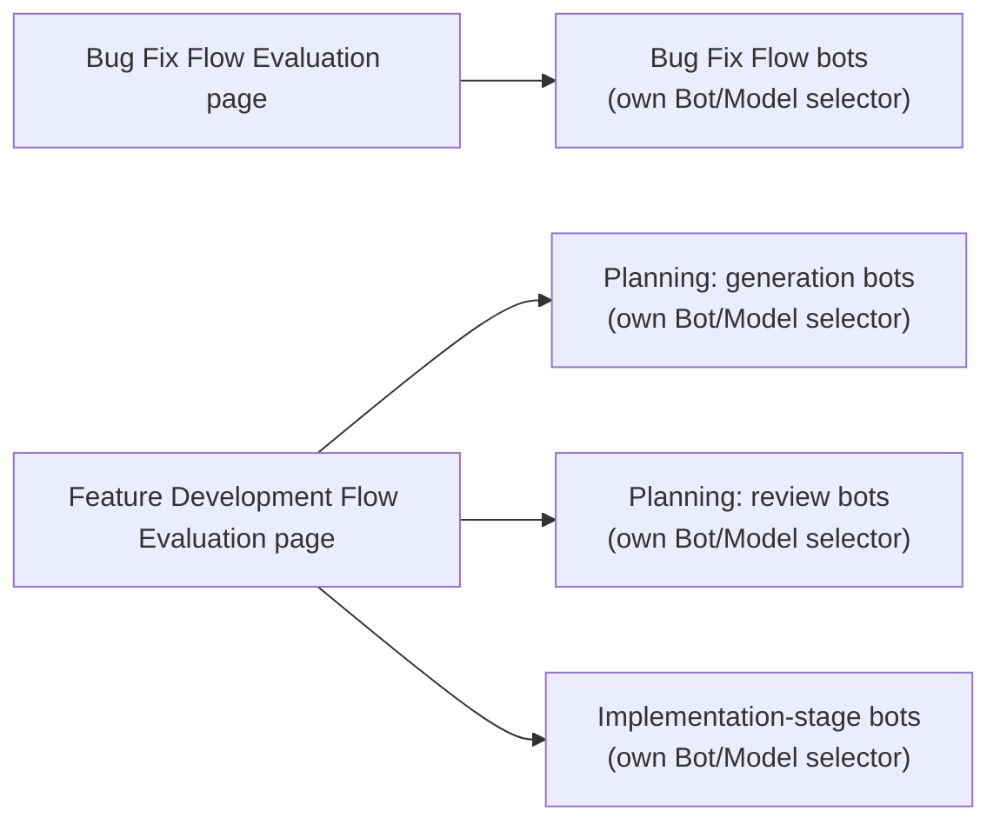

# Agentic SDLC Evaluation Framework

| Field       | Value   |
|-------------|---------|
| Author(s)   | Tommy Hughes |
| Jira        | https://redhat.atlassian.net/browse/OSAC-959 |
| Date        | 2026-07-30 |

## Problem Statement

OSAC is shifting bug-fix and feature-development work onto AI agents — a Bug Fix Flow and a Feature Development Flow — but has no quantitative way to evaluate agent performance beyond MTTR, RCA accuracy, and velocity. That narrow lens can't distinguish a fast-but-unreliable agent from a slow-but-dependable one, or a cheap agent from a genuinely cost-effective one: a cheap-but-unreliable bot costs more per outcome than an expensive, reliable one once failed attempts are counted, but a cost-per-token or cost-per-run view hides this entirely. More than one bot/model is already in production — the EP Review Bot for planning review, the `jira-ai-issue-solver`-based bot for Bug Fix Flow, with `prd-creator`/`design-creator` from OSAC-3168 and future alternatives on the way — and today there is no way to compare them on equal terms. Without a consistent, bot-agnostic framework, the team cannot tell whether AI agents are actually improving outcomes, cannot identify what is holding a given agent back, and cannot make an informed build-vs-buy-vs-swap call when a new bot or model becomes available.

## In Scope

- A five-dimension evaluation framework — Effectiveness, Efficiency, Autonomy, Reliability, and Continuous Improvement — applied consistently across the Bug Fix Flow and both stages of the Feature Development Flow (Planning, covering both generation and review, and Implementation).
- Bot/model identity (name, version, underlying model) as a first-class attribute of every metric, so the same dashboards can later be pointed at a different bot, model, or vendor without redefining the metrics.
- Cost measured per successfully-completed outcome (model spend, runtime spend, retry/rework cost, and human review time combined) for every bot role — not per token or per run.
- An agent-segmented first-time CI pass rate and a CI-failure-type breakdown (unit test / lint / build / integration) for bot-authored pull requests, shown alongside — not replacing — the organization's existing whole-org pass-rate view.
- Two new Org Pulse "AI Impact" dashboard pages — Bug Fix Flow Evaluation and Feature Development Flow Evaluation — using OSAC's existing AI Impact template: KPI tiles, a rolling 8-week trend chart, and a paired score-distribution/dimension-breakdown chart. `[Clarify: R2.Q2]`
- A Bot/Model selector on each dashboard page, scoped to bots performing the same role, so comparisons only ever happen between bots doing the same job:

- Dashboard metrics refresh automatically on OSAC's existing recurring data-collection schedule (well under an hour); no manual data pulls and no real-time/live-update requirement. `[Clarify: R1.Q5]`
- Explicit "not yet reported," "building baseline," or "unattributed" states wherever cost, reliability, or bot-identity data is missing or insufficient — never a blank or a zero — with affected bots excluded from bot/model comparisons until real data exists. `[Clarify: R1.Q3]`
- Validation of the framework against real end-to-end use cases from the team's backlog, run against at least two bots/models spanning at least one planning-stage generation bot, one planning-stage review bot, and one code-stage bot, to confirm the framework generalizes across roles and vendors rather than being tuned to a single bot.

## Out of Scope

- Code quality metrics such as test coverage or cyclomatic complexity.
- Tenant user productivity tracking.
- Per-tenant/production AI-usage billing — distinct from the operational bot/model cost tracked above.
- Detailed dashboard UI/visual design (exact colors, spacing, chart library, and whether existing AI Impact template components are reused as-is or extended) — this Feature specifies the required states and interactions (KPI/trend/distribution-style presentation, Bot/Model selector, missing-data states); the design EP determines the concrete implementation.
- Defining or maintaining UOI/Konflux DevLake's whole-org Issue Cycle Time, PR Cycle Time, and first-time-pass-rate metrics — these already exist independently. MTTR and PR velocity remain on their existing UOI view; the new Org Pulse pages link to that view rather than duplicating or moving it. `[Clarify: R2.Q1]`
- A dedicated CLI tool for these metrics, or a documented/externally-supported API contract beyond what the underlying platform already provides incidentally — dashboard consumption is this Feature's committed interface (see Assumptions). `[Clarify: R1.Q2 — amended]`
- New data retention or archival infrastructure — the 8-week trend window is a display constraint, not a change to how long underlying data is kept. `[Clarify: R2.Q2]`
- Automated report distribution (e.g., a scheduled email or Slack digest) — the dashboards' own trend charts already cover the recurring-pulse need.
- Predictive insights, optimization recommendations, or closed-loop automatic tuning of prompts, models, or workflows based on evaluation results — this Feature reports and displays data; it does not act on it automatically.
- The detailed content and delivery plan for dashboard user documentation (e.g., a short guide explaining the five dimensions and the "not yet reported"/"building baseline"/"unattributed" states) — a documentation need is identified here; the design EP plans and delivers it.

## User Stories

### Lead Engineer

- As a lead engineer, I need metrics showing MTTR improvement from AI agents.
- As a lead engineer, I want to know what a bot/agent costs per resolved bug or accepted feature, so I can judge whether its speed is actually worth the spend.
- As a lead engineer, I want to see how often an agent needs human intervention or a retry to succeed, so I can judge how close it is to running unsupervised.
- As a lead engineer, I want to know how well the review bot's verdict matches a human reviewer's judgment, so I can trust its pass/fail calls without re-checking every one.
- As a lead engineer, I want to see an explicit "not yet reported" or "building baseline" indicator when a bot's cost or reliability data isn't available yet, so I don't mistake missing data for a bot being free or already proven reliable. `[Clarify: R1.Q3]`

### Product Owner

- As a product owner, I need data on feature development velocity with agents.
- As a product owner, I want to know how consistently an agent succeeds across repeated attempts — not just its average speed — so a flaky agent doesn't quietly inflate my delivery estimates.
- As a product owner, I want to know whether an autonomously generated PRD/design needs fewer revision cycles than our current process, so I can judge whether adopting `prd-creator`/`design-creator` would actually speed up delivery.
- As a product owner, I want the new dashboards to link to our existing MTTR and velocity view rather than duplicating it, so I have one authoritative place to check those numbers regardless of which dashboard I started from. `[Clarify: R2.Q1]`

### DevOps Engineer

- As a DevOps engineer, I need an Org Pulse dashboard tracking agent success rates over time, using the same AI Impact template already in use elsewhere.
- As a DevOps engineer, I want to switch the same dashboard's Bot/Model dropdown to compare two different bots, the same way I'd change the time range, so evaluating a candidate replacement doesn't require a new dashboard.
- As a DevOps engineer, I want to see whether execution traces and human-override signals are being captured completely, so I know the data needed to actually improve the agents over time isn't silently missing.
- As a DevOps engineer, I want a bot/model's data to still show up under an "unattributed" grouping if its identity hasn't been wired up yet, so a gap in one bot's setup doesn't hide or block the rest of the dashboard. `[Clarify: R2.Q3]`

## Assumptions

- This Feature has no tenant-facing surface — all consumers are internal OSAC engineering roles (Lead Engineer, Product Owner, DevOps Engineer), not the four canonical tenant/provider personas used elsewhere in OSAC PRDs.
- `agent-eval-harness` continues to run its existing judge/human calibration (Cohen's κ) for the EP Review Bot; this Feature surfaces that calibration data rather than building a new one.
- The two new Org Pulse "AI Impact" pages are added within OSAC's own existing Org Pulse deployment, which OSAC's team already controls — no coordination with another team's Org Pulse instance is required. `[Clarify: R1.Q4]`
- Because the new pages are built the same way as OSAC's existing Org Pulse AI Impact tabs, their underlying metric data is already incidentally reachable via that platform's standard per-module API mechanism — this Feature does not need to build new API access for that to be true, though it is not a documented or supported external contract. `[Clarify: R1.Q2 — amended]`
- No numeric target thresholds (e.g., MTTR reduction %, RCA accuracy %) are set at launch for any dimension — success criteria establish a baseline first, consistent with today's small reference sample sizes (an 11-case bugfix backtest set; a 10-PRD/6-design gold-standard set).

## Dependencies

- **Each bot's owning workstream:** Bug Fix Flow's `jira-ai-issue-solver` deployment, OSAC-3168's `prd-creator`/`design-creator`, and the EP Review Bot must each emit cost, model/bot identity, and — for the review role — judge/human agreement data before that bot's dashboard metrics can populate. (OSAC-516's `osac-bugfix-eval` backtesting harness is a separate dependency — it scores fix quality against a curated historical case set and is relevant to Reliability/fix-correctness validation, not to this cost/identity data.) Until a given workstream starts emitting, its dashboard section shows the "building baseline"/"not yet reported" state.

---

## Provenance

Authored: revise @ prd 0.6.3 - 68284c8, workspace main @ 07cf78f3
Phases: draft, revise, revise

<!-- ai-workflow-provenance:{"schema_version":1,"provenance_kind":"session","workflow":"prd","workflow_version":"0.6.3","ai_workflows":"68284c8","source_repo":"07cf78f3","source_repo_branch":"main","commits_behind_main":0,"commits_ahead_main":0,"main_ref":"main","phases":["draft","revise","revise"],"authoring_modes":["skill"],"context_changed":false} -->
