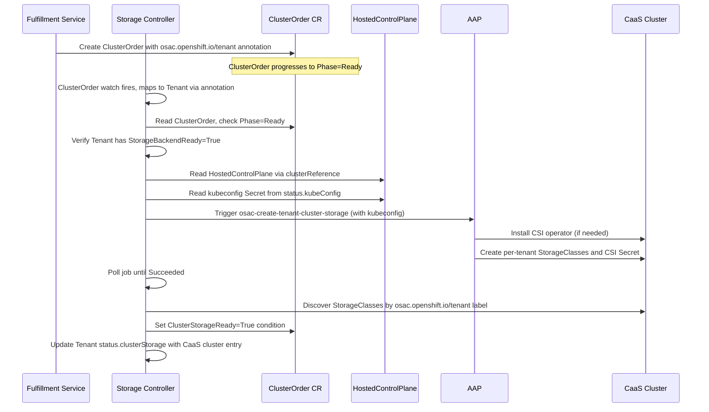
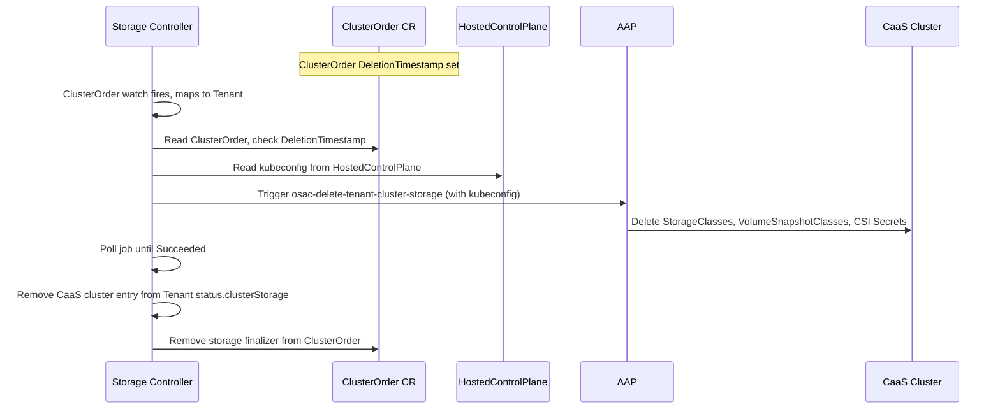

# CaaS Cluster Storage

## Summary

Extend the OSAC Storage Controller to provision persistent storage on CaaS tenant clusters. When a ClusterOrder reaches `Phase=Ready`, the storage controller retrieves the cluster's kubeconfig via the HyperShift HostedControlPlane API, triggers AAP to install the CSI driver and per-tenant StorageClasses, and tracks readiness as a `ClusterStorageReady` condition on the ClusterOrder CR. See [PRD](prd.md) for detailed requirements.

## Motivation

The OSAC Storage Controller ([OSAC-1001](https://redhat.atlassian.net/browse/OSAC-1001)) provisions storage for tenants on a single preconfigured VMaaS target cluster in two stages: backend setup (Stage 1: VAST tenant, views, quotas, credentials) and cluster-side setup (Stage 2: CSI driver, per-tenant StorageClasses). Both stages are triggered when a Tenant CR reaches `Phase=Ready`.

CaaS clusters require three things the current architecture does not provide:

1. **Multiple target clusters.** Each ClusterOrder has its own hosted control plane. The controller must obtain a kubeconfig dynamically rather than using a preconfigured target.

2. **Different trigger.** CaaS Stage 2 is triggered by `ClusterOrder.Phase=Ready`, not `Tenant.Phase=Ready`. Stage 1 has already completed during tenant onboarding.

3. **Per-cluster visibility.** Storage readiness must be visible on each ClusterOrder, not only aggregated on the Tenant CR.

### Goals

- Extend the existing storage controller rather than introducing a new controller or duplicating provisioning logic.
- Retrieve the CaaS cluster kubeconfig from `ClusterOrder.status.clusterReference` via the HyperShift HostedControlPlane API.
- Track per-ClusterOrder storage readiness as a separate condition from the cluster's compute readiness (`Phase`).
- Keep VMaaS storage provisioning unchanged.

### Non-Goals

- StorageTier API integration ([OSAC-1110](https://redhat.atlassian.net/browse/OSAC-1110), separate epic).
- VAST provider CaaS changes ([OSAC-1122](https://redhat.atlassian.net/browse/OSAC-1122), separate epic).
- Dynamic tier addition to running CaaS clusters (beyond v0.1).
- Storage UI ([OSAC-1252](https://redhat.atlassian.net/browse/OSAC-1252), backlog).
- Dedicated AAP ServiceAccount with scoped RBAC for storage operations ([OSAC-499](https://redhat.atlassian.net/browse/OSAC-499), stretch goal). The AAP `storage-operations-ig` currently uses the shared `osac-sa`.

## Proposal

1. **Extend the Storage Controller** to provision and tear down cluster-side storage on CaaS clusters, triggered by ClusterOrder lifecycle events. The controller retrieves the CaaS cluster kubeconfig and passes it to AAP as an extra variable.

2. **Update AAP storage roles** to pass the resolved kubeconfig to all `kubernetes.core.k8s` calls, so StorageClasses and CSI resources are created on the CaaS cluster instead of the hub. Kubeconfig acceptance and resolution in the playbooks is handled by [OSAC-1327](https://redhat.atlassian.net/browse/OSAC-1327).

No new controllers, CRDs, or fulfillment-service changes are required.

### Changes Per Repository

| Repository | Changes |
|---|---|
| **osac-operator** | Extend storage controller (kubeconfig retrieval, `mapClusterOrderToTenant`, CaaS reconciliation loop, teardown). Add `ClusterStorageReady` condition and `osac.openshift.io/cluster-storage` finalizer to ClusterOrder CRD. Expand RBAC for ClusterOrder status/finalizers and HostedControlPlane read access. |
| **osac-aap** | Add `kubeconfig` parameter to all `kubernetes.core.k8s` calls in `ensure_storage_class.yaml` and `teardown_cluster_storage.yaml`. Kubeconfig resolution and `vmaas`-only guard removal are handled by [OSAC-1327](https://redhat.atlassian.net/browse/OSAC-1327) (PR [#377](https://github.com/osac-project/osac-aap/pull/377)). |
| **fulfillment-service** | None. The `osac.openshift.io/tenant` annotation is already set on ClusterOrder CRs by the cluster reconciler. |
| **osac-installer** | Update RBAC manifests to reflect the storage controller's expanded permissions. |

### Workflow Description

#### Personas

- **Cloud Provider Admin:** Registers storage backends, creates Tenant CRs, monitors storage readiness.
- **Tenant Admin / Tenant User:** Orders CaaS clusters, consumes persistent storage via PVCs.

#### Components

- **Storage Controller (osac-operator):** Reconciles storage state on Tenant and ClusterOrder CRs.
- **AAP (osac-aap):** Executes cluster-side storage provisioning and teardown playbooks.

#### Prerequisites

1. Tenant CR has `StorageBackendReady=True` (Stage 1 completed during tenant onboarding).
2. ClusterOrder has `osac.openshift.io/tenant=<tenantName>` annotation and `Phase=Ready`.
3. ClusterOrder's `status.clusterReference` points to a HostedCluster with a populated `status.kubeConfig`.

#### CaaS Storage Provisioning



When a ClusterOrder changes, the storage controller looks up the owning Tenant via the `osac.openshift.io/tenant` annotation. It then lists all Ready ClusterOrders for that tenant that don't yet have `ClusterStorageReady=True`, retrieves each cluster's kubeconfig, triggers the AAP provisioning job, and sets the condition on success.

#### CaaS Storage Teardown



The storage finalizer (`osac.openshift.io/cluster-storage`) blocks ClusterOrder deletion until cleanup completes. The controller triggers the teardown AAP job, polls until completion, removes the Tenant's `status.clusterStorage` entry, then removes the finalizer.

If the HostedControlPlane or kubeconfig Secret is already gone (the HostedCluster was deleted outside of OSAC's control), the CaaS cluster no longer exists and there are no resources to clean up. The controller logs a warning, removes the `status.clusterStorage` entry, and removes the finalizer.

Backend teardown (Stage 1 reverse) is not triggered by ClusterOrder deletion. Backend resources are shared across a tenant's clusters and only torn down when the Tenant itself is deleted.

Error handling follows the existing OSAC controller pattern: set the condition to `False` with a descriptive reason, and wait for a change to the ClusterOrder or related resources before retrying. See [Failure Handling and Recovery](#failure-handling-and-recovery) for the full failure mode table.

### API Extensions

#### ClusterOrder CRD

New condition:

```go
ClusterOrderConditionClusterStorageReady ClusterOrderConditionType = "ClusterStorageReady"
```

Owned by the storage controller. A ClusterOrder can reach `Phase=Ready` without `ClusterStorageReady=True`; compute and storage readiness are independent.

New finalizer: `osac.openshift.io/cluster-storage`. Added when provisioning begins, removed after teardown.

`ClusterStorageJobs []JobStatus` already exists in `ClusterOrderStatus`.

#### Tenant CRD

No schema changes. The existing `status.clusterStorage []ClusterStorageStatus` list (keyed by `clusterName`) accommodates CaaS entries alongside VMaaS. For CaaS, `clusterName` is the ClusterOrder name.

#### RBAC

New permissions for the storage controller's ClusterRole:

```go
// +kubebuilder:rbac:groups=osac.openshift.io,resources=clusterorders/status,verbs=get;update;patch
// +kubebuilder:rbac:groups=osac.openshift.io,resources=clusterorders/finalizers,verbs=update
// +kubebuilder:rbac:groups=hypershift.openshift.io,resources=hostedcontrolplanes,verbs=get;list;watch
```

These are added to the existing `osac-operator-controller-manager` ClusterRole.

If the storage controller is down, ClusterOrders still reach `Phase=Ready`. The `ClusterStorageReady` condition remains stale until the controller recovers. Deletion is blocked by the finalizer.

### Implementation Details/Notes/Constraints

#### Kubeconfig Retrieval

Three-step lookup:

1. `ClusterOrder.status.clusterReference` provides the HostedCluster namespace and name.
2. Read the `HostedControlPlane` resource in that namespace (`hypershift.openshift.io/v1beta1`).
3. Read the Secret from `HostedControlPlane.status.kubeConfig` (name and key).

The kubeconfig is used to construct a `client.Client` for StorageClass discovery and passed to AAP for CSI driver and StorageClass installation.

#### Reconciliation Flow

The storage controller already watches ClusterOrders via `mapClusterOrderToTenant`, but today that function is a stub returning nil. It will read the `osac.openshift.io/tenant` annotation from the ClusterOrder and look up the owning Tenant (this annotation is already set by the fulfillment-service cluster reconciler).

`handleUpdate` extends with a CaaS loop after the existing VMaaS logic. For each Ready ClusterOrder without `ClusterStorageReady=True`:

1. Add the `osac.openshift.io/cluster-storage` finalizer.
2. Retrieve the kubeconfig.
3. Trigger or poll the AAP job (using `ClusterOrder.Status.ClusterStorageJobs`).
4. On success, discover StorageClasses on the CaaS cluster and set the condition.
5. Update the Tenant's `status.clusterStorage`.

Any ClusterOrder with a `DeletionTimestamp` and the storage finalizer triggers teardown instead.

#### AAP Changes: Target Cluster Kubeconfig

For VMaaS, storage roles run K8s calls against the AAP pod's default cluster context. For CaaS, each cluster has a different kubeconfig that must be passed per-job.

[OSAC-1327](https://redhat.atlassian.net/browse/OSAC-1327) (PR [#377](https://github.com/osac-project/osac-aap/pull/377), WIP) handles kubeconfig resolution: accepts `ansible_eda.event.admin_kubeconfig` as an extra variable, writes it to a temp file, removes the `vmaas`-only guards, and adds cluster name discovery. However, the `kubernetes.core.k8s` calls in `ensure_storage_class.yaml` and `teardown_cluster_storage.yaml` still don't pass the resolved kubeconfig, so StorageClasses and CSI resources would be created on the hub cluster instead of the CaaS cluster. This design adds `kubeconfig: "{{ _remote_kubeconfig | default(omit) }}"` to those K8s calls.

On the operator side, the storage controller retrieves the kubeconfig from the HostedControlPlane Secret and injects it as `admin_kubeconfig` in the `ansible_eda.event` payload (matching PR #377's convention). This uses the existing `extra_vars_context.go` pattern with a new `WithAdminKubeconfig` function.

#### StorageClass Properties

CaaS clusters use the same StorageClass properties as VMaaS (same AAP role, same values):

| Property | NFS | Block |
|---|---|---|
| `reclaimPolicy` | `Delete` | `Delete` |
| `volumeBindingMode` | `Immediate` | `WaitForFirstConsumer` |
| Provisioner | `csi.vastdata.com` | `blockcsi.vastdata.com` |

For NFS, `Delete` means the backing VAST view/export is removed when the PVC is deleted. For block, the backing volume is removed. This is consistent across VMaaS and CaaS.

Labels on all StorageClasses:
- `osac.openshift.io/tenant=<tenantName>`
- `osac.openshift.io/storage-tier=<tier>`
- `osac.openshift.io/storage-protocol=<nfs|block>`
- `app.kubernetes.io/managed-by=osac-aap`

The tier resolution algorithm (`storage_tier_resolution.go`) is reused without modification. The only difference is which cluster it runs against.

#### Extension Point: Tier API

When the Tier API ([OSAC-1110](https://redhat.atlassian.net/browse/OSAC-1110)) is available, the storage controller will query it for available tiers and pass them to AAP as extra variables. The tier resolution algorithm on the target cluster remains unchanged.

### Security Considerations

CaaS cluster storage inherits the existing security model:

- **Kubeconfig handling:** The kubeconfig Secret is read from the HostedCluster namespace on the hub cluster and passed to AAP without being persisted. The storage controller's RBAC permissions ([API Extensions](#rbac)) grant it read access to HostedControlPlane resources and Secrets in those namespaces.
- **Tenant isolation:** StorageClasses are scoped to tenants via the `osac.openshift.io/tenant` label, and the tier resolution algorithm only returns StorageClasses matching the tenant. CSI credentials are scoped per-tenant via VAST RBAC Realms ([OSAC-1326](https://redhat.atlassian.net/browse/OSAC-1326)).
- **API-level authorization:** No new Open Policy Agent (OPA) authorization policies are needed in fulfillment-service, because storage provisioning is triggered by the platform (storage controller), not by tenant API calls.

### Failure Handling and Recovery

| Failure Mode | Behavior | Recovery | User Observes |
|---|---|---|---|
| Kubeconfig not available | `ClusterStorageReady=False`, reason `KubeConfigNotAvailable` | Automatic when HostedControlPlane populates `status.kubeConfig`. | ClusterOrder Ready but `ClusterStorageReady=False`. |
| AAP provisioning fails | `ClusterStorageReady=False`, reason `ProvisionFailed` | Retries when the ClusterOrder or a related resource changes. | `kubectl describe` shows job failure message. |
| AAP teardown fails | Finalizer remains. | Retries on next reconciliation trigger. | ClusterOrder stuck in Deleting. |
| HostedControlPlane gone during teardown | No resources to clean up. | Controller removes `status.clusterStorage` entry and finalizer. | ClusterOrder deletion proceeds. Warning event logged. |
| Storage controller down | Conditions stale. Phase=Ready unaffected. | Automatic on restart; the controller re-evaluates all Tenants and ClusterOrders. | New clusters show Ready without storage condition until recovery. |
| Duplicate StorageClasses per tier | Warning event, `ClusterStorageReady=False`, reason `MultipleFound` | Admin resolves duplicates on the CaaS cluster. | Warning event on Tenant CR. |

### RBAC / Tenancy

No tenant-facing RBAC changes. Storage provisioning is platform-managed; tenants consume storage through standard PVC APIs. Tenant isolation is enforced by label-based filtering in the tier resolution algorithm. Controller permissions are described under [RBAC in API Extensions](#rbac).

### Observability and Monitoring

New Kubernetes events on ClusterOrder:

| Event Type | Reason | When |
|---|---|---|
| Normal | `ClusterStorageProvisioned` | Provisioning succeeded and StorageClasses discovered. |
| Warning | `ClusterStorageProvisionFailed` | AAP provisioning job failed. |
| Warning | `KubeConfigNotAvailable` | Cannot retrieve kubeconfig for the CaaS cluster. |
| Warning | `DuplicateStorageClass` | Multiple StorageClasses for the same tier. |

Structured log entries include `clusterOrder`, `tenant`, and `clusterName` fields.

### Risks and Mitigations

| Risk | Mitigation |
|---|---|
| Kubeconfig Secret rotation between provisioning and discovery | Controller reads kubeconfig fresh on each reconciliation. |
| ClusterOrder count per tenant grows large | Acceptable for v0.1 (single-digit expected). Can split to a separate controller later. |
| ClusterOrder deleted while provisioning is in progress | Finalizer prevents premature deletion. Controller transitions to teardown on next reconciliation. |
| HyperShift API changes break kubeconfig path | Import HyperShift API types as a Go module for compile-time checking. |

### Drawbacks

The storage controller now writes conditions and finalizers on both Tenant and ClusterOrder CRs, increasing its surface area. A separate CaaS storage controller would be simpler per-controller but would duplicate provisioning logic and introduce dual-writer conflicts on Tenant status.

## Alternatives (Not Implemented)

### 1. Separate CaaSStorageReconciler

A standalone controller reconciling ClusterOrders directly.

**Pros:** Clean separation of VMaaS and CaaS concerns.
**Cons:** Duplicates provisioning lifecycle logic. Two controllers writing to Tenant `status.clusterStorage` creates ordering issues.
**Rejected:** The provisioning logic (AAP job triggering, polling, status updates, finalizer management) is identical for VMaaS and CaaS. Keeping it in one controller avoids maintaining two copies and coordinating two writers on Tenant status.

### 2. ClusterOrder controller owns storage provisioning

The ClusterOrder controller triggers storage directly when a cluster reaches Ready.

**Pros:** No cross-resource condition writes.
**Cons:** Mixes storage into the cluster controller. Reverses the separation established by [OSAC-1001](https://redhat.atlassian.net/browse/OSAC-1001).
**Rejected:** Storage logic belongs in the storage controller.

### 3. Storage readiness gates ClusterOrder Phase=Ready

Require storage before a ClusterOrder can reach Ready.

**Pros:** Tenants never see a Ready cluster without storage.
**Cons:** Blocks compute availability on storage provisioning. Unnecessarily restrictive for stateless workloads.
**Rejected:** Compute and storage readiness are independent concerns. The `ClusterStorageReady` condition provides visibility without coupling.

## Test Plan

### Unit Tests

Controller tests using envtest for the Kubernetes API and mock provisioning providers for AAP, following the existing pattern in `storage_controller_test.go`:

- `mapClusterOrderToTenant`: Tenant lookup from annotation. Cover missing, empty, and non-existent Tenant cases.
- Kubeconfig retrieval: Cover missing `clusterReference`, missing HostedControlPlane, missing Secret, and missing key.
- CaaS provisioning: Create Tenant + ClusterOrder, verify provisioning triggers when both are ready. Verify condition setting on ClusterOrder, Tenant `status.clusterStorage` updates, and finalizer management.
- CaaS teardown: Delete a ClusterOrder, verify teardown completes before finalizer is removed. Cover the case where HostedControlPlane is already gone.
- Duplicate StorageClass detection emits warning events.
- VMaaS regression: Verify VMaaS flow is unchanged when CaaS clusters exist.

### E2E Tests

Via osac-test-infra ([OSAC-1329](https://redhat.atlassian.net/browse/OSAC-1329)):
- Provision a CaaS cluster, verify StorageClasses are installed and PVCs work.
- Delete a CaaS cluster, verify storage resources are cleaned up.
- Tenant isolation: StorageClasses from one tenant are not visible on another tenant's cluster.

## Graduation Criteria

N/A. OSAC is in active development and has not been released to customers.

## Upgrade / Downgrade Strategy

Pre-GA change. This enhancement adds a new condition (`ClusterStorageReady`) and finalizer to ClusterOrder. No existing fields are modified, no data migration needed.

## Version Skew Strategy

No fulfillment-service changes are needed. The storage controller and AAP roles can be deployed independently. If the operator is deployed before the AAP changes, the controller triggers templates that don't exist yet; AAP returns "template not found", the controller records a failed job, and retries once AAP is updated.

## Support Procedures

- `kubectl get clusterorder -o wide` shows `ClusterStorageReady` (priority=1 column).
- `kubectl describe clusterorder <name>` shows conditions, events, and `ClusterStorageJobs` history.
- `kubectl get tenant <name> -o wide` shows aggregate storage status.
- Controller logs: filter by `clusterOrder=<name>`.

## Infrastructure Needed

None.
