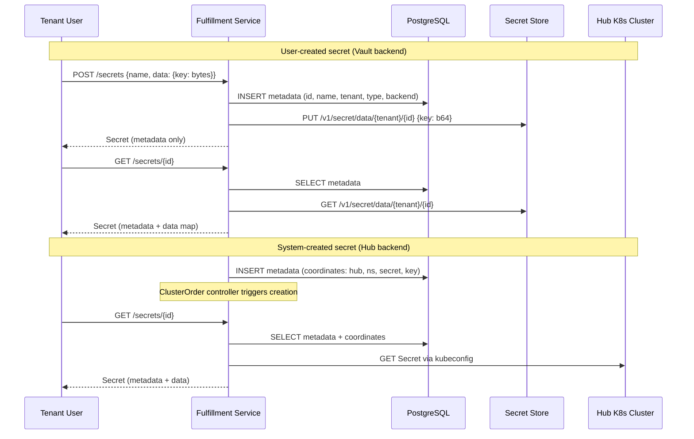
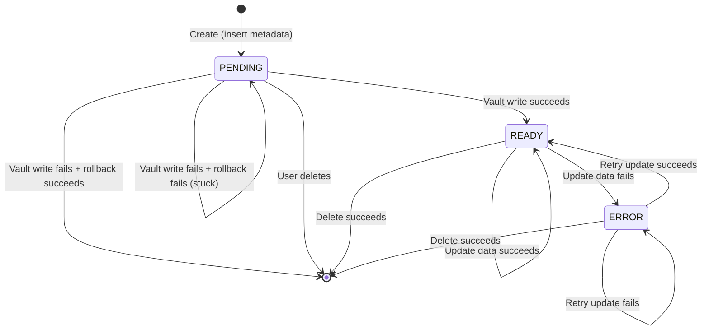

# Secret Management

## Summary

This enhancement introduces a Secret resource that provides a uniform API
over different secret sources — a Vault-compatible secret store for
encrypted-at-rest storage and Hub clusters for on-demand Kubernetes
credential retrieval — giving all OSAC personas a single interface for
creating, retrieving, and managing credentials through the
fulfillment-service gRPC/REST API and CLI. See [PRD](prd.md) for detailed
requirements.

## Motivation

Credentials in OSAC are currently scattered across resource types.
Cluster kubeconfigs are retrieved via dedicated `GetKubeconfig` and
`GetPassword` RPCs that reach into hub Kubernetes clusters at request time
[Codebase: internal/servers/clusters_server.go].
Pull secrets, OIDC client secrets, and storage backend passwords are stored
inline in their parent resource's spec, redacted on read and stripped on
update through ad-hoc server-side logic. Each resource type that touches
credentials implements its own storage, redaction, and retrieval pattern.

This fragmentation creates three problems. First, credential data stored in
the PostgreSQL `data` JSONB column is not encrypted at rest — anyone with
database access can read secrets in cleartext. Second, tenants cannot manage
credentials independently: rotating a pull secret requires updating the
cluster that uses it, and there is no way to list all credentials a tenant
owns. Third, each new resource type that needs credentials must reimplement
redaction and retrieval logic, increasing the surface area for mistakes.

### Goals

- Keep the Secret data storage path (store/retrieve bytes) separate from the metadata path (CRUD in PostgreSQL) so that secret bytes never transit PostgreSQL.
- Reuse the existing GenericServer/GenericDAO patterns for Secret CRUD metadata, adding backend dispatch only for data storage and retrieval [Codebase: internal/servers/generic_server.go].
- Maintain tenant isolation guarantees consistent with all other OSAC resources (OPA policies, tenant-scoped metadata, per-tenant backend isolation).

### Non-Goals

- Secret rotation automation — users can update secret values manually, but scheduled or event-driven rotation workflows are out of scope.
- UI support — secret management is CLI and API only for 0.2.
- Secret store deployment and operations — the cloud provider is responsible for deploying and operating the Vault-compatible secret store. OSAC connects to it; OSAC does not manage its lifecycle.

## Proposal

A single new resource type is introduced:

**Secret** is a tenant- and project-scoped resource that holds credential
metadata in PostgreSQL and delegates data storage to a backend determined
by the secret's source. Secrets appear in both the public and private APIs.
The public API provides a uniform CRUD interface — tenants
interact with secrets without knowing which backend stores them. The
private API exposes the `backend` field and source-specific fields (e.g.,
Hub coordinates) for admin visibility and system-created secrets.

Secret data bytes never pass through PostgreSQL. On Create, the server
writes metadata to PostgreSQL and data bytes to the backend. On Get, the
server fetches metadata from PostgreSQL and data from the backend. List
responses return metadata only.

Two secret backends exist for 0.2:

- **Vault** — user-created and system-created secrets stored in a
  Vault-compatible secret store. The store's connection parameters are
  configured via fulfillment-service startup flags, like the database
  connection.
- **Hub** — system-created secrets whose data lives in Kubernetes Secrets
  on hub clusters (e.g., cluster kubeconfigs, admin passwords). The
  fulfillment-service retrieves data on demand using the existing Hub
  kubeconfig infrastructure.

### Workflow Description

#### Cloud Infrastructure Admin: Configure the Secret Store

Starting state: The cloud provider has deployed a Vault-compatible secret
store (e.g., OpenBao or HashiCorp Vault) and made it reachable from the
OSAC hub cluster.

1. The Cloud Infrastructure Admin sets the appropriate `--vault-*` flags
   on the fulfillment-service deployment (see Vault Configuration)
2. On startup, the fulfillment-service validates the connection by
   performing a health check against the configured endpoint. If the
   check fails, the service logs an error but continues to start — Hub
   secrets remain functional, and Vault-backed secret creation returns
   `FAILED_PRECONDITION` until the store is reachable.

#### Tenant User: Create and Retrieve a Secret

1. The tenant user creates a secret:
   `osac create secret my-ssh-key --from-file id_rsa=~/.ssh/id_rsa`
2. The fulfillment-service writes metadata to PostgreSQL and stores the
   key-value data (`{"id_rsa": <bytes>}`) in the secret store under the
   tenant's KV path.
3. The CLI confirms creation and displays the secret metadata (no data).
4. To retrieve the data:
   `osac get secret my-ssh-key -o yaml`
5. The fulfillment-service reads metadata from PostgreSQL and fetches
   data from the secret store.

#### Tenant User: Create a Cluster with a Secret Reference

1. The tenant user creates a secret for container image registry auth:
   `osac create secret my-pull-secret --type pull-secret --from-file auth.json`
2. The tenant user creates a cluster referencing the secret:
   `osac create cluster my-cluster --pull-secret my-pull-secret`
3. The fulfillment-service validates that `my-pull-secret` exists and is
   type `PULL_SECRET`. The cluster spec stores
   `pull_secret_ref = "my-pull-secret"` — no inline credential data.
4. The cluster reconciler resolves the reference by reading the secret
   data via the private Secrets API, then provisions the cluster with
   the pull secret.

#### System: Automatic Secret Creation During Cluster Provisioning

Starting state: A cluster has been provisioned and a kubeconfig is
available on the hub.

1. When the ClusterOrder controller detects that the HostedCluster has a
   ready kubeconfig, it calls the fulfillment-service private Secrets API
   to create a Hub-backed secret.
2. The fulfillment-service stores the secret metadata in PostgreSQL with
   backend `HUB` and the coordinates (hub ID, namespace, Kubernetes Secret
   name, key) needed to retrieve the data on demand.
3. When a tenant user retrieves the secret
   (`osac get secret cluster-kubeconfig -o yaml`), the
   fulfillment-service follows the Hub coordinates to retrieve the
   kubeconfig from the hub cluster — the same retrieval path currently
   implemented in `getHostedClusterSecret()` [Codebase: internal/servers/clusters_server.go].



In both paths, the tenant user interacts with the same public API — the
backend is transparent.

#### Error Handling

Errors are returned as gRPC status codes. See **Failure Handling and
Recovery** for the state machine and per-operation behavior.

### API Extensions

**New gRPC services:**

| Service | API | Purpose |
|---------|-----|---------|
| `osac.private.v1.Secrets` | Private | Full Secret CRUD with backend visibility |
| `osac.public.v1.Secrets` | Public | Uniform Secret CRUD for tenants |

**Modified resources:**

- `osac.private.v1.Event`: Add `Secret secret` to the payload oneof.
- `osac.public.v1.Clusters`: `GetKubeconfig` and `GetPassword` RPCs are
  deprecated then removed.

### Implementation Details/Notes/Constraints

#### Proto Schema: Secret

```proto
// private/osac/private/v1/secret_type.proto

message Secret {
  string id = 1;
  Metadata metadata = 2;
  SecretSpec spec = 3;
  SecretStatus status = 4;
}

message SecretSpec {
  map<string, bytes> data = 1;
  SecretBackend backend = 2;
  SecretType type = 3;
  HubCoordinates hub_coordinates = 4;
}

enum SecretBackend {
  SECRET_BACKEND_UNSPECIFIED = 0;
  SECRET_BACKEND_VAULT = 1;
  SECRET_BACKEND_HUB = 2;
}

enum SecretType {
  SECRET_TYPE_UNSPECIFIED = 0;
  SECRET_TYPE_OPAQUE = 1;
  SECRET_TYPE_PULL_SECRET = 2;
  SECRET_TYPE_KUBECONFIG = 3;
}

message HubCoordinates {
  string hub = 1;
  string namespace = 2;
  string secret_name = 3;
  string key = 4;
}

message SecretStatus {
  SecretState state = 1;
  optional string message = 2;
}

enum SecretState {
  SECRET_STATE_UNSPECIFIED = 0;
  SECRET_STATE_PENDING = 1;
  SECRET_STATE_READY = 2;
  SECRET_STATE_ERROR = 3;
}
```

The public Secret (`public/osac/public/v1/secret_type.proto`) uses the
same structure but omits `backend` and `hub_coordinates` from
`SecretSpec`. The `data` field is a `map<string, bytes>` modeled after
Kubernetes Secret `Data`. It is provided on Create/Update, returned on
Get, and omitted from List. The CLI controls display: the default table
view shows metadata only, while structured output formats (`-o yaml/json`)
include base64-encoded data values — following the same convention as
`kubectl get secret`.

The `type` field is set at creation and immutable. The server validates
data keys and value format based on type.

#### Secret Types

| Type | Required Keys | Format Validation | Notes |
|------|--------------|-------------------|-------|
| `OPAQUE` (default) | At least one arbitrary key | None | Passwords, tokens, API keys |
| `PULL_SECRET` | `.dockerconfigjson` | Valid JSON with top-level `auths` object | Key name follows the `kubernetes.io/dockerconfigjson` convention; all major runtimes (podman, CRI-O, containerd) use this format |
| `KUBECONFIG` | `kubeconfig` | Valid YAML with `apiVersion: v1`, `kind: Config` | Structure validated, not connectivity |

For Hub-backed secrets (system-created), the `data` map is populated on
demand from the Kubernetes Secret — the key matches the Kubernetes
Secret's `Data` field key (typically `kubeconfig` or `password`).

These three types cover the credential migration scope. Additional types
(e.g., TLS, SSH key) can be added when needed.

The `backend` field is set by the server, not the caller:
- Public API Create: server sets `backend = VAULT` automatically.
- Private API Create: caller can set `backend = HUB` with
  `hub_coordinates` for system-created secrets.

#### Proto Schema: Service RPCs

Both public and private Secrets services follow the standard CRUD pattern:

```proto
service Secrets {
  rpc List(SecretsListRequest) returns (SecretsListResponse);
  rpc Get(SecretsGetRequest) returns (SecretsGetResponse);
  rpc Create(SecretsCreateRequest) returns (SecretsCreateResponse);
  rpc Update(SecretsUpdateRequest) returns (SecretsUpdateResponse);
  rpc Delete(SecretsDeleteRequest) returns (SecretsDeleteResponse);
}
```

#### Database Schema

A new migration will create the `secrets` table.

Secrets are tenant- and project-scoped, following the `objects` table
pattern.

The `data` JSONB column stores the SecretSpec proto JSON (`backend`,
`type`, `hub_coordinates`) — not secret bytes (see Proposal).

#### Vault Configuration

The Vault-compatible store connection is configured via fulfillment-service
startup flags, following the existing pattern for infrastructure
dependencies like the database connection:

```
--vault-endpoint        Vault-compatible API endpoint URL
--vault-auth-mount-path Kubernetes auth method mount path (default: auth/kubernetes)
--vault-kv-mount-path   KV v2 secret engine mount path (default: secret)
--vault-role            Role for fulfillment-service authentication
```

When these flags are set, the VaultBackend is constructed at startup and
injected into the PrivateSecretsServer. When unset, the VaultBackend is
nil and user-created secret operations return `FAILED_PRECONDITION`.

The secret store must meet these prerequisites:

- **Reachable endpoint** — the store's API must be reachable from the
  fulfillment-service pods
- **TLS** — the endpoint must serve TLS; the CA certificate must be
  trusted by the fulfillment-service
- **Kubernetes auth method** — enabled and configured to trust the
  fulfillment-service ServiceAccount for token exchange
- **KV v2 secret engine** — mounted at the path specified in
  `--vault-kv-mount-path`

Documentation will cover setup for common implementations.

#### Server Implementation

Private server behavioral specifics:

- **Create:**
  - Sets `backend = VAULT` if not specified
  - Validates data against the secret type (see Secret Types)
  - Dispatches to vault to store the data
- **Get:**
  - Reads metadata from Postgres, dispatches to backend to fetch data
- **Update:**
  - If `spec.data` is non-empty on the update, validate against the secret type and write to backend
- **Update (Hub-backed):**
  - Metadata-only updates (e.g. labels) are allowed.
  - If `spec.data` is non-empty, returns `FAILED_PRECONDITION` — Hub-backed secret data is system-managed.
- **Delete:**
  - Vault-backed: dispatches to backend to delete stored data, then deletes PostgreSQL metadata.
  - Hub-backed: returns `FAILED_PRECONDITION` — Hub-backed secrets are system-managed. The controller that created them (e.g., ClusterOrder) deletes the metadata when the parent resource is deleted.

Public server wraps the private server and ensures `backend` and
`hub_coordinates` are stripped from responses.

For more specific state transitions, see Per-operation behavior section below.

#### CLI Commands

New commands follow existing patterns:

| Command | Description |
|---------|-------------|
| `osac create secret <name> --from-file=<key>=<path>` | Create a secret with a key-value pair from a file |
| `osac create secret <name> --from-file=<path>` | Create with filename as the key |
| `osac create secret <name> --from-literal=<key>=<value>` | Create a secret from a literal value |
| `osac create secret <name> --type=pull-secret --from-file=<path>` | Create a typed secret (auto-maps to required key) |
| `osac get secrets` | List secrets (metadata only) |
| `osac get secret <name>` | Get secret (table: metadata only; `-o yaml/json`: includes data) |
| `osac describe secret <name>` | Detailed secret metadata view |
| `osac delete secret <name>` | Delete a secret |
| `osac edit secret <name>` | Edit secret data/metadata in `$EDITOR` (base64-encoded, per kubectl convention) |

The `--from-file`, `--from-literal`, and `--type` flags are new to the
OSAC CLI. They follow `kubectl create secret` conventions because secrets
hold arbitrary key-value data — unlike other OSAC resources which have
typed fields with dedicated flags (e.g., `--pull-secret-file`). `--type`
defaults to `opaque`. Data values are included in structured output
formats (`-o yaml/json`) as base64-encoded strings, following kubectl
conventions. The default table view shows metadata only.

#### Secret References

Resources that currently embed credentials as inline fields gain a new reference field that holds the name of
a Secret resource. The existing inline field is deprecated / removed after data migration.

Validation rules:
- Referenced Secret must exist and match the expected type
- Referenced secret must be in the same project or an ancestor project

**All credential reference fields:**

| Resource | Inline Field (deprecated) | Reference Field | Secret Type |
|----------|--------------------------|-----------------|-------------|
| Cluster | `pull_secret` | `pull_secret_ref` | `PULL_SECRET` |
| ClusterTemplate | `pull_secret` | `pull_secret_ref` | `PULL_SECRET` |
| Hub | `kubeconfig` | `kubeconfig_ref` | `KUBECONFIG` |
| IdentityProvider | `client_secret` | `client_secret_ref` | `OPAQUE` |
| IdentityProvider | `bind_credential` | `bind_credential_ref` | `OPAQUE` |
| StorageBackend | `password` | `password_ref` | `OPAQUE` |


#### Credential Migration

A Go migration script moves existing inline credentials into the Secrets
API. The script maps each inline credential to the appropriate key-value
structure based on the target secret type:

1. Reads all resources with inline credential data from PostgreSQL
2. For each credential, creates a Secret resource in the same project
   as the parent resource, with the correct type and data map:
   - `pull_secret` → type `PULL_SECRET`, data
     `{".dockerconfigjson": <value>}`
   - `kubeconfig` → type `KUBECONFIG`, data `{"kubeconfig": <value>}`
   - `client_secret`, `bind_credential`, `password` → type `OPAQUE`,
     data `{"value": <value>}`
3. Writes metadata to PostgreSQL and data to the Vault store
4. Sets the corresponding `*_ref` field on the resource to the new
   secret's name
5. Clears the inline credential field

The script is idempotent across all steps — safe to re-run if
interrupted at any point. For each credential it checks whether the
Secret already exists (skips creation), whether the `*_ref` field is
already set (skips the update), and whether the inline field is already
cleared (skips the clear). This ensures a crash between any two steps
does not leave partial state on rerun. It runs as a one-time job after
the Vault store is configured and the fulfillment-service is upgraded
with the new schema.

### Security Considerations

**Encryption at rest:** The Vault-compatible secret store provides
encryption at rest. PostgreSQL stores only metadata (see Proposal).

**Authentication to the secret store:** The fulfillment-service
authenticates via the Kubernetes auth method [Assumption: Vault-compatible
stores support K8s auth]. The ServiceAccount token is exchanged for a
short-lived token scoped to the KV mount. No long-lived tokens are stored.

**Input validation:** Total secret data size is capped at 1 MiB (Vault API default
max entry size). For typed secrets, the server validates both the
required keys and the value format (see Secret Types). Secret names
follow the existing OSAC naming validation (alphanumeric, hyphens, max
253 characters).

**Data exposure in transit:** Secret data is transmitted over TLS-encrypted
gRPC connections. The CLI displays data only in structured output formats
(`-o yaml/json`); the default table view shows metadata only.

**No secret data in logs or events:** The RedactFunc strips `spec.data`
from all event payloads. Server-side logging does not include secret data.

### Failure Handling and Recovery

Secret state reflects the result of the last write operation, not current
backend reachability. Three states:

- **PENDING** — metadata exists in PostgreSQL, no data in the backend.
  Creation did not complete. The user can delete the record.
- **READY** — metadata and backend data are consistent. Normal operating
  state.
- **ERROR** — last data write failed. Previous data in the backend is
  still intact and retrievable. The user can retry or delete.



PENDING is normally transient. It becomes observable only if both the
backend write and the rollback delete fail (stuck incomplete creation).
Hub-backed secrets skip this state machine entirely — they are created as
`READY`, their data is immutable, and they cannot be deleted through the
API (metadata updates like labels are still allowed).

#### Per-operation behavior

| Operation | Steps | On Failure |
|-----------|-------|------------|
| **Create (Vault)** | Insert metadata as `PENDING` → write data to store → set `READY` | Attempt rollback (delete metadata). If rollback fails, record stays `PENDING` for manual cleanup. |
| **Create (Hub)** | Insert metadata with coordinates as `READY` | N/A — no backend write |
| **Get** | Read metadata → fetch data from backend | Return `UNAVAILABLE`. State unchanged — reflects last write, not reachability. |
| **Update (Vault data)** | Write new data to store → set `READY` | Set `ERROR` with message. Previous data in store is intact. |
| **Update (Vault metadata)** | Update metadata in PostgreSQL only | Standard DB error handling. State unchanged. |
| **Update (Hub metadata)** | Update metadata in PostgreSQL only | Standard DB error handling. State unchanged. |
| **Update (Hub data)** | N/A — returns `FAILED_PRECONDITION` | Data is system-managed; not modifiable through the API. |
| **Delete (Vault)** | Delete data from backend → delete metadata | Return `UNAVAILABLE`, secret remains intact (prevents orphaned store data). |
| **Delete (Hub)** | N/A — returns `FAILED_PRECONDITION` | System-managed; creating controller deletes metadata when parent is removed. |

### RBAC / Tenancy

**Tenant isolation metadata:** Secrets carry tenant and project scope in
standard `Metadata` fields.

**OPA policy additions:**

```rego
# Public API — tenant users and tenant admins
has_client_permissions {
    grpc_method in {
        "/osac.public.v1.Secrets/List",
        "/osac.public.v1.Secrets/Get",
        "/osac.public.v1.Secrets/Create",
        "/osac.public.v1.Secrets/Update",
        "/osac.public.v1.Secrets/Delete",
    }
}
```

The private Secrets API is admin-only, handled by the existing `is_admin`
catch-all for private API methods.

**Visibility:** Tenants see only their own secrets, scoped by project.
The public Secret API does not expose the `backend` field or Hub
coordinates.

**Secret store data organization:** Per-tenant KV paths
(`{kv_mount_path}/data/{tenant_name}/*`) organize secret data by tenant
within the store. Tenant isolation is enforced at
the application layer — the fulfillment-service only reads or writes
paths matching the authenticated tenant.

### Observability and Monitoring

Secrets API requests use the existing fulfillment-service gRPC metrics and structured logging.

### Risks and Mitigations

| Risk | Impact | Mitigation |
|------|--------|------------|
| Secret store becomes a single point of failure for all secret operations | Secret creation and data retrieval fail when the store is down | Vault-compatible stores support HA deployment. The cloud provider is responsible for HA configuration. Metadata remains accessible when the store is down. |
| Secret store data loss results in unrecoverable secret loss | Secrets with Vault backend become permanently inaccessible | The cloud provider is responsible for backup and disaster recovery of their secret store deployment. Documentation will cover backup recommendations. |

### Drawbacks

Requiring cloud providers to deploy a Vault-compatible store adds an
external prerequisite. This is justified because encryption at rest
cannot be met with PostgreSQL alone — building custom encryption would
duplicate what Vault-compatible stores already provide.

The two-backend model adds CRUD dispatch and divergent failure handling
complexity.

## Alternatives (Not Implemented)

### Database Envelope Encryption

Store secret data in PostgreSQL, encrypted using envelope encryption
(RSA wrapping an AES data key). This avoids the external secret store
dependency and keeps all data in one store.

**Rejected because:** Key management for envelope encryption is complex —
the wrapping key must itself be securely stored and rotated. Better to trust
an industry-standard technology like Vault than build and maintain ourselves.

### Full backwards compatibility with existing data fields

Rather than having an explicit migration step, data can be left in Postgres
and lazily migrated.  A shim layer is introduced that knows how/where to read
secret data.  On read if data is in Postgres it will be migrated to Vault.

**Rejected because:** Project maturity level does not necessitate this kind of
overhead / ongoing maintainance burden.

## Test Plan

**Unit tests (Ginkgo):**
- Secret proto validation (required fields, name format, data size limits)
- Backend interface: mock Vault and Hub backends to test Store/Fetch/Delete dispatch
- Server logic: Create with backend write, Get with backend data fetch, Update with data replacement, Delete with backend cleanup
- State transitions: Ensure failure states (e.g. write to backend results in record stuck `PENDING` or update `ERROR`) written
- Public↔private type mapping: verify `backend` and `hub_coordinates` are stripped in public responses
- RedactFunc: verify data is stripped from event payloads
- OPA policy: verify role-based access for Secret methods
- Migration: Test idempotency logic + expected generated payloads

**Integration tests (Kind cluster):**
- Secret CRUD through gRPC with a Vault-compatible store in the Kind cluster
- Tenant isolation: verify tenant A cannot read tenant B's secrets
- Hub-backend secrets: create via private API with coordinates, retrieve via public API
- Migration: Moving data from a cluster with inline pull_secret to the Vault backend

**E2E tests (pytest, osac-test-infra):**
- Automatic secret creation during cluster provisioning

## Graduation Criteria

**Dev Preview (0.2):** Full Secret CRUD, Vault and Hub backends, CLI
commands.

## Upgrade / Downgrade Strategy

**Upgrade** requires deploying a Vault-compatible secret store, then
setting the `--vault-*` flags on the fulfillment-service. After the
service is running with the new schema, the credential migration
script runs (see Credential Migration) to move inline credentials into the
Secrets API.

**Downgrade** is not supported once secrets are in Vault.

## Version Skew Strategy

OSAC is pre-GA — all components (fulfillment-service, osac-operator,
CLI) are expected to be deployed together at matching versions. An
up-to-date CLI is required for new operations such as creating Secrets
and attaching them to other resources.

## Support Procedures

**Detecting failures:**
Fulfillment-service logs at ERROR level for backend operation failures,
including the backend type, tenant, and error message.

**Disabling the feature:**
Not supported once secrets are in use. Removing the `--vault-*` flags
prevents new secret creation but leaves existing secret metadata in
PostgreSQL and data in the secret store with no way to access it through
OSAC. There is no graceful disable path.

## Infrastructure Needed

- Vault-compatible secret store instance in the integration test Kind cluster (OpenBao recommended for CI due to its permissive license)
