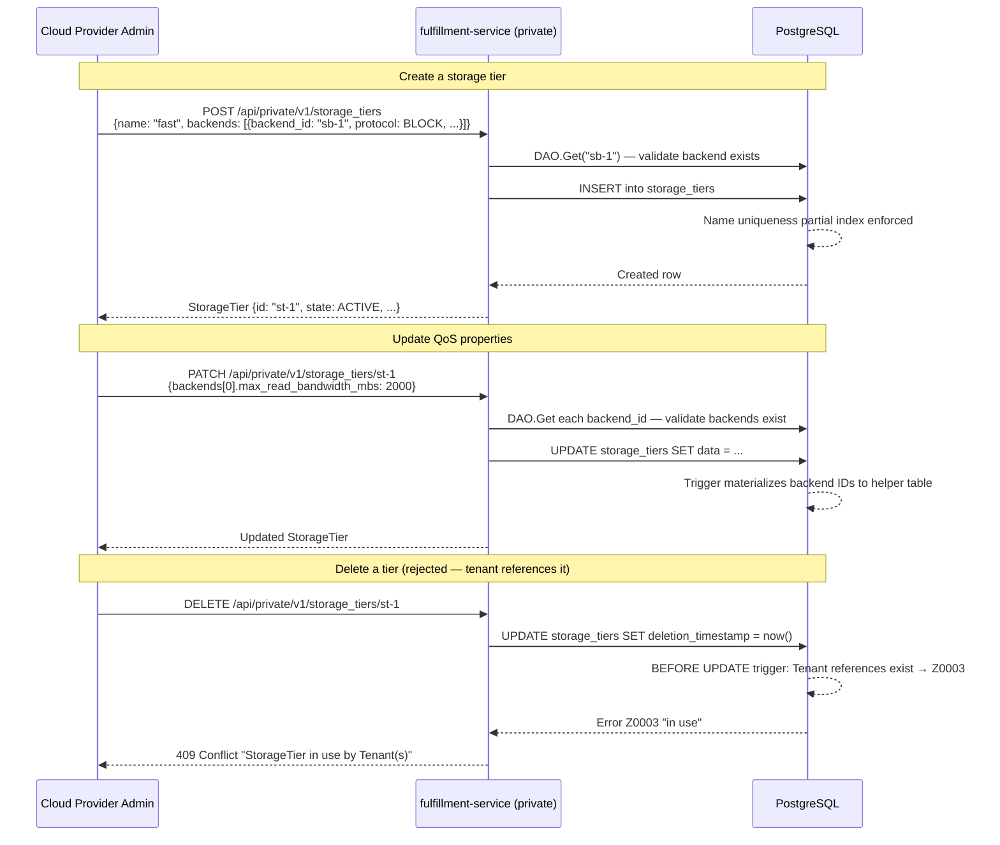

# StorageTier API

## Summary

This design introduces a `StorageTiers` gRPC service under `osac.private.v1` that enables Cloud Provider Admins to define named storage offerings backed by registered StorageBackends with typed, provider-neutral QoS properties. The entity is DB-backed with no CRD or controller. See [PRD](prd.md) for detailed requirements.

## Motivation

OSAC currently configures storage tiers through the `STORAGE_TIERS` environment variable and Kubernetes label conventions (`osac.openshift.io/storage-tier`). The osac-operator can already discover tiers by filtering StorageClasses with the `osac.openshift.io/storage-tier` label (via `tenant_controller.go:groupByTier`), so basic tier discovery works. The gaps are structured QoS metadata and a central catalog that exists before any StorageClasses are created — neither the env var nor the label convention captures QoS properties or enforces referential integrity with registered storage backends.

StorageBackend (OSAC-1111) registers storage infrastructure — endpoints, credentials, provider type. The missing layer is a tier definition that binds a named offering (e.g., "fast", "standard", "archive") to one or more registered backends with per-backend QoS properties. StorageTier fills this gap by providing an API-managed catalog that downstream workflows — specifically Tenant Storage Onboarding (OSAC-23) — consume to determine which StorageClasses to create and what QoS policies to apply.

The design follows the established fulfillment-service patterns: private gRPC service with REST transcoding, PostgreSQL storage via the generic DAO, referential integrity via DB triggers, and CEL-based filtering on List.

### Goals

- Reuse the existing generic server, DAO, and migration patterns to minimize implementation risk.
- Store QoS properties as typed proto fields (not JSON) for schema evolution and compile-time safety.
- Enforce referential integrity between StorageTier and StorageBackend at the database level using triggers.
- Include Signal RPC to support future consumption by the OSAC Storage Controller.

### Non-Goals

- Public API for tenants — tenants discover their assigned tiers through the Tenant CR status, not by querying StorageTier directly.
- Kubernetes CRD or operator controller — StorageTier is a DB-backed entity only.
- Automatic StorageClass creation or refresh when QoS properties change — that is the OSAC Storage Controller's responsibility (OSAC-23).
- Multi-backend selection logic — v0.1 supports single backend per tier (VAST); selection logic is deferred.

## Proposal

StorageTier is a new private API resource in the fulfillment-service. It consists of two new proto files (`storage_tier_type.proto`, `storage_tiers_service.proto`), a private server implementation (`private_storage_tiers_server.go`), a database migration for the `storage_tiers` table with referential integrity triggers, and registration in the gRPC server startup.

A StorageTier binds a named offering to a StorageBackend with protocol and QoS properties. The tier name is immutable after creation, while QoS properties are mutable to allow in-place updates that propagate to the storage provider's policies. Referential integrity ensures that backends cannot be deleted while tiers reference them, and tiers cannot be deleted while tenants reference them.

### Workflow Description

**Actors:** Cloud Provider Admin (manages tiers via private API).

**Preconditions:** At least one StorageBackend (OSAC-1111) exists and is registered.



The diagram shows the three primary workflows: creation with backend validation, QoS update with backend re-validation, and deletion blocked by referential integrity.

**Error paths:**

- *Backend not found on Create/Update:* The server validates each `backend_id` via `DAO.Get` before persisting. Returns `NOT_FOUND` with the invalid backend ID.
- *Duplicate name on Create:* The partial unique index raises a constraint violation. The DAO translates it to `ALREADY_EXISTS`.
- *Concurrent update conflict:* When `lock = true` in the Update request, the DAO's optimistic concurrency check rejects stale versions with `ABORTED`.
- *Tier in use on Delete:* The `BEFORE UPDATE` trigger on `storage_tiers` checks for active Tenants referencing the tier. Returns `FAILED_PRECONDITION` with the Z0003 error.

### API Extensions

**New gRPC service:** `osac.private.v1.StorageTiers` — full CRUD plus Signal. No public service, no mapper, no webhooks, no finalizers, no CRDs.

**Impact if service is unavailable:** Cloud Provider Admins cannot manage storage tier definitions. Existing tiers already persisted in the database remain readable by the OSAC Storage Controller through direct DB queries or cached gRPC responses. No impact on running tenant workloads.

### Implementation Details/Notes/Constraints

#### Proto Schema

**`storage_tier_type.proto`** defines the StorageTier message and its nested types:

```protobuf
syntax = "proto3";
package osac.private.v1;

import "osac/private/v1/metadata_type.proto";

enum StorageProtocol {
  STORAGE_PROTOCOL_UNSPECIFIED = 0;
  STORAGE_PROTOCOL_NFS = 1;
  STORAGE_PROTOCOL_BLOCK = 2;
}

enum StorageTierState {
  STORAGE_TIER_STATE_UNSPECIFIED = 0;
  STORAGE_TIER_STATE_ACTIVE = 1;
}

message BackendAssociation {
  // ID of the registered StorageBackend.
  string backend_id = 1;

  // Storage protocol for this backend association.
  StorageProtocol protocol = 2;

  // Maximum read bandwidth in megabytes per second.
  int32 max_read_bandwidth_mbs = 3;

  // Maximum write bandwidth in megabytes per second.
  int32 max_write_bandwidth_mbs = 4;

  // Storage quota in gibibytes.
  int64 quota_gib = 5;

  // Whether data-at-rest encryption is enabled.
  bool encryption_enabled = 6;
}

message StorageTier {
  // Unique identifier.
  string id = 1;

  // Standard OSAC metadata (name, labels, annotations, version).
  Metadata metadata = 2;

  // Human-readable description of the tier offering.
  string description = 3;

  // Backend associations with per-backend QoS properties.
  // v0.1: single backend per tier.
  repeated BackendAssociation backends = 4;

  // Current state of the tier.
  StorageTierState state = 5;
}
```

Design notes:
- `metadata.name` carries the tier name (e.g., "fast", "standard"). It is immutable after creation — enforced in the server's Update method by rejecting name changes.
- `quota_gib` uses `int64` for petabyte-scale headroom, consistent with OSAC's `_gib` suffix convention (see [`compute_instance_type.proto`](https://github.com/osac-project/fulfillment-service/blob/main/proto/public/osac/public/v1/compute_instance_type.proto) `Disk.size_gib`).
- `backends` is `repeated` to support future multi-backend tiers, but v0.1 validates that exactly one backend is provided.
- No `status` sub-message — StorageTier has no async provisioning lifecycle. The `state` field is sufficient.

**`storage_tiers_service.proto`** follows the established private service pattern (see [`network_classes_service.proto`](https://github.com/osac-project/fulfillment-service/blob/main/proto/private/osac/private/v1/network_classes_service.proto) for reference):

```protobuf
service StorageTiers {
  rpc List(StorageTiersListRequest) returns (StorageTiersListResponse) {
    option (google.api.http) = {get: "/api/private/v1/storage_tiers"};
  }
  rpc Get(StorageTiersGetRequest) returns (StorageTiersGetResponse) {
    option (google.api.http) = {
      get: "/api/private/v1/storage_tiers/{id}"
      response_body: "object"
    };
  }
  rpc Create(StorageTiersCreateRequest) returns (StorageTiersCreateResponse) {
    option (google.api.http) = {
      post: "/api/private/v1/storage_tiers"
      body: "object"
      response_body: "object"
    };
  }
  rpc Update(StorageTiersUpdateRequest) returns (StorageTiersUpdateResponse) {
    option (google.api.http) = {
      patch: "/api/private/v1/storage_tiers/{object.id}"
      body: "object"
      response_body: "object"
    };
  }
  rpc Delete(StorageTiersDeleteRequest) returns (StorageTiersDeleteResponse) {
    option (google.api.http) = {delete: "/api/private/v1/storage_tiers/{id}"};
  }
  rpc Signal(StorageTiersSignalRequest) returns (StorageTiersSignalResponse) {
  }
}
```

Request and response messages follow the established List/Update pattern (offset, limit, filter, order for List; FieldMask and lock for Update).

#### Server Implementation

`private_storage_tiers_server.go` follows the established private server pattern (see [`private_network_classes_server.go`](https://github.com/osac-project/fulfillment-service/blob/main/internal/servers/private_network_classes_server.go) for reference):

- Builder pattern: `PrivateStorageTiersServerBuilder` with `SetLogger`, `SetNotifier`, `SetAttributionLogic`, `SetTenancyLogic`, `SetMetricsRegisterer`.
- Embeds `GenericServer[*privatev1.StorageTier]` for standard CRUD delegation.
- Custom validation in `Create` and `Update`:
  1. Validate exactly one backend in `backends` (v0.1 constraint).
  2. For each `backend_id`, call `storageBackendsDAO.Get(ctx, backendID)` to verify the backend exists and is active. Return `NOT_FOUND` if any backend is missing. A `BEFORE INSERT/UPDATE` trigger on `storage_tiers` also validates backend existence with `FOR SHARE` locking to prevent TOCTOU races with concurrent backend deletion (matching the [Subnet/VirtualNetwork creation trigger pattern](https://github.com/osac-project/fulfillment-service/blob/main/internal/database/migrations/55_add_virtual_network_child_ref_triggers.up.sql#L94)).
  3. On `Create`: set `state = STORAGE_TIER_STATE_ACTIVE`.
  4. On `Update`: reject changes to `metadata.name` (immutable field check).

**generic_server.go change:** Add `case *privatev1.StorageTier: event.SetStorageTier(object)` to the `setPayload()` switch statement.

**gRPC registration:** In `start_grpc_server_cmd.go`, construct `PrivateStorageTiersServer` via the builder and register with `privatev1.RegisterStorageTiersServer(grpcServer, server)`. No public server registration needed.

#### Database Migration

Two migrations are required. The StorageBackend table migration (OSAC-1111) must be applied first; StorageTier's migrations follow.

**Storage tiers table migration (`create_storage_tiers_tables.up.sql`)**

Creates the `storage_tiers` and `archived_storage_tiers` tables plus the name uniqueness constraint:

```sql
create table storage_tiers (
  id text not null primary key,
  name text not null default '',
  creation_timestamp timestamp with time zone not null default now(),
  deletion_timestamp timestamp with time zone not null default 'epoch',
  finalizers text[] not null default '{}',
  creators text[] not null default '{}',
  tenants text[] not null default '{}',
  labels jsonb not null default '{}'::jsonb,
  annotations jsonb not null default '{}'::jsonb,
  data jsonb not null
);

create table archived_storage_tiers (
  id text not null,
  name text not null default '',
  creation_timestamp timestamp with time zone not null,
  deletion_timestamp timestamp with time zone not null,
  archival_timestamp timestamp with time zone not null default now(),
  creators text[] not null default '{}',
  tenants text[] not null default '{}',
  labels jsonb not null default '{}'::jsonb,
  annotations jsonb not null default '{}'::jsonb,
  data jsonb not null
);

create index storage_tiers_by_name on storage_tiers (name);
create index storage_tiers_by_owner on storage_tiers using gin (creators);
create index storage_tiers_by_tenant on storage_tiers using gin (tenants);
create index storage_tiers_by_label on storage_tiers using gin (labels);

-- Platform-scoped name uniqueness among active tiers:
create unique index storage_tiers_unique_name
  on storage_tiers (name)
  where deletion_timestamp = 'epoch' and name != '';
```

**Referential integrity triggers migration (`add_storage_tier_ref_triggers.up.sql`)**

Creates the materialized helper table and referential integrity triggers. This migration depends on the `storage_backends` table from OSAC-1111.

```sql
-- Helper table: extracts backend IDs from the JSONB backends array for trigger-based
-- reverse lookup. Follows the materialized helper table pattern (see AGENTS.md).
create table storage_tier_backends (
  storage_tier_id text not null references storage_tiers(id) on delete cascade,
  backend_id text not null,
  primary key (storage_tier_id, backend_id)
);

create index storage_tier_backends_by_backend on storage_tier_backends (backend_id);

-- Materialize backend IDs from JSONB on every insert/update of storage_tiers:
create function materialize_storage_tier_backends() returns trigger as $$
declare
  bid text;
begin
  delete from storage_tier_backends where storage_tier_id = new.id;

  for bid in
    select jsonb_array_elements(new.data->'backends')->>'backendId'
  loop
    insert into storage_tier_backends (storage_tier_id, backend_id)
    values (new.id, bid);
  end loop;

  return new;
end;
$$ language plpgsql;

create trigger materialize_storage_tier_backends
  after insert or update on storage_tiers
  for each row
  when (new.deletion_timestamp = 'epoch')
  execute function materialize_storage_tier_backends();

-- Validate that all backend IDs in a new/updated StorageTier exist and are active.
-- Uses FOR SHARE to prevent TOCTOU races with concurrent backend deletion.
create function check_storage_tier_backend_refs() returns trigger as $$
declare
  bid text;
  found_id text;
begin
  for bid in
    select jsonb_array_elements(new.data->'backends')->>'backendId'
  loop
    select id into found_id
    from storage_backends
    where id = bid
      and deletion_timestamp = 'epoch'
    for share;

    if found_id is null then
      raise exception using
        errcode = 'Z0002',
        message = format(
          'StorageBackend ''%s'' does not exist or has been deleted',
          bid
        );
    end if;
  end loop;

  return new;
end;
$$ language plpgsql;

create trigger check_storage_tier_backend_refs
  before insert or update on storage_tiers
  for each row
  when (new.deletion_timestamp = 'epoch')
  execute function check_storage_tier_backend_refs();

-- Prevent deleting a StorageBackend that is referenced by an active StorageTier:
create function check_storage_backend_not_in_use_by_tier() returns trigger as $$
declare
  tier_count bigint;
begin
  select count(*) into tier_count
  from storage_tier_backends stb
  join storage_tiers st on st.id = stb.storage_tier_id
  where stb.backend_id = old.id
    and st.deletion_timestamp = 'epoch';

  if tier_count > 0 then
    raise exception using
      errcode = 'Z0003',
      message = format(
        'cannot delete StorageBackend ''%s'': %s StorageTier(s) still reference it',
        old.id, tier_count
      );
  end if;

  return new;
end;
$$ language plpgsql;

create trigger check_storage_backend_not_in_use_by_tier
  before update on storage_backends
  for each row
  when (old.deletion_timestamp = 'epoch' and new.deletion_timestamp != 'epoch')
  execute function check_storage_backend_not_in_use_by_tier();

-- Backfill existing rows (if any — table is expected to be empty at migration time):
update storage_tiers set data = data;
```

**Note:** The tenant-reference trigger (`check_storage_tier_not_in_use`) that prevents deleting a StorageTier while tenants reference it is **deferred to a follow-up migration that ships with OSAC-23**. The trigger depends on the Tenant proto schema for storage tier assignments, which is not yet finalized. No tenants can reference tiers until OSAC-23 lands, so there is no protection gap.

Design notes on the triggers:
- The `storage_tier_backends` helper table enables efficient reverse lookup from backend ID to tiers, avoiding a full-table scan of `storage_tiers` JSONB data.
- The materialization trigger only fires for active tiers (`WHEN (new.deletion_timestamp = 'epoch')`). On soft-delete, stale helper rows remain until archival hard-deletes the tier row (cleaned up via `ON DELETE CASCADE` FK).
- The backend validation trigger (`check_storage_tier_backend_refs`) uses `FOR SHARE` locking to prevent TOCTOU races with concurrent backend deletion.
- The StorageBackend deletion trigger joins `storage_tier_backends` with `storage_tiers` to check only active (non-deleted) tiers.
- The tenant-reference trigger is deferred to OSAC-23 (see note above).
- The `storage_tier_backends` table must be excluded from schema validation in `database_tool.go` (helper table pattern).

#### Component Interaction

```mermaid
graph LR
    Admin["Cloud Provider Admin"]
    FS["fulfillment-service<br/>(private gRPC)"]
    DB["PostgreSQL"]
    SC["OSAC Storage Controller<br/>(OSAC-23, future)"]

    Admin -->|CRUD via REST/gRPC| FS
    FS -->|GenericDAO| DB
    SC -->|List/Get + Signal| FS

    subgraph DB
        ST["storage_tiers"]
        SB["storage_backends"]
        STB["storage_tier_backends<br/>(helper)"]
        T["tenants"]
    end

    ST -.->|trigger: materialize| STB
    SB -.->|trigger: block delete| STB
    ST -.->|trigger: block delete<br/>(deferred to OSAC-23)| T
```

The diagram shows that the fulfillment-service is the sole writer to `storage_tiers`. The OSAC Storage Controller (future) reads tier definitions via the gRPC API. Referential integrity is enforced at the database layer through triggers on `storage_backends` and `storage_tiers`, with `storage_tier_backends` serving as the materialized lookup table.

### Security Considerations

StorageTier inherits the fulfillment-service's existing security model without modification:

- **Authentication:** JWT validation via the gRPC interceptor chain. Only authenticated Cloud Provider Admin tokens can access the private API.
- **Authorization:** OPA policies enforce role-based access. The private API is restricted to admin roles; no new OPA rules are required.
- **Input validation:** Backend IDs are validated via `DAO.Get` (existence check). QoS numeric fields are typed proto fields with natural bounds (int32/int64). Protocol is a proto enum — invalid values are rejected by proto unmarshaling.
- **Data exposure:** No sensitive data in StorageTier. QoS properties and backend references are operational metadata, not credentials. StorageBackend credentials are stored in the StorageBackend entity, not in the tier.

### Failure Handling and Recovery

| Failure Mode | Behavior | User Observation |
|---|---|---|
| Backend validation fails on Create | Server returns `NOT_FOUND` with the invalid backend ID. No row is inserted. | Admin corrects the backend ID and retries. |
| Name uniqueness violation on Create | Partial unique index raises constraint violation. DAO translates to `ALREADY_EXISTS`. | Admin chooses a different name or deletes the existing tier first. |
| Optimistic lock conflict on Update | DAO compares metadata version; mismatch returns `ABORTED`. | Admin re-fetches the tier, reapplies changes, and retries. |
| StorageBackend deletion blocked by tier | Trigger raises Z0003. DAO translates to `FAILED_PRECONDITION`. | Admin removes the backend association from all referencing tiers first. |
| StorageTier deletion blocked by tenant | Trigger raises Z0003. DAO translates to `FAILED_PRECONDITION`. | Admin unassigns the tier from all tenants first. |
| PostgreSQL unavailable | Standard DAO error propagation; gRPC returns `UNAVAILABLE`. | Admin retries. No data corruption — transaction never committed. |
| Materialization trigger failure | Transaction that caused the trigger rolls back. No partial state in helper table. | Admin retries the Create/Update. |

All operations are transactional. No partial state is possible — either the full Create/Update/Delete commits or it rolls back entirely. There is no async reconciliation, so controller restart mid-reconciliation is not applicable.

### RBAC / Tenancy

StorageTier is platform-scoped, managed exclusively by Cloud Provider Admins. It follows the same tenancy approach as NetworkClass:

- The `tenants` column is populated by the existing `tenancyLogic` (which assigns platform-scoped entities to the system tenant or all tenants, depending on configuration).
- Tenant isolation annotations (`osac.openshift.io/tenant`) are set by the standard attribution logic.
- No new OPA policies are required. The private API's existing admin-only access control is sufficient.
- Tenants do not access StorageTier directly — they discover their assigned tiers through the Tenant resource's status (populated by OSAC-23).

### Observability and Monitoring

No new observability changes. Existing monitoring mechanisms apply:

- The gRPC interceptor chain already emits Prometheus metrics for all RPC calls (request count, latency, error rate) — these automatically cover StorageTier RPCs.
- Structured logging via slog captures Create/Update/Delete operations with resource IDs.
- The notification system (event payloads via `setPayload()`) enables downstream consumers to react to StorageTier changes.

### Risks and Mitigations

**Trigger ordering with OSAC-1111:** The referential integrity triggers migration creates a trigger on the `storage_backends` table. If the StorageBackend table migration (OSAC-1111) is not applied first, the triggers migration fails. Mitigation: migrations are numbered sequentially and applied in order; OSAC-1111 is a stated dependency and must merge first.

**Tenant reference trigger deferred:** The trigger preventing StorageTier deletion when tenants reference it is deferred to a follow-up migration that ships with OSAC-23. The trigger depends on the Tenant proto schema for storage tier assignments, which is not yet finalized. No protection gap exists because no tenants can reference tiers until OSAC-23 lands.

**QoS update propagation limits:** Changes to QoS properties that map to Kubernetes StorageClass parameters (e.g., encryption settings) require StorageClass recreation to take effect for new volumes. Existing volumes are unaffected. Mitigation: the OSAC Storage Controller (OSAC-23) handles StorageClass lifecycle, including parameter drift detection.

### Drawbacks

The primary trade-off is adding another DB-backed entity with referential integrity triggers. This increases migration complexity and requires coordination across two features (OSAC-1110 and OSAC-1111). However, the alternative — free-form JSON for QoS or no referential integrity — creates worse problems: schema drift, no compile-time safety, and orphaned references.

The materialized helper table (`storage_tier_backends`) adds a maintenance surface: the trigger must be updated if the JSONB schema for `backends` changes. This cost is justified by the need for efficient reverse lookups when blocking StorageBackend deletion — a full-table JSONB scan on `storage_tiers` would not scale.

## Alternatives (Not Implemented)

**Free-form JSON for QoS properties:** Store QoS as an untyped `google.protobuf.Struct` or `map<string, string>`. Pros: maximum flexibility, no proto changes when adding properties. Cons: no compile-time type safety, no proto schema documentation, no field-level validation, CEL filtering on nested fields requires custom translator support. Rejected because typed fields provide better developer experience and catch errors at compile time.

**Server-side-only referential integrity (no DB triggers):** Validate backend references in the Go server code without DB triggers. Pros: simpler migrations, all logic in Go. Cons: does not protect against direct DB writes or race conditions (concurrent StorageBackend delete and StorageTier create). Rejected because the trigger approach matches the established VirtualNetwork pattern and provides stronger guarantees.

**CRD-backed StorageTier with a controller:** Define StorageTier as a Kubernetes CRD with a reconciler in osac-operator. Pros: native Kubernetes semantics, kubectl access. Cons: unnecessary complexity for a catalog entity with no async provisioning lifecycle; would require syncing state between the CRD and the DB. Rejected because StorageTier has no reconciliation logic — it is a static catalog entry, not a managed resource.

**Do nothing (keep `STORAGE_TIERS` env var):** Continue using environment variables for tier configuration. Pros: zero implementation effort. Cons: tiers are not queryable via API, no referential integrity with backends, no QoS metadata, no audit trail, blocks OSAC-23 (Tenant Storage Onboarding). Rejected because OSAC-23 requires an API-managed tier catalog.

## Test Plan

Test plan will be developed during implementation. Expected coverage:

**Unit tests** (`ginkgo run -r internal`):
- `PrivateStorageTiersServer` CRUD lifecycle: create with valid backend, get by ID, list with pagination and filtering, update QoS properties, delete.
- Backend validation: reject create/update with non-existent backend ID.
- Name immutability: reject update that changes `metadata.name`.
- Optimistic concurrency: reject update with stale version.
- `setPayload()` switch coverage for the new StorageTier case.

**Integration tests** (`ginkgo run it`):
- Full CRUD via gRPC and REST endpoints against a kind cluster with PostgreSQL.
- Referential integrity: create StorageTier referencing a StorageBackend, then attempt to delete the backend — verify Z0003 rejection.
- Name uniqueness: create two tiers with the same name — verify constraint violation. Delete first, recreate — verify name reuse.
- Trigger behavior: verify `storage_tier_backends` helper table is populated correctly after create and update.

## Graduation Criteria

Graduation criteria will be defined when targeting a release. Expected stages: Dev Preview -> Tech Preview -> GA based on production deployment feedback.

## Upgrade / Downgrade Strategy

This is a new API with no upgrade impact. The database migrations add new tables and triggers without modifying existing tables.

Downgrade requires:
1. Deleting all StorageTier instances via the API.
2. Reverting the referential integrity triggers migration (drop triggers, drop `storage_tier_backends` helper table).
3. Reverting the storage tiers table migration (drop `storage_tiers` and `archived_storage_tiers` tables).

No other components depend on StorageTier at initial deployment. When OSAC-23 (Tenant Storage Onboarding) is deployed, downgrade must also consider removing tier references from Tenant resources.

## Version Skew Strategy

StorageTier is entirely within the fulfillment-service — no cross-component version skew applies. The gRPC service and database migration are deployed together as part of the fulfillment-service image. The OSAC Storage Controller (OSAC-23, future) consumes StorageTier via the gRPC API; standard proto backward compatibility (additive-only field changes) ensures version skew tolerance.

## Support Procedures

**Failure detection:**
- gRPC error rate increase on `osac.private.v1.StorageTiers/*` RPCs (visible in existing Prometheus dashboards).
- PostgreSQL migration failure logs during service startup (storage tier migration apply errors).
- Trigger errors (Z0003) logged at WARN level with the resource ID and referencing entity count.

**Disabling the feature:**
- Remove the `PrivateStorageTiersServer` registration from the gRPC server startup. StorageTier RPCs return `UNIMPLEMENTED`.
- Existing data in `storage_tiers` is inert — no controllers read it without the OSAC Storage Controller.
- No impact on existing workloads. Tenant onboarding (OSAC-23) would fail to look up tiers, but that feature depends on StorageTier being available.

**Recovery:**
- Re-register the server. The database tables and triggers remain intact. No data loss or consistency issues.

## Infrastructure Needed

None.
