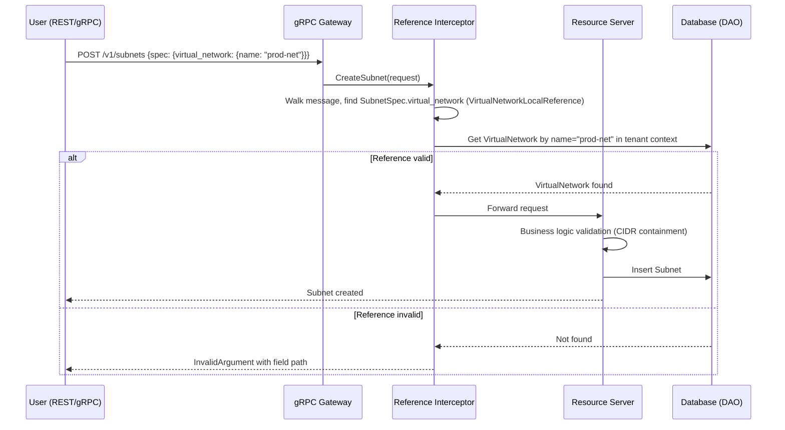

# Type-Safe Resource References

## Summary

This enhancement replaces all opaque `string` reference fields in the OSAC
fulfillment API with per-type structured protobuf messages (`<Type>Reference`
and `<Type>LocalReference`), introduces a gRPC interceptor using protoreflect
for centralized reference validation, and updates the CLI, UI, database
triggers, and CEL filter paths accordingly. See [PRD](prd.md) for detailed
requirements.

## Motivation

Every OSAC resource that points to another resource does so through a bare
`string` field. A `SubnetSpec.virtual_network` is indistinguishable at the
schema level from `SubnetSpec.ipv4_cidr` -- both are strings. This creates
three classes of problems:

1. **No compile-time safety.** Nothing prevents a developer from passing a
   SecurityGroup ID where a VirtualNetwork ID is expected. The proto compiler,
   Go type system, and REST/JSON schema all treat these identically.

2. **No cross-tenant addressability.** References carry only an identifier (or
   name) with no tenant or project context. Referencing a shared resource in a
   different tenant (a global ClusterTemplate, a platform-scoped NetworkClass)
   requires out-of-band knowledge of the target's identifier.

3. **Scattered, inconsistent validation.** Each server validates references
   inline in its Create/Update methods using ad-hoc DAO lookups. Error codes
   are inconsistent -- some servers return `InvalidArgument`, others return
   `NotFound` for the same "referenced resource doesn't exist" condition.
   Business logic validation (CIDR containment, same-VirtualNetwork checks) is
   entangled with existence checks.

The current codebase contains 34 spec-level reference fields across 15 public
API resources (see the complete inventory in the architectural context
document). Each field has its own inline validation logic in the corresponding
server implementation. The UI resolves IDs to names client-side for display,
requiring extra API calls. The CLI passes raw strings with no structural
validation.

This proposal replaces every reference field with a typed message that carries
the referenced resource's name (and optionally tenant and project for
cross-scope references), centralizes existence validation in an interceptor,
and standardizes error reporting across all services. [Locked: D2]

### Goals

- Provide compile-time type safety for all inter-resource references through
  per-type protobuf messages, making it impossible to assign a SecurityGroup
  reference to a VirtualNetwork field.
- Centralize reference existence validation in a single gRPC interceptor so
  that new resources automatically inherit validation without per-server code.
- Standardize error reporting for invalid references on `InvalidArgument` with
  structured field paths across all services.
- Maintain incremental deliverability so that each resource group can be
  migrated independently while the system remains functional. [Locked: D6]
- Prepare the proto schema for the future (tenant, project, name) migration
  by including the `id` field in reference messages, even though id-based
  resolution is deferred. [Locked: D5]

### Non-Goals

- The (tenant, project, name) migration itself -- reference types provide the
  foundation, but the migration of resource identification from UUIDs to
  (tenant, project, name) tuples is a separate initiative. [Locked: D5]
- Backward compatibility with the current string-based reference format.
  [Locked: D1]
- Changes to internal resource identification (primary keys, database schema
  beyond trigger updates).
- Quota enforcement or RBAC changes -- existing authorization model applies
  unchanged.

## Proposal

The design introduces three coordinated changes:

1. **Per-type reference messages in proto.** For each referenceable resource
   type, two new messages are added to its `_type.proto` file:
   `<Type>Reference` (full: id, tenant, project, name) for cross-tenant/project
   references, and `<Type>LocalReference` (name only) for same-tenant/project
   references. All 34 spec-level string reference fields are replaced with the
   appropriate message type. Field numbers are reused since backward
   compatibility is not required. [Locked: D1]

2. **gRPC reference validation interceptor.** A new unary server interceptor
   uses protoreflect to walk incoming request messages, identify fields whose
   type is a reference message (detected by naming convention and message
   structure), validate that the referenced resource exists via DAO lookups, and
   return standardized `InvalidArgument` errors with field paths. Business logic
   validation (CIDR containment, same-VirtualNetwork membership) remains in
   per-server code.

3. **Consumer updates.** The CLI constructs reference messages from flag values.
   The UI sends nested JSON objects instead of flat strings. Database triggers
   update their JSON path expressions. CEL filter paths change from
   `this.spec.virtual_network` to `this.spec.virtual_network.name`.

### Workflow Description

#### Creating a compute instance with network attachments (Tenant User)

Starting state: A Tenant User has a Subnet named `app-subnet` and a
SecurityGroup named `app-sg`, both in READY state within their tenant and
project.

1. The user submits a CreateComputeInstance request. In the REST/JSON body,
   network attachments use nested reference objects:
   ```json
   {
     "metadata": { "name": "my-vm" },
     "spec": {
       "catalog_item": { "name": "standard-vm" },
       "network_attachments": [
         {
           "subnet": { "name": "app-subnet" },
           "security_groups": [{ "name": "app-sg" }]
         }
       ]
     }
   }
   ```

2. The gRPC gateway deserializes the JSON into the proto message. The
   `catalog_item` field is a `ComputeInstanceCatalogItemReference` (full
   reference, since catalog items may be cross-tenant). The `subnet` field is
   a `SubnetLocalReference` (local, since subnets are always same-tenant). The
   `security_groups` field is a `repeated SecurityGroupLocalReference`.

3. The reference validation interceptor fires before the server handler. It
   walks the `CreateComputeInstanceRequest` message using protoreflect,
   discovers the reference-typed fields, and for each:
   - Extracts the `name` field from the reference message.
   - Looks up the resource via the corresponding DAO using the caller's tenant
     context.
   - If the resource does not exist, collects an error with the field path
     (e.g., `spec.network_attachments[0].subnet.name`).

4. If any reference is invalid, the interceptor returns `InvalidArgument` with
   all invalid references listed in the error details. The user sees:
   ```
   InvalidArgument: invalid references:
     spec.network_attachments[0].subnet.name: Subnet "app-subnet" not found
   ```

5. If all references are valid, the request proceeds to the
   ComputeInstancesServer handler, which performs business logic validation
   (e.g., the security groups must belong to the same VirtualNetwork as the
   subnet).

6. On success, the created ComputeInstance is returned with the reference
   fields populated exactly as submitted.

#### Creating a virtual network with a cross-tenant network class (Tenant Admin)

Starting state: A Cloud Infrastructure Admin has created a NetworkClass named
`high-perf` in the platform scope.

1. The Tenant Admin submits a CreateVirtualNetwork request:
   ```json
   {
     "metadata": { "name": "prod-net" },
     "spec": {
       "network_class": { "name": "high-perf" },
       "ipv4_cidr": "10.0.0.0/16"
     }
   }
   ```

2. The `network_class` field is a `NetworkClassReference` (full reference).
   Since NetworkClass is a platform-scoped resource, the interceptor looks it
   up without tenant filtering.

3. The interceptor validates that `high-perf` exists. The server handler
   validates CIDR format and NetworkClass capabilities (IPv4 support).

#### Error handling: invalid reference

When a user references a nonexistent resource:

```json
{
  "metadata": { "name": "my-subnet" },
  "spec": {
    "virtual_network": { "name": "nonexistent-vnet" }
  }
}
```

The interceptor returns:
```
Code: InvalidArgument
Message: invalid resource references
Details: [
  {
    field: "spec.virtual_network.name",
    description: "VirtualNetwork \"nonexistent-vnet\" not found in tenant \"tenant-a\", project \"default\""
  }
]
```

The response uses `google.rpc.BadRequest` with `FieldViolation` entries for
each invalid reference, providing a machine-parseable and human-readable error.



The diagram above shows the request flow for a Subnet creation. The reference
validation interceptor sits between the gRPC gateway and the resource server.
It validates reference existence before the server handler runs. If any
reference is invalid, the interceptor short-circuits the request with a
structured error. If all references are valid, the request proceeds to the
server for business logic validation and persistence.

### API Extensions

This enhancement modifies existing protobuf message definitions. It does not
add new gRPC services, CRDs, webhooks, or finalizers.

**Modified proto files (public API):**

| File | Change |
|------|--------|
| `compute_instance_type.proto` | Add `ComputeInstanceTemplateReference`, `ComputeInstanceCatalogItemReference`, `SubnetLocalReference`, `SecurityGroupLocalReference`. Replace string fields in `ComputeInstanceSpec` and `NetworkAttachment`. Import `InstanceTypeLocalReference` from `instance_type_type.proto`. |
| `subnet_type.proto` | Add `VirtualNetworkLocalReference`. Replace `SubnetSpec.virtual_network`. |
| `virtual_network_type.proto` | Add `NetworkClassReference`. Replace `VirtualNetworkSpec.network_class`. |
| `security_group_type.proto` | Add `VirtualNetworkLocalReference` (reuse from subnet). Replace `SecurityGroupSpec.virtual_network`. |
| `external_ip_attachment_type.proto` | Add `ExternalIPLocalReference`, `ComputeInstanceLocalReference`, `ClusterLocalReference`, `BareMetalInstanceLocalReference`. Replace string fields in `ExternalIPAttachmentSpec` oneof. |
| `external_ip_type.proto` | Add `ExternalIPPoolReference`. Replace `ExternalIPSpec.pool`. |
| `public_ip_attachment_type.proto` | Add `PublicIPLocalReference`, `ComputeInstanceLocalReference` (reuse). Replace string fields. |
| `public_ip_type.proto` | Add `PublicIPPoolReference`. Replace `PublicIPSpec.pool`. |
| `nat_gateway_type.proto` | Add references for VirtualNetwork and ExternalIP. Replace string fields. |
| `cluster_type.proto` | Add `ClusterTemplateReference`, `ClusterCatalogItemReference`, `HostTypeReference`. Replace string fields. |
| `baremetal_instance_type.proto` | Add `BareMetalInstanceCatalogItemReference`. Replace string field. |
| `role_binding_type.proto` | Add `RoleReference`, `UserReference`. Replace string fields. |
| `project_membership_type.proto` | Add `ProjectReference`, `UserReference` (reuse). Replace string fields. |
| `catalog_item_type.proto` (cluster, compute, baremetal) | Add template references. Replace string fields. |
| `instance_type_type.proto` | Add `InstanceTypeLocalReference` for deprecation replacement. |

**Private API:** Each private API `_type.proto` file mirrors the corresponding
public API changes. Private-only status-level references (hub, pool mirrors)
are addressed in the Implementation Details section.

**Shared reference messages:** When multiple resources reference the same
target type (e.g., both `NetworkAttachment` and `PublicIPAttachmentSpec`
reference `ComputeInstance`), the reference message is defined once in the
target type's `_type.proto` file and imported where needed. This prevents
duplicate message definitions.

**Operational impact:** None. This is a schema change with no new controllers,
webhooks, or runtime components beyond the interceptor (which replaces existing
inline validation logic).

## UX Alignment

The UI `@temp-api` files pass reference values as plain strings. After this
enhancement, the REST/JSON wire format changes from flat strings to nested
objects. The following table maps the affected UI code to the new proto
structure.

| UI code location | Current wire format | New wire format | Notes |
|---|---|---|---|
| `networking.ts` `CreateVirtualNetworkInput.networkClass` | `spec: { network_class: networkClass }` (string) | `spec: { network_class: { name: networkClass } }` | Local var already holds the name |
| `networking.ts` `CreateSubnetInput.virtualNetworkId` | `spec: { virtual_network: virtualNetworkId }` (string) | `spec: { virtual_network: { name: vnetName } }` | Rename variable from `Id` to name-based |
| `networking.ts` `CreateSecurityGroupInput.virtualNetworkId` | `spec: { virtual_network: virtualNetworkId }` (string) | `spec: { virtual_network: { name: vnetName } }` | Same pattern as Subnet |
| `networking.ts` `virtualNetworkFilterForSubnetList` | `this.spec.virtual_network == "${id}"` | `this.spec.virtual_network.name == "${name}"` | CEL filter path change |
| `ip-management.ts` `useCreatePublicIP` body | `spec: { pool: string }` | `spec: { pool: { name: poolName } }` | |
| `ip-management.ts` `useCreateExternalIP` body | `spec: { pool: string }` | `spec: { pool: { name: poolName } }` | |
| `ip-management.ts` `useCreatePublicIPAttachment` body | `spec: { publicIp: string, target: { case, value } }` | `spec: { public_ip: { name: ipName }, compute_instance: { name: vmName } }` | Oneof becomes separate fields with reference messages |
| `ip-management.ts` `useCreateExternalIPAttachment` body | `spec: { externalIp: string, target: { case, value } }` | `spec: { external_ip: { name: ipName }, compute_instance: { name: vmName } }` | Same oneof pattern |
| `cluster.ts` `CreateClusterInput.spec.catalogItem` | `spec: { catalogItem: string }` | `spec: { catalog_item: { name: catalogName } }` | |
| `compute-instance-wire.ts` `buildComputeInstanceCreateBody` | `spec: { template: "id", catalog_item: "id", subnet: "id", security_groups: ["id"] }` | `spec: { template: { name: "tpl" }, catalog_item: { name: "ci" }, network_attachments: [{ subnet: { name: "s" }, security_groups: [{ name: "sg" }] }] }` | Most complex change; wire builder must wrap strings |

**Known deviation:** The `@temp-api` attachment types
(`useCreatePublicIPAttachment`, `useCreateExternalIPAttachment`) use a
`target: { case, value }` pattern that does not map to proto oneof wire
format. The correct proto oneof wire format sets only the chosen field at the
top level of the spec. This is an existing UI deviation, not introduced by
this enhancement.

After the backend ships and `pnpm gen-types` is run in osac-ux, the UI
migration diff is limited to wrapping string values in `{ name: value }`
objects at each call site, plus updating CEL filter expressions to use the
`.name` sub-path.

### Implementation Details/Notes/Constraints

#### Reference Message Schema

Two message patterns are defined per referenceable type:

```protobuf
// Full reference — used when the target may be in a different tenant/project.
// Defined in the target type's _type.proto file.
message ClusterTemplateReference {
  // Resource identifier. Resolution by id is deferred to the (tenant, project, name)
  // migration. When both id and name are provided, the server validates consistency.
  // Initially, the server ignores this field.
  string id = 1;

  // Tenant that owns the referenced resource.
  // Empty means the caller's current tenant.
  string tenant = 2;

  // Project that owns the referenced resource.
  // Empty means the caller's current project.
  string project = 3;

  // Human-readable name of the referenced resource.
  // Required for the initial implementation.
  string name = 4 [(buf.validate.field).string.min_len = 1];
}

// Local reference — used when the target is always in the same tenant/project.
// Defined in the target type's _type.proto file.
message SubnetLocalReference {
  // Human-readable name of the referenced resource.
  string name = 1 [(buf.validate.field).string.min_len = 1];
}
```

The `id` field is included in full references for forward compatibility with
the (tenant, project, name) migration. In the initial implementation, the
server ignores the `id` field entirely -- resolution uses `name` only.
[Locked: D5]

When the (tenant, project, name) migration completes, the server will support
bidirectional resolution:
- If only `id` is provided, resolve to (tenant, project, name).
- If only `name` is provided (with optional tenant/project), resolve to id.
- If both are provided, validate consistency and return an error if they
  disagree.

Local references omit `id`, `tenant`, and `project` because the target is
always in the same scope as the referencing resource. If a future need arises
for id-based local references, a new field can be added without breaking
existing clients.

#### Which fields use local vs. full references

The choice between local and full reference depends on whether the target
resource can be in a different tenant or project from the referencing resource:

| Field | Reference Type | Rationale |
|-------|---------------|-----------|
| `SubnetSpec.virtual_network` | `VirtualNetworkLocalReference` | Subnet is always in the same tenant/project as its parent VirtualNetwork |
| `SecurityGroupSpec.virtual_network` | `VirtualNetworkLocalReference` | Same reasoning as Subnet |
| `NetworkAttachment.subnet` | `SubnetLocalReference` | ComputeInstance and Subnet are in the same tenant/project |
| `NetworkAttachment.security_groups` | `repeated SecurityGroupLocalReference` | Same tenant/project |
| `NATGatewaySpec.virtual_network` | `VirtualNetworkLocalReference` | Same tenant/project |
| `NATGatewaySpec.external_ip` | `ExternalIPLocalReference` | Same tenant/project |
| `ExternalIPAttachmentSpec.external_ip` | `ExternalIPLocalReference` | Same tenant/project |
| `ExternalIPAttachmentSpec.compute_instance` | `ComputeInstanceLocalReference` | Same tenant/project |
| `ExternalIPAttachmentSpec.cluster` | `ClusterLocalReference` | Same tenant/project |
| `ExternalIPAttachmentSpec.baremetal_instance` | `BareMetalInstanceLocalReference` | Same tenant/project |
| `PublicIPAttachmentSpec.public_ip` | `PublicIPLocalReference` | Same tenant/project |
| `PublicIPAttachmentSpec.compute_instance` | `ComputeInstanceLocalReference` | Same tenant/project |
| `InstanceTypeDeprecation.replacement` | `InstanceTypeLocalReference` | Same scope |
| `VirtualNetworkSpec.network_class` | `NetworkClassReference` | NetworkClass is platform-scoped (cross-tenant) |
| `ClusterSpec.template` | `ClusterTemplateReference` | Templates may be shared across tenants |
| `ClusterSpec.catalog_item` | `ClusterCatalogItemReference` | Catalog items may be shared across tenants |
| `ClusterNodeSet.host_type` | `HostTypeReference` | HostTypes are platform-scoped |
| `ComputeInstanceSpec.template` | `ComputeInstanceTemplateReference` | Templates may be shared |
| `ComputeInstanceSpec.catalog_item` | `ComputeInstanceCatalogItemReference` | Catalog items may be shared |
| `ComputeInstanceSpec.instance_type` | `InstanceTypeReference` | InstanceTypes may be shared |
| `ExternalIPSpec.pool` | `ExternalIPPoolReference` | Pools are platform-scoped |
| `PublicIPSpec.pool` | `PublicIPPoolReference` | Pools are platform-scoped |
| `BareMetalInstanceSpec.catalog_item` | `BareMetalInstanceCatalogItemReference` | Catalog items may be shared |
| `ClusterCatalogItem.template` | `ClusterTemplateReference` | Cross-tenant template reference |
| `ComputeInstanceCatalogItem.template` | `ComputeInstanceTemplateReference` | Cross-tenant template reference |
| `BareMetalInstanceCatalogItem.template` | `BareMetalInstanceTemplateReference` | Cross-tenant template reference |
| `ClusterTemplateNodeSet.host_type` | `HostTypeReference` | Platform-scoped |
| `ComputeInstanceTemplateSpecDefaults.instance_type` | `InstanceTypeReference` | May be shared |
| `RoleBindingSpec.role` | `RoleReference` | Roles may be platform-scoped |
| `RoleBindingSpec.users` | `repeated UserReference` | Users may be cross-project |
| `ProjectMembershipSpec.project` | `ProjectReference` | Cross-project by definition |
| `ProjectMembershipSpec.user` | `UserReference` | Cross-project |

#### Concrete before/after example

**Before (current):** `subnet_type.proto`

```protobuf
message SubnetSpec {
  // Parent VirtualNetwork ID. Required and immutable after creation.
  string virtual_network = 1 [
    (google.api.field_behavior) = REQUIRED,
    (google.api.field_behavior) = IMMUTABLE
  ];
  optional string ipv4_cidr = 2 [(google.api.field_behavior) = IMMUTABLE];
  optional string ipv6_cidr = 3 [(google.api.field_behavior) = IMMUTABLE];
}
```

**After:** `subnet_type.proto`

```protobuf
// Local reference to a VirtualNetwork by name.
// Used when the VirtualNetwork is always in the same tenant/project.
message VirtualNetworkLocalReference {
  string name = 1;
}

message SubnetSpec {
  // Parent VirtualNetwork. Required and immutable after creation.
  VirtualNetworkLocalReference virtual_network = 1 [
    (google.api.field_behavior) = REQUIRED,
    (google.api.field_behavior) = IMMUTABLE
  ];
  optional string ipv4_cidr = 2 [(google.api.field_behavior) = IMMUTABLE];
  optional string ipv6_cidr = 3 [(google.api.field_behavior) = IMMUTABLE];
}
```

**Before (current):** `external_ip_attachment_type.proto`

```protobuf
message ExternalIPAttachmentSpec {
  string external_ip = 1 [...];
  oneof target {
    string compute_instance = 2;
    string cluster = 3;
    string baremetal_instance = 4;
  }
  ExternalIPAttachmentEndpoint target_endpoint = 5 [...];
}
```

**After:** `external_ip_attachment_type.proto`

```protobuf
message ExternalIPAttachmentSpec {
  ExternalIPLocalReference external_ip = 1 [...];
  oneof target {
    ComputeInstanceLocalReference compute_instance = 2;
    ClusterLocalReference cluster = 3;
    BareMetalInstanceLocalReference baremetal_instance = 4;
  }
  ExternalIPAttachmentEndpoint target_endpoint = 5 [...];
}
```

**REST/JSON wire format change:**

Before:
```json
{
  "spec": {
    "external_ip": "019728a4-3f5c-7def-8abc-1234567890ab",
    "compute_instance": "01972f1b-a4e9-7c82-9def-abcdef123456"
  }
}
```

After:
```json
{
  "spec": {
    "external_ip": { "name": "my-external-ip" },
    "compute_instance": { "name": "my-vm" }
  }
}
```

#### gRPC Reference Validation Interceptor

The interceptor is a unary server interceptor registered in the gRPC
interceptor chain after authentication and transaction management (so that
tenant context and a database transaction are available).

```go
// ReferenceValidator validates resource references in incoming gRPC requests.
type ReferenceValidator struct {
    // registry maps proto message full names to their DAO lookup functions.
    registry map[protoreflect.FullName]ReferenceLookupFunc
}

// ReferenceLookupFunc looks up a resource by name within a tenant/project scope.
// Returns nil error if the resource exists, dao.ErrNotFound if it does not.
type ReferenceLookupFunc func(
    ctx context.Context,
    tenant, project, name string,
) error

// Validate walks a proto message and validates all reference-typed fields.
// Returns a google.rpc.BadRequest with FieldViolation entries for each
// invalid reference, or nil if all references are valid.
func (v *ReferenceValidator) Validate(
    ctx context.Context,
    msg proto.Message,
) error
```

**Reference detection.** The interceptor identifies reference fields by
checking whether a field's message type ends with `Reference` or
`LocalReference`. This naming convention is enforced by the proto schema and
does not require manual registration of individual fields -- only the lookup
functions per referenced type need to be registered. If the interceptor
discovers a reference field whose message type has no registered lookup
function, it returns `Internal` -- this is a programming error (fail closed).
A startup-time check validates that all known reference message types have
registered lookups, preventing deployment of misconfigured servers.

**Message walking.** The interceptor uses `protoreflect.Message.Range()` to
iterate over set fields. For message-typed fields, it checks whether the
message type matches a registered reference type. For repeated fields, it
iterates each element. For oneof fields, it inspects the populated variant.
For nested messages (like `NetworkAttachment` inside `ComputeInstanceSpec`),
it recurses.

**Tenant context for local references.** For `LocalReference` messages (which
have only a `name` field), the interceptor extracts tenant and project from
the request's authentication context. For full `Reference` messages, it uses
the explicitly provided `tenant` and `project` fields, falling back to the
caller's context when empty.

**Error aggregation.** The interceptor collects all invalid references before
returning, so the user sees every problem in a single error response. It
constructs a `google.rpc.BadRequest` status detail with one `FieldViolation`
per invalid reference, where the `field` is the proto field path (e.g.,
`spec.network_attachments[0].subnet.name`) and the `description` is a
human-readable message.

**Platform-scoped resources.** Resources like NetworkClass, ExternalIPPool,
PublicIPPool, and HostType are platform-scoped and not filtered by tenant. The
lookup function registered for these types omits tenant filtering.

**Interceptor registration in the chain:**

```
Panic Recovery -> Metrics -> Logging -> Protovalidate -> Transaction -> Auth -> Authz -> JIT Provisioning -> Reference Validation -> Handler
```

The interceptor runs after Auth (tenant context for scoped lookups) and after
Transaction (DAO lookups share the request's database transaction). Validation
failures cause a transaction rollback, which is the desired behavior (no
partial state changes).

#### Database Trigger Changes

Resources are stored as JSON-serialized protobuf in a `data` column. Existing
PL/pgSQL triggers serve two purposes:

1. **Forward reference checks (Z0002):** On insert/update, verify the
   referenced resource exists using `SELECT ... FOR SHARE` (which also
   serializes concurrent inserts and deletes). The interceptor now handles
   the existence check, but whether to keep or remove these triggers depends
   on the locking strategy — see Open Question 2.

2. **Reverse reference checks (Z0003):** On delete, verify no other resource
   still references the deleted one (e.g., prevent deleting a VirtualNetwork
   that has Subnets). The interceptor does not cover deletes — these triggers
   are kept but updated to use the new JSON paths.

**All triggers require JSON path updates** to reflect the new nested
reference structure. This is a semantic shift: triggers currently match on
resource IDs (primary keys), but will switch to matching on resource names
(unique within a tenant). This aligns with the name-based resolution model
introduced by this EP.

**Tenant scoping.** Because names are unique per tenant (not globally like
IDs), trigger queries must add tenant predicates when switching from ID-based
to name-based matching. The scoping rule depends on the reference type:

- **Same-tenant local references** (Subnet→VN, CI→Subnet, SG→VN,
  CI→InstanceType): Currently match on `id` with no tenant filter. After
  migration, add `tenant = new.tenant` (forward triggers) or
  `tenant = old.tenant` (reverse triggers) to scope lookups within the
  correct tenant.
- **Cross-tenant/shared references** (Cluster→CatalogItem,
  CI→CatalogItem): Already have tenant scoping via
  `(tenant = new.tenant OR tenant = 'shared')`. After migration, drop the
  ID match alternative and update JSON paths to nested `->>'name'`.
- **Platform-scoped references** (VN→NetworkClass): No triggers exist
  today. If added, no tenant filter is needed — platform-scoped names are
  globally unique.

Associated indexes must include `tenant` as a leading column for
same-tenant triggers to keep queries efficient.

Example path changes:

| Trigger function | Table | Path change | Tenant scoping |
|---|---|---|---|
| `check_virtual_network_not_in_use()` (Z0003) | virtual_networks | `= old.id` → `data->'spec'->'virtual_network'->>'name'` | Add `tenant = old.tenant` |
| `check_subnet_not_in_use()` (Z0003) | subnets | `->>'subnet'` → `->'subnet'->>'name'` | Add `tenant = old.tenant` |
| `check_instance_type_not_in_use()` (Z0003) | instance_types | `->>'instance_type'` → `->'instance_type'->>'name'` | Add `tenant = old.tenant` |
| `check_subnet_virtual_network_ref()` (Z0002) | subnets | `id = vn_id` → `name = vn_name` | Add `tenant = new.tenant` |
| `check_compute_instance_subnet_refs()` (Z0002) | compute_instances | `id = subnet_id` → `name = subnet_name` | Add `tenant = new.tenant` |
| `check_cluster_catalog_item_ref()` (Z0002) | clusters | Drop `id =` alternative | Already scoped |
| `check_ci_catalog_item_ref()` (Z0002) | compute_instances | Drop `id =` alternative | Already scoped |

#### CEL Filter Expression Changes

Users and the UI use CEL filter expressions in List operations. With nested
references, filter paths change:

| Before | After |
|--------|-------|
| `this.spec.virtual_network == "vnet-id"` | `this.spec.virtual_network.name == "prod-net"` |
| `this.spec.template == "tpl-id"` | `this.spec.template.name == "standard"` |
| `this.spec.pool == "pool-id"` | `this.spec.pool.name == "default-pool"` |

The `FilterTranslator` in `internal/database/dao/` translates CEL expressions
to SQL WHERE clauses. It already supports nested field access for JSON paths.
No changes to the translator are needed -- the new paths map naturally to
JSON traversal (`data->'spec'->'virtual_network'->'name'`).

Existing saved or hardcoded filters using the old path format will break.
This is acceptable per D1 (no backward compatibility). The UI and CLI update
their filter expressions as part of the same delivery chunk.

#### CLI Changes

The CLI currently accepts reference values as string flags (e.g.,
`--template my-template`, `--subnet my-subnet`). After the change, the CLI
constructs reference messages from flag values:

**For local references:**
```bash
# Before (unchanged user experience):
osac compute-instance create --name my-vm --catalog-item standard-vm \
  --subnet app-subnet --security-group app-sg

# The CLI internally constructs:
# catalog_item: { name: "standard-vm" }  (full reference, tenant/project from context)
# network_attachments[0].subnet: { name: "app-subnet" }  (local reference)
# network_attachments[0].security_groups[0]: { name: "app-sg" }  (local reference)
```

**For full references with explicit tenant/project:**
```bash
osac cluster create --name my-cluster \
  --template shared-template --template-tenant global --template-project templates

# The CLI internally constructs:
# template: { name: "shared-template", tenant: "global", project: "templates" }
```

For each reference field that supports full references, the CLI adds
`--<field>-tenant` and `--<field>-project` optional flags. When omitted,
the caller's current tenant and project are used (same as today).

The CLI's `describe` output displays references with their resolved names:

```
Spec:
  Virtual Network: prod-net
  IPv4 CIDR:       10.0.1.0/24
```

#### Private API and Status-Level References

Private API `_type.proto` files mirror the public API changes for all
spec-level reference fields. Both APIs share the same field numbers and must
be updated in lockstep.

Status-level references in the private API fall into two categories:

1. **System-managed `hub` fields** (13 fields across resource statuses):
   These reference the Hub resource and are set by controllers, not users. They
   use `HubLocalReference` for consistency, but the interceptor does not
   validate them (status fields are not present in Create/Update requests).

2. **Status mirror fields** (pool mirrors in ExternalIP/PublicIP status, users
   sync in RoleBindingStatus): These duplicate spec-level references in status
   for read convenience. They use the same reference message type as the spec
   field. Controllers populate them during reconciliation.

#### Incremental Delivery Plan

Delivery is organized into functional chunks. Each chunk migrates a group of
related resources, updates all layers (proto, server, interceptor registration,
database triggers, CLI, UI), and leaves the system fully functional.
[Locked: D6]

| Chunk | Resources | Reference Fields | Rationale |
|-------|-----------|-----------------|-----------|
| 1 - Interceptor + Networking | VirtualNetwork, Subnet, SecurityGroup, NetworkClass | `network_class`, `virtual_network` (x3) | Foundation: build interceptor with the simplest reference graph. Networking resources have clear local-reference semantics. |
| 2 - Compute | ComputeInstance, ComputeInstanceTemplate, ComputeInstanceCatalogItem, InstanceType | `template`, `catalog_item`, `instance_type`, `subnet`, `security_groups`, `replacement` | Highest user-facing impact. Depends on networking references from Chunk 1. |
| 3 - IP Management | ExternalIP, ExternalIPPool, ExternalIPAttachment, PublicIP, PublicIPPool, PublicIPAttachment, NATGateway | `pool` (x2), `external_ip` (x2), `public_ip`, `virtual_network`, `compute_instance`, `cluster`, `baremetal_instance` | IP resources have complex oneof targets. |
| 4 - Clusters + Bare Metal | Cluster, ClusterTemplate, ClusterCatalogItem, BareMetalInstance, BareMetalInstanceCatalogItem, BareMetalInstanceTemplate, HostType | `template` (x2), `catalog_item` (x2), `host_type` (x2) | CaaS and BMaaS services. |
| 5 - IAM | RoleBinding, ProjectMembership, Role, User, Project | `role`, `users`, `project`, `user` | IAM references are self-contained. |

Within each chunk, the implementation order is:
1. Define reference messages in `_type.proto` files (public + private).
2. Run `buf lint && buf generate`.
3. Register lookup functions in the interceptor for the new reference types.
4. Update server code: remove inline validation for fields now handled by the
   interceptor; keep business logic validation.
5. Update database triggers and run migration.
6. Update CLI flag handling and output formatting.
7. Update UI wire format and CEL filters.
8. Update `docs/API.md` reference conventions to reflect the new patterns.
9. Update tests (unit + integration).

### Security Considerations

This enhancement inherits the existing OSAC security model without changes.

**Authentication:** Reference validation runs after the authentication
interceptor, so all DAO lookups execute in an authenticated context with a
valid tenant identity.

**Authorization:** The interceptor validates that referenced resources exist
within the caller's authorized scope. For local references, lookups are
scoped to the caller's tenant and project. For full references with an
explicit tenant/project, the existing OPA policies enforce whether the caller
has cross-tenant access. No new authorization rules are introduced.

**Input validation:** Reference messages have a constrained schema (string
fields for id, tenant, project, name). The protobuf deserialization layer
rejects malformed input. The interceptor validates that names are non-empty
and match existing resources. No SQL injection risk exists because lookups
use parameterized DAO queries, not string concatenation.

**Cross-tenant information disclosure:** When a user provides a full reference
with an explicit tenant, the interceptor's error message reveals whether the
referenced resource exists in that tenant. This is the same behavior as the
current system (servers return "not found" for nonexistent references). The
existing OPA policies already gate cross-tenant visibility.

### Failure Handling and Recovery

**Interceptor lookup failure (database error).** If the DAO lookup fails due
to a database error (connection timeout, query error), the interceptor returns
`Internal` with a generic message. The transaction interceptor handles
rollback. The client retries the request.

**Partial reference validation failure.** The interceptor validates all
references in a single pass and returns all failures together. It does not
short-circuit on the first invalid reference. This minimizes round trips for
users correcting multiple references.

**Race condition: referenced resource deleted between validation and
persistence.** The interceptor validates references within the same database
transaction as the Create/Update operation. Under `READ COMMITTED`, a
concurrent delete of the referenced resource could commit after the
interceptor's existence check but before the child insert commits. The
current forward triggers use `SELECT ... FOR SHARE` on the parent row to
serialize this — see Open Question 2 for whether to retain them or move
the locking into the interceptor's DAO lookups.

**Interceptor panic.** The panic recovery interceptor is first in the chain
and catches panics from all downstream interceptors, including the reference
validator.

### RBAC / Tenancy

No RBAC or tenancy changes are required. The reference validation interceptor
reuses the existing tenant context from the authentication interceptor. Local
reference lookups are automatically scoped to the caller's tenant and project.
Full reference lookups with explicit tenant/project are subject to existing
OPA cross-tenant access policies.

This enhancement does not introduce new resources, so no new tenant isolation
metadata (`osac.openshift.io/tenant`, `osac.openshift.io/owner-reference`)
is needed.

### Observability and Monitoring

**Metrics:**

| Metric | Type | Labels | Description |
|--------|------|--------|-------------|
| `osac_reference_validation_total` | Counter | `resource_type`, `result` (`valid`, `invalid`, `error`) | Total reference validations performed by the interceptor. A sustained increase in `invalid` indicates user confusion or integration issues. |
| `osac_reference_validation_duration_seconds` | Histogram | `resource_type` | Latency of reference validation per request. Useful for detecting DAO lookup performance degradation. Alert if p99 exceeds 100ms. |

**Structured logging:** The interceptor logs at `DEBUG` level for each
reference validated (resource type, name, result). At `WARN` level for
validation failures (includes the field path and error). At `ERROR` level for
DAO lookup errors (database connectivity issues).

**No new Kubernetes events.** The interceptor operates at the gRPC layer, not
the controller layer. Existing controller events are unaffected.

### Risks and Mitigations

| Risk | Likelihood | Impact | Mitigation |
|------|-----------|--------|------------|
| Proto field number reuse causes wire incompatibility during incremental rollout | Medium | High | Each delivery chunk updates all consumers (server, CLI, UI) atomically. No mixed-version deployments within a chunk. CI validates proto compatibility within each chunk. |
| Interceptor adds latency to every Create/Update request | Low | Medium | The interceptor replaces existing inline DAO lookups, not adding new ones. Net latency change is near zero. The `osac_reference_validation_duration_seconds` metric monitors this. [Locked: R2.Q4] |
| CEL filter breakage for existing API consumers | Medium | Medium | Breaking change is accepted per D1. Document the path changes in the API changelog. Each chunk's release notes list affected filter paths. |
| Cross-chunk dependency: Chunk 2 (Compute) depends on Chunk 1 (Networking) for SubnetLocalReference | Low | Medium | Chunk ordering is fixed. Chunk 1 must merge before Chunk 2. CI enforces proto import resolution. |

### Drawbacks

**API surface complexity increases.** Each referenceable type gains one or two
new message definitions. The public API adds approximately 25 new message
types (one `LocalReference` per locally-referenced type, one `Reference` per
cross-tenant-referenced type). This increases the proto file count and
generated code size. However, each message is small (1-4 fields) and follows
a predictable pattern, so the cognitive overhead is low.

**REST/JSON verbosity increases.** `"subnet": "my-subnet"` becomes
`"subnet": { "name": "my-subnet" }`. Every reference field gains one level
of nesting. For resources with many references (ComputeInstance has 4
reference fields), the JSON body grows. This is an acceptable trade-off for
type safety and is consistent with how other infrastructure APIs (Kubernetes,
AWS CloudFormation) represent structured references.

**Breaking change for all API consumers.** Every client that creates or
updates a resource with references must update its request format. With no
backward compatibility period [Locked: D1], all consumers must update per
delivery chunk. This is mitigated by incremental delivery [Locked: D6] and
by the fact that the REST/JSON change is mechanical (wrap string in object).

**Protobuf lacks generics.** Each reference type is a separate message because
protobuf has no parameterized types. A `ResourceReference<Subnet>` would be
ideal but is not possible. The per-type approach trades verbosity for
compile-time safety -- the Go compiler rejects assigning a
`SubnetLocalReference` to a `VirtualNetworkLocalReference` field.

## Alternatives (Not Implemented)

None -- alternatives (URI/ARN format, generic reference message, do nothing)
were evaluated during design and rejected. See the PRD PR #113 discussion for
details on the URI/ARN trade-off.

## Open Questions

1. **Should status-level references (hub, pool mirrors) use typed messages?**
   The design proposes they do for consistency, but they are system-managed and
   not user-facing. Using typed messages in status adds migration work for
   controllers but prevents the schema from diverging between spec and status.
   Feedback requested from controller maintainers.

2. **Should forward reference triggers (Z0002) be kept or removed?** The
   current forward triggers use `SELECT ... FOR SHARE` on the parent row,
   which serializes concurrent child inserts and parent deletes under
   `READ COMMITTED`. Without this lock, the interceptor's plain SELECT
   leaves a race window where both a child insert and parent delete can
   commit, creating a dangling reference. Options: (a) keep forward triggers
   and update their JSON paths — redundant with the interceptor but preserves
   the locking safety net, (b) remove forward triggers and add `FOR SHARE`
   to the interceptor's DAO lookup queries. Resolve during Epic 1
   implementation.

3. **How should CEL filter changes be communicated to API consumers?** The path
   change (`this.spec.virtual_network` to `this.spec.virtual_network.name`)
   breaks existing filters. Options: (a) document in release notes only,
   (b) add a deprecation warning in the List response when old-format filters
   are detected, (c) accept breakage per D1 with no mitigation. The design
   currently assumes option (c).

## Test Plan

**Unit tests (Ginkgo):**

- Reference message construction: verify that each reference type correctly
  serializes/deserializes in both proto binary and JSON formats.
- Interceptor reference detection: verify that the interceptor discovers all
  reference-typed fields in each request message, including nested messages
  (`NetworkAttachment` inside `ComputeInstanceSpec`), repeated fields
  (`security_groups`), and oneof fields (`ExternalIPAttachmentSpec.target`).
- Interceptor validation logic: verify that the interceptor returns
  `InvalidArgument` with correct field paths for missing references, returns
  success for valid references, and aggregates multiple errors.
- Per-server validation removal: verify that servers no longer perform inline
  existence checks for fields handled by the interceptor, but continue to
  perform business logic validation.

**Integration tests (kind cluster):**

- End-to-end Create with valid references: Create a VirtualNetwork, then a
  Subnet referencing it by name. Verify the Subnet is created and the
  reference is persisted correctly.
- End-to-end Create with invalid reference: Attempt to create a Subnet
  referencing a nonexistent VirtualNetwork. Verify `InvalidArgument` with
  the correct field path.
- Cross-tenant reference: Create a VirtualNetwork referencing a NetworkClass
  in platform scope. Verify resolution succeeds.
- Database trigger enforcement: Delete a VirtualNetwork that has Subnets.
  Verify the trigger prevents deletion (SQLSTATE Z0003).
- CEL filter with new path: List Subnets filtered by
  `this.spec.virtual_network.name == "prod-net"`. Verify correct results.

**E2E tests (osac-test-infra, pytest):**

- Full provisioning workflow: Create NetworkClass, VirtualNetwork, Subnet,
  SecurityGroup, and ComputeInstance with all references by name. Verify the
  ComputeInstance reaches RUNNING state.
- Error scenario: Attempt to create a ComputeInstance with a nonexistent
  Subnet name. Verify the API returns a clear error message.

Test plan details will be developed during implementation for each delivery
chunk. Each chunk's tests cover the specific resources migrated in that chunk.

## Graduation Criteria

Graduation criteria will be defined when targeting a release. Expected stages:
Dev Preview -> Tech Preview -> GA based on production deployment feedback.

Each delivery chunk is independently shippable. A chunk graduates when:
- All reference fields in the chunk's resources use typed messages.
- The interceptor validates all references in the chunk.
- CLI and UI support the new format for the chunk's resources.
- Unit, integration, and E2E tests pass.
- API documentation and OpenAPI specs are updated.

### Removing a deprecated feature

Not applicable. The old string-based format is removed immediately with no
deprecation period. [Locked: D1]

## Upgrade / Downgrade Strategy

OSAC does not currently support in-place upgrades. Deployments are fresh
installations. No data migration or backfill is needed — trigger functions
are defined with the correct JSON paths from the start.

## Version Skew Strategy

Version skew between fulfillment-service and osac-operator during upgrades is
handled by the delivery chunk model:

- Each chunk updates fulfillment-service proto definitions, server code, and
  database triggers as a single deployment unit.
- The osac-operator communicates with fulfillment-service via gRPC using
  generated client types. When fulfillment-service updates its proto
  definitions, the operator must be rebuilt with the new generated types.
  This is coordinated within each delivery chunk.
- During the transition between chunks, some resources use typed references
  and some still use strings. This is acceptable because the interceptor only
  validates reference types it recognizes -- string fields pass through
  unchanged.

No CRD version migration is required. The osac-operator CRDs do not include
reference fields (references exist in the fulfillment-service proto layer).

## Support Procedures

**Detecting reference validation failures:**

- **Metrics:** A spike in `osac_reference_validation_total{result="invalid"}`
  indicates widespread reference errors, possibly from a misconfigured client
  or a breaking change that was not communicated.
- **Logs:** Search for `WARN` level entries with `reference_validation` in the
  structured log output. Each entry includes the resource type, field path,
  and the invalid reference name.
- **Client errors:** Clients receive `InvalidArgument` (gRPC code 3) with
  `google.rpc.BadRequest` details listing each invalid field. If clients
  report opaque errors, check whether they are parsing the error details
  correctly.

**Detecting interceptor performance degradation:**

- **Metrics:** The `osac_reference_validation_duration_seconds` histogram
  tracks per-request validation latency. If p99 exceeds 100ms, investigate
  DAO query performance (missing indexes, database load).

**Debugging reference resolution failures:**

If a reference that should be valid is rejected:
1. Check that the referenced resource exists: `osac <type> list --filter "this.metadata.name == \"<name>\""`.
2. Check tenant context: the caller's token must include the correct tenant.
   For full references with explicit tenant, verify cross-tenant access is
   permitted by OPA policy.
3. Check the interceptor registry: verify that the lookup function for the
   reference type is registered. The interceptor fails closed — an
   unregistered reference type returns `Internal`, not a silent pass-through.
   If the server started successfully, all reference types have registered
   lookups (validated at startup).

## Infrastructure Needed

None. All changes are within existing repositories (fulfillment-service,
osac-ux) and use existing CI infrastructure.

---

## Provenance

Authored: commit @ design 0.3.0 - 883316f, workspace main @ c5499e4
Final: respond @ design 0.3.0 - 92734a2, workspace main @ c5499e4

> Context changed between commit and respond.

<!-- ai-workflow-provenance:{"schema_version":1,"provenance_kind":"session","workflow":"design","workflow_version":"0.3.0","ai_workflows":"92734a2","source_repo":"c5499e4","source_repo_branch":"main","commits_behind_main":0,"commits_ahead_main":0,"main_ref":"main","phases":["commit","commit","commit","respond"],"authoring_modes":["skill"],"context_changed":true} -->
